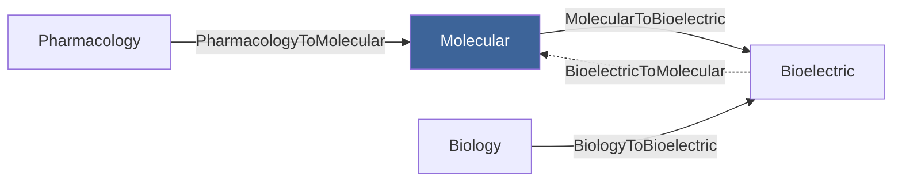

# per-ontology-mermaid-external

Generate the cross-ontology connection diagram for one pr4xis ontology. Sibling to [`per-ontology-mermaid-internal`](../per-ontology-mermaid-internal/SKILL.md), which handles internal structure.

## Inputs

- **Required**: absolute path to an ontology directory under `crates/domains/src/`

## What to read

1. **The target ontology's `Entity` enum** — to know what to grep for
2. **Every `impl Functor for X` block** in `crates/domains/src/` — find the ones whose `Source` or `Target` type belongs to this ontology. Extract the functor name, source ontology, target ontology, and direction.
3. **Every `impl Adjunction for X` block** in `crates/domains/src/` — find adjunctions whose `Left` or `Right` functor involves this ontology. Extract the adjunction name and the two ontologies it connects.

## What to generate

A mermaid `graph LR` block with:

- **The target ontology as a central node**, styled distinctly
- **One node per other ontology** that's connected via a functor or adjunction
- **Edges** with style by connection type:
  - `-->` for outgoing functor (`This → Other`)
  - `<--` for incoming functor (`Other → This`)
  - Adjunctions: paired `-->` and `-.->` arrows, with the adjunction name as edge label

Cap the diagram at 15 connected ontologies. If the ontology has more than 15 connections, surface a warning and render only the most "core" 15 (those connected via adjunctions first, then by functor count).

Example:



(Where `Mol` is the central node — the ontology this README is for.)

## Where to insert

Inside `<ontology-dir>/README.md`, between these exact markers:

```markdown
<!-- BEGIN AUTO-GENERATED: external-connections -->

(generated mermaid block goes here)

<!-- END AUTO-GENERATED: external-connections -->
```

If the markers don't exist, insert them in a new `## External connections` section right after `## Internal structure`. If both auto-generated sections are missing, add this one second so the reader sees internal-then-external.

## Rules

- Only emit edges that correspond to actual `impl Functor` or `impl Adjunction` blocks in the codebase
- Never invent connections to ontologies that don't exist
- Style the central node distinctly so the reader sees which ontology this diagram is *about*
- Use short readable IDs (`Mol`, `Bio`, `Bel`) rather than long path-based ones — but make sure the labels are unambiguous

## Verification

1. Mermaid syntax is valid
2. Every functor edge points at a real `impl Functor for X` in the codebase
3. Every adjunction edge corresponds to a real `impl Adjunction for X`
4. The central node is the target ontology, styled distinctly from the rest
5. Cap of 15 connected ontologies respected (or warning surfaced)

## Output

Report:
- Path of the README updated
- Number of functors connected (in / out)
- Number of adjunctions involving this ontology
- Whether the diagram was capped at 15

## Failure modes

- **Ontology has no functors or adjunctions**: render an empty node with a note "no cross-domain connections yet — see [Compose via functor](../../../docs/use/compose-via-functor.md) to add one"
- **Functor source/target type can't be parsed**: skip that functor and surface it in the report
- **Markers missing AND README missing**: ask the user — this skill should run after `per-ontology-readme`, not stand alone
