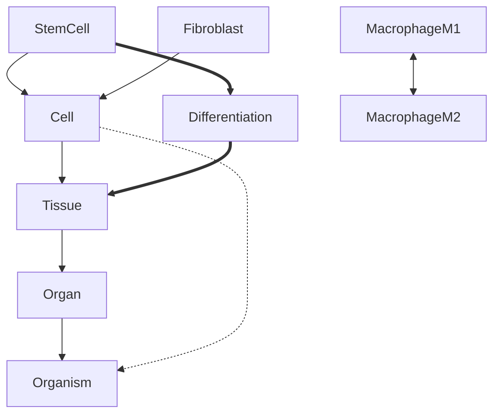

# per-ontology-mermaid-internal

Generate the internal-structure mermaid diagram for one pr4xis ontology and insert it into that ontology's `README.md`.

## When to invoke

After [`per-ontology-readme`](../per-ontology-readme/SKILL.md) has produced a README. Diagrams are inserted into the README between marker comments so this skill (and future regenerations) can update the diagram without touching surrounding prose.

This is one of four sibling skills for the per-ontology rollout. The wrapper [`per-ontology-rollout`](../per-ontology-rollout/SKILL.md) invokes this one alongside `per-ontology-readme`, `per-ontology-citings`, and `per-ontology-mermaid-external`.

## Inputs

- **Required**: the absolute path to an ontology directory
- **Optional**: maximum number of nodes to render (default: 30; if the ontology has more, sample by node degree)

## What to read

1. **`<ontology-dir>/ontology.rs`** — extract the `define_ontology!` block:
   - The entity enum and all its variants (these become nodes)
   - The taxonomy rows: every `(Child, Parent)` becomes a solid arrow `Child --> Parent`
   - The mereology rows: every `(Part, Whole)` becomes a dashed arrow `Part -.-> Whole`
   - The causation rows: every `(Cause, Effect)` becomes a dotted arrow `Cause ==> Effect`
   - The opposition rows: every `(A, B)` becomes a paired arrow `A <--> B`

2. **The entity enum definition** — for the canonical list of all concepts, even if they don't appear in any reasoning relation

3. **Any custom `Quality` types** mentioned in the ontology — these get attached to entities as small property labels (optional, only if the diagram has space)

## What to generate

A mermaid `graph TB` block with:

- **Nodes**: every entity variant. Use the enum variant name as the node ID. If the enum has more than 30 variants, sample the most-connected 30 (those that appear in the most relation rows) and add a subtitle noting that the diagram is a sample.

- **Edges**: every relation row, with the arrow style indicating which reasoning system:
  - `-->` for taxonomy (is-a)
  - `-.->` for mereology (part-of)
  - `==>` for causation (causes)
  - `<-->` for opposition (opposes)

- **Styling**: a small `classDef` block at the bottom that colors nodes by their root taxonomy class (if a clear root exists, like `Cell` for biology). Subtle, not loud.

- **Legend**: a tiny legend below the diagram explaining the arrow styles. Three lines max.

Example output for a hypothetical small ontology:



> Arrows: solid `-->` is-a · dashed `-.->` part-of · double `==>` causes · double-headed `<-->` opposes

## Where to insert

Inside `<ontology-dir>/README.md`, between these exact marker comments:

```markdown
<!-- BEGIN AUTO-GENERATED: internal-structure -->

(generated mermaid block goes here)

<!-- END AUTO-GENERATED: internal-structure -->
```

If the markers don't exist in the README, insert them in a new `## Internal structure` section right after the "Composition with other ontologies" section. If the markers exist but the README has been edited around them, the markers still take precedence — only replace the content between them, never the surrounding prose.

## Rules

- **Never duplicate a node**. If the same entity appears in multiple relations, it's still one node.
- **Never invent relations**. Only emit edges that correspond to actual rows in `define_ontology!`.
- **Preserve mermaid syntax exactly**. Test the output by mentally reading it — every arrow must have a valid source and target.
- **Sample, don't truncate**. If there are too many nodes, sample the most-connected 30 and note that it's a sample. Do not just take the first 30 alphabetically.
- **Don't restyle existing valid mermaid**. If the ontology already has a custom diagram in the README outside the markers, leave it alone.

## Verification

Before declaring success:

1. The mermaid block exists between the markers
2. Every node in the block corresponds to an entity in the enum
3. Every edge corresponds to a relation row in `define_ontology!`
4. The mermaid syntax is valid (no orphan arrows, no malformed node IDs, no broken classDef references)
5. The README still parses as valid markdown around the inserted block
6. The legend is present and matches the arrow styles actually used in this diagram (don't show a "causes" entry if the diagram has no causation arrows)

## Output

Report a summary with:

- Path of the README that was updated
- Number of nodes rendered
- Number of edges rendered, broken down by reasoning system (e.g., "12 taxonomy, 8 mereology, 0 causation, 4 opposition")
- Whether the diagram was sampled (and if so, how many entities were left out)
- Anything notable about the structure (e.g., "this ontology has a single tall taxonomy chain — consider splitting into smaller diagrams for clarity")

## Failure modes

- **`define_ontology!` block can't be parsed**: surface the parse failure and stop. Don't generate a partial diagram from a broken block.
- **The ontology has no relations** (taxonomy / mereology / causation / opposition all empty): generate a diagram with just nodes and a note "this ontology has no internal relations encoded; only the concept set is shown". This is rare but legitimate.
- **The ontology has more than 100 entities**: the sampling is going to lose information. Sample to 30, surface the truncation prominently in the report, and recommend the human consider splitting the ontology.
- **Existing mermaid block between markers doesn't match what would be regenerated**: log the diff before overwriting. The user may have hand-tuned the diagram for clarity.

## Notes

The diagram is a *visual aid*, not the source of truth. The source of truth is `ontology.rs`. If the diagram and the code disagree, the code wins; regenerate the diagram. Never edit the diagram in a way that doesn't reflect the code.

For the cross-ontology view (functors, adjunctions), see the sibling skill [`per-ontology-mermaid-external`](../per-ontology-mermaid-external/SKILL.md). That diagram goes in a separate marker block.
