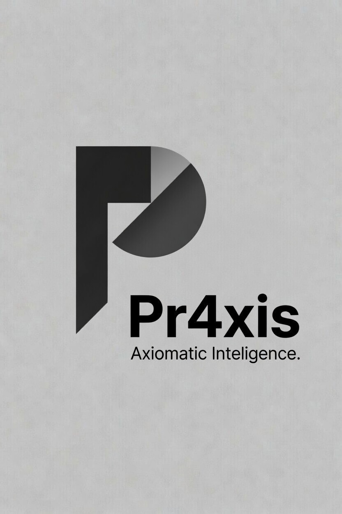

<p align="center">
  
</p>

<p align="center">
  <a href="https://www.rust-lang.org/"></a>
  <a href="https://nixos.org/"></a>
  <a href="https://creativecommons.org/licenses/by-nc-sa/4.0/"></a>
</p>

<p align="center">
  <a href="https://github.com/i-am-logger/pr4xis/actions/workflows/ci.yml"></a>
  <a href="https://codecov.io/gh/i-am-logger/praxis"></a>
  <a href="https://pr4xis.dev"></a>
</p>

# pr4xis — Axiomatic Intelligence

**pr4xis is a new kind of AI: axiomatic, not statistical.** Where LLMs predict the next token from training data, pr4xis derives the next claim from accepted axioms — the same way mathematicians prove theorems.

Aristotle named three kinds of knowing:

- **episteme** — knowing how things are
- **techne** — knowing how to make things
- **praxis** — *the doing itself, done well*

pr4xis is the doing.

The mathematical foundation runs from G. Spencer-Brown's *Laws of Form* (1969) through Heim's syntrometric logic to contemporary applied category theory — see [Foundations](docs/understand/foundations.md) for the academic lineage. Every step in that chain is **verified at test time**, not asserted:

```
cargo test -p pr4xis-domains -- syntrometry
```

runs the whole suite — the primary `Syntrometry → Pr4xisSubstrate` functor (14 of 18 concepts round-trip as fixed points; four intentional collapses whose richer semantics lives in the dedicated Dialectics and Kripke ontologies), the `Distinction → Syntrometry` embedding (Spencer-Brown → Heim), and cross-functors into `MetaOntology`, `Staging` (Futamura), `Algebra` (Goguen/Zimmermann), `Dialectics` (Hegel/Aristotle/Marx/Adorno/Priest), `Kripke` (possible-worlds semantics), and `C1` (Dehaene GWT).

## The problem

- **LLMs hallucinate by design.** Next-token prediction has no ground truth. When wrong, they cannot tell you which axiom failed because there are no axioms. For creative writing, this is fine. For domains where it kills people, it is unworkable.
- **Scientific knowledge is siloed.** WordNet, BioPortal, the Gene Ontology, DOLCE, OBO Foundry — rich, well-curated, almost entirely unable to be combined and trusted. Decades of expert curation, no executable substrate to compose them.

pr4xis solves both. It runs on formal scientific knowledge humans have already accumulated and on the 106 domain ontologies built directly in the workspace, with mathematical proof that every connection is sound. **Many more ontologies are still to be added** — the substrate exists precisely so that integration with BioPortal, the Gene Ontology, OBO Foundry, and the rest can be machine-checkable instead of merely hopeful.

## Where this matters

- **Safety-critical engineering** — aerospace navigation, sensor fusion, biomedical decision support, industrial process control. pr4xis already includes the foundational ontologies for orbital mechanics, attitude estimation, multi-target tracking, Kalman filtering, AHRS, SLAM, and more.
- **LLM verification** — pr4xis as a deterministic checker behind a generative front end. The LLM produces text; pr4xis verifies which claims actually hold.
- **Long-lived knowledge bases** — personal research notes, organizational SOPs, academic literature. The substrate keeps a knowledge base machine-checkable as it grows.

## pr4xis vs LLMs

|   | LLMs | pr4xis |
|---|---|---|
| **How it knows** | Learned from training data | Derived from accepted axioms |
| **Correctness** | Approximate — best guess from training patterns | Proven — every claim verified by math |
| **Hallucination** | Inherent — no ground truth | Impossible — every claim traces to a proof |
| **Determinism** | Stochastic — depends on temperature and seed | Absolute — same input, same proof, every time |
| **Traceability** | Opaque — billions of weights, no audit trail | Full proof path from conclusion back to its axioms |
| **When wrong** | Confidently wrong, hard to find why | The failing axiom is named |
| **Cross-domain reasoning** | Implicit blending, no guarantees | Proven connections between domains |
| **Undo / redo / branch** | None — each completion is final | Built in: undo, redo, branch from any prior state |
| **Missing knowledge** | Doesn't know what it doesn't know | Detects gaps automatically |

## Demo

Try it now: **[pr4xis.dev](https://pr4xis.dev)** — runs entirely in the browser. No server, no GPU, no API key. If a query breaks, [file an issue](https://github.com/i-am-logger/pr4xis/issues) — broken queries are bug reports, not user error.

## Get started

Install, run the CLI, and write your first interaction with the engine: **[docs/learn/get-started.md](docs/learn/get-started.md)**.

## Contributing

- **Try the demo** at [pr4xis.dev](https://pr4xis.dev) and [file issues](https://github.com/i-am-logger/pr4xis/issues) for what breaks.
- **Contribute an ontology** if you work in a domain that could be encoded as one. Existing ontologies under `crates/domains/src/` are the working examples.
- **Partner on a safety-critical deployment** in aerospace, biomedical, industrial, or legal.

## Documentation

**For a specific audience:**

| Doc | Audience |
|---|---|
| [for engineers](docs/why/for-engineers.md) | What pr4xis does for your stack, how it composes, what to do first |
| [for researchers](docs/why/for-researchers.md) | The novelty claim, the academic lineage, the open research directions |

**To get started:**

| Doc | What it covers |
|---|---|
| [Get started](docs/learn/get-started.md) | Three-step tutorial: install → first query → first ontology |

**To go deeper:**

| Doc | What it covers |
|---|---|
| [Architecture](docs/understand/architecture.md) | The five-layer Rust stack, the engine, how everything fits together |
| [Concepts](docs/understand/concepts.md) | Categories, functors, adjunctions, gap detection — explained for engineers |
| [Evolution](docs/understand/evolution.md) | How ontologies grow without breaking — transform via functor, never rewrite |
| [Foundations](docs/understand/foundations.md) | Academic lineage from Spencer-Brown to applied category theory |

**To contribute:**

| Doc | What it covers |
|---|---|
| [Build an ontology from a paper](docs/use/build-ontology-from-paper.md) | The contributor authoring workflow, end to end |
| [Compose via functor](docs/use/compose-via-functor.md) | How to write a verified cross-domain functor |
| [Write axioms](docs/use/write-axioms.md) | How to write a domain axiom the engine enforces |

**Reference and research:**

| Doc | What it covers |
|---|---|
| [Glossary](docs/reference/glossary.md) | Every pr4xis term, in plain English |
| [Domain catalog](docs/reference/domain-catalog.md) | The 106 ontologies in the workspace and how they are organized |
| [Gap detection](docs/research/gap-detection.md) | The bioelectricity Kv discovery — a concrete result you can verify |
| [Novelty](docs/research/novelty.md) | What is new about pr4xis, what is prior art, what is pending verification |
| [Draft papers](docs/research/papers/) | Three drafts: categorical bioelectricity, adjunction-based gap detection, and the ontology-diagnostics meta-ontology |
| [Paper outline](docs/research/paper-outline.md) | Draft architecture paper |

## License

CC BY-NC-SA 4.0 — see [LICENSE](LICENSE).

---

- **Repo:** [github.com/i-am-logger/pr4xis](https://github.com/i-am-logger/pr4xis)
- **Document date:** 2026-04-14
