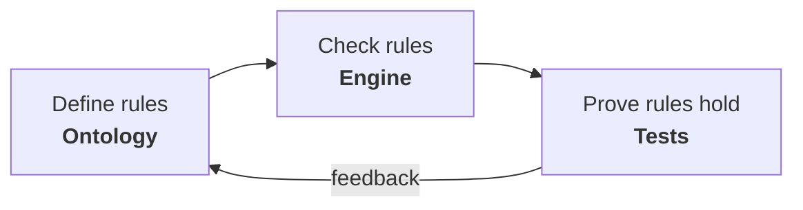

# Praxis

[](https://creativecommons.org/licenses/by-nc-sa/4.0/)
[](https://www.rust-lang.org/)
[](.)

Aristotle classified knowledge into three kinds: **episteme** (knowing how things are), **techne** (knowing how to make things), and **praxis** (knowing how to do the right thing). This is praxis — a system that doesn't just compute, it understands what it's doing and can prove it's correct.

> "Every good regulator of a system must be a model of that system."
> — Conant & Ashby (1970)

The code contains **zero domain knowledge**. All intelligence lives in composable ontologies — formal descriptions of what exists and how things relate. Every transformation between domains is a mathematically proven functor. Every claim has a proof. 1,809 of them.



## What it proves

| Claim | How |
|---|---|
| A dog is an animal | Taxonomy: dog → mammal → animal (WordNet, 107K concepts) |
| Chess rules are complete | 5 famous games (1851-1858) replayed to checkmate |
| "the dog runs" is grammatical | Pregroup algebra: np·n^l · n · np^r·s contracts to s |
| F = ma | Property test: Dv = (F/m)*Dt for all random inputs |
| Energy is conserved | KE + PE = constant for all inputs |
| Nothing exceeds light speed | Engine blocks any velocity >= c |
| Dialogue IS communication | Functor laws verified: identity + composition preserved |
| The Engine IS a control system | Functor: Plant→Situation, Model→Ontology (Conant-Ashby) |
| Edit distance is a metric | Triangle inequality proven by property-based testing |
| Spelling correction is an adjunction | Channel F⊣Correction G: G∘F ≠ Id (information loss) |

## Quick start

```rust
use praxis::engine::Engine;
use praxis_domains::technology::games::chess::{new_game, ChessAction, Square};

let game = new_game()
    .next(ChessAction::new(Square::new(4, 1), Square::new(4, 3)))?  // e4
    .next(ChessAction::new(Square::new(4, 6), Square::new(4, 4)))?; // e5

game.situation()       // current board
game.back()?           // undo
game.trace().dump()    // full history — every check, every result
```

## Documentation

| Document | What it covers |
|---|---|
| [Foundations](docs/foundations.md) | Academic lineage — every ontology traced to its source paper |
| [Architecture](docs/architecture.md) | Five layers: logic, category, ontology, engine, codegen |
| [Concepts](docs/concepts.md) | What ontologies are and how they compose via functors |
| [Domains](docs/domain-crates.md) | Physics, chess, music, linguistics, traffic, law, and more |

## Crates

| Crate | Purpose |
|---|---|
| `praxis` | Core — category theory, ontology, reasoning, logic, engine |
| `praxis-domains` | 25+ domain ontologies with proven cross-domain functors |
| `praxis-examples` | 11 classic puzzles solved through ontological reasoning |

## Principles

- **Nothing mechanical.** Every interaction with data goes through an ontology. No blind parsing.
- **Research first.** Every ontology is grounded in academic papers. Bugs are ontology gaps.
- **Composition over custom code.** Existing ontologies compose via functors. Extend, don't reinvent.
- **Nothing here until there's a proof.** This document describes only what the codebase demonstrates.

## Testing

```bash
cargo test --workspace   # 1,809 proofs
```

Property-based testing with [proptest](https://github.com/proptest-rs/proptest).

## License

CC BY-NC-SA 4.0 — see [LICENSE](LICENSE).
