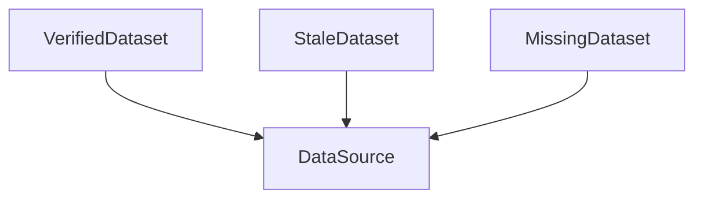

# Data Provisioning -- Managed external data dependencies

Composes several pr4xis ontologies into a uniform fetch + content-type-polymorphic decoder chain for external data. The fetch path (download, verify identity, write to disk) is the same for any content type; the decoder chain is specific per `ContentType`. This is pr4xis's alternative to Git LFS for large test data.

Key references (this ontology is a composition, so its grounding is a union of the ontologies it composes):
- `formal/meta/artifact_identity/` — identity claims, verification, the four families
- `formal/information/storage/` — Repository / Store / Materialize / Realize — Spivak 2012 functorial data migration, Gupta & Mumick 1995 materialized views, Haerder & Reuter 1983 ACID
- `formal/information/provenance/` — W3C PROV-O for fetch events
- `formal/meta/staging/` — Futamura 1971 freeze: Dynamic → Static
- Dolstra 2006 (via artifact_identity) — fixed-output derivations
- Wilkinson et al. 2016 — FAIR Guiding Principles (F1 persistent identifier, A1 accessible, R1 reusable)
- Global WordNet Association WN-LMF 1.3 — the upstream schema for WordNet, the initial registered source

## Entities (7)

| Category | Entities |
|---|---|
| Concept (1) | DataSource |
| Infrastructure (2) | DataCache, DecoderFunctor |
| Event (1) | ProvisioningEvent |
| Lifecycle states (3) | VerifiedDataset, StaleDataset, MissingDataset |

## Taxonomy (is-a)

Every lifecycle state is-a `DataSource`. At any given time a dataset is in exactly one of the three states (enforced by the opposition relation below).

## Opposition Pairs

| Pair | Meaning |
|---|---|
| VerifiedDataset / StaleDataset | A dataset is in at most one of these at a time |
| VerifiedDataset / MissingDataset | Present-and-valid vs not-present |
| StaleDataset / MissingDataset | Present-but-invalid vs not-present |

## Qualities

| Quality | Type | Description |
|---|---|---|
| IsUsableLocally | bool | True for VerifiedDataset, false for StaleDataset and MissingDataset |
| TriggersUpdate | bool | True for StaleDataset and MissingDataset — both are inputs to `pr4xis update` |

## Axioms

| Axiom | Description | Source |
|---|---|---|
| EveryDataSourceHasIdentity | Every RegistryEntry resolves to a non-empty CompositeIdentity | Dolstra 2006 / FAIR F1 |
| RegistryUniquenessByName | No two RegistryEntries share a name | structural |
| DecoderTotalityPerContentType | Every ContentType in use has a defined decoder | type-theoretic |
| IdentityClaimsUseLeaves | Every IdentityClaim uses a leaf IdentityConcept, not a family or root | structural (taxonomy) |

Plus the auto-generated structural axioms from `define_ontology!` (category laws, taxonomy NoCycles).

## The registry

The concrete list of managed datasets lives in `registry.rs` as a const `DATA_SOURCES: &[RegistryEntry]`. The initial PR registers one dataset:

### `wordnet` — English WordNet 2025

- **Content type**: `XmlLmf`
- **Remote location**: `https://github.com/globalwordnet/english-wordnet/releases/download/2025-edition/english-wordnet-2025.xml.gz` *(upstream — Global WordNet Association / Open English WordNet; pr4xis does not re-host)*
- **Local path**: `crates/domains/data/wordnet/english-wordnet-2025.xml`
- **Identity** (composite, both must verify):
  - `XmlElementAttribute`: `<Lexicon version="2025">` (self-description — what the upstream itself declares)
  - `RawHash`: sha256 `6f49adeec174ab3092169fb25cf4a925226b63975a5d29a691a5dff88f0673b2` (the decompressed bytes) — authoritative, pinned in `registry.rs` as `WORDNET_2025_SHA256`
- **Gzipped**: yes

Both claims are enforced by `CompositeRequiresAll`: `fetch.rs` runs the declared `XmlElementAttribute` and `RawHash` extractors against the downloaded bytes, and `VerificationFailClosed` rejects the file if either claim fails. If the upstream ever re-publishes different bytes under the same tag, the fetch fails; updating to a new edition is a deliberate code change, not a silent drift.

## Content type polymorphism

The `ContentType` enum has 7 variants; only `XmlLmf` has a real decoder in this PR. The other variants are declared but `DecoderTotalityPerContentType` fails the axiom test if anyone adds a registry entry using them without also adding a decoder.

| ContentType | Decoder status | Decoder chain |
|---|---|---|
| `XmlLmf` | ✓ real | `xml_reader::read_xml → lmf::reader::read_wordnet` → then callers use `English::from_wordnet` |
| `Pdf` | — | `applied/pdf_document/` + text extraction (future PR) |
| `Plaintext` | — | direct (future PR) |
| `Json` | — | serde_json parse (future PR) |
| `Video` | — | frame extraction via ffmpeg (future PR) |
| `Audio` | — | waveform decoder (future PR) |
| `Binary` | — | passthrough (future PR) |

## The full chain — integration test

The key test in `tests.rs` is `full_chain_raw_bytes_to_english_ontology`, which runs raw bytes through the complete pipeline:

1. Start with synthesized WordNet LMF XML bytes (matching the real schema: `<Lexicon version="2025">` with `<Synset>` and `<LexicalEntry>` children)
2. Compute the real sha256 of the bytes
3. Verify the `XmlElementAttribute` identity claim (upstream self-description)
4. Verify the `RawHash` identity claim (cryptographic integrity)
5. Decode via the `XmlLmf` decoder (delegates to existing `xml_reader → lmf::reader`)
6. Feed the resulting `WordNet` through the existing `English::from_wordnet` functor
7. Confirm the resulting `English` ontology instance is queryable with real data

This test proves that the new data-provisioning layer composes cleanly with the existing `formal/meta/artifact_identity/` ontology, the existing `xml_reader`, the existing `lmf::reader`, and the existing `English::from_wordnet`. No mock; the real pipeline end-to-end.

## Functors

No cross-domain functors yet — see [Compose via functor](../../../../../../docs/use/compose-via-functor.md) to add one. The data_provisioning ontology is the **consumer** of:

- `formal/meta/artifact_identity/` — for every identity claim
- `formal/information/storage/` — for cache semantics
- `formal/information/provenance/` — for fetch events
- `formal/meta/staging/` — for the freeze functor framing
- `social/software/markup/xml/` + `social/software/markup/xml/lmf/` — via the XmlLmf decoder
- `cognitive/linguistics/english/` — the downstream target of the XmlLmf chain

And a **producer** of materialized files. A future PR wires the `fetch.rs` module (behind the `fetch` feature) into the pipeline and the `pr4xis update` CLI subcommand consumes it.

## Files

- `ontology.rs` -- Entity enum, define_ontology! with taxonomy + opposition, RegistryEntry struct, ContentType enum, 2 qualities, 4 domain axioms
- `registry.rs` -- const DATA_SOURCES table (one entry: wordnet), by_name lookup, resolve_identity runtime builder (Vec<IdentityClaim> is not const)
- `decoders/mod.rs` -- has_decoder_for dispatch
- `decoders/xml_lmf.rs` -- wraps the existing xml_reader → lmf::reader pipeline
- `fetch.rs` (behind `fetch` feature) -- network fetch + gunzip + verify + write (next commit)
- `tests.rs` -- 17 tests: category laws, entity counts, qualities, 4 domain axioms, decoder dispatch, full-chain integration, rejection on version mismatch
- `README.md` -- this file
- `citings.md` -- per-ontology bibliography
- `mod.rs` -- module declarations
