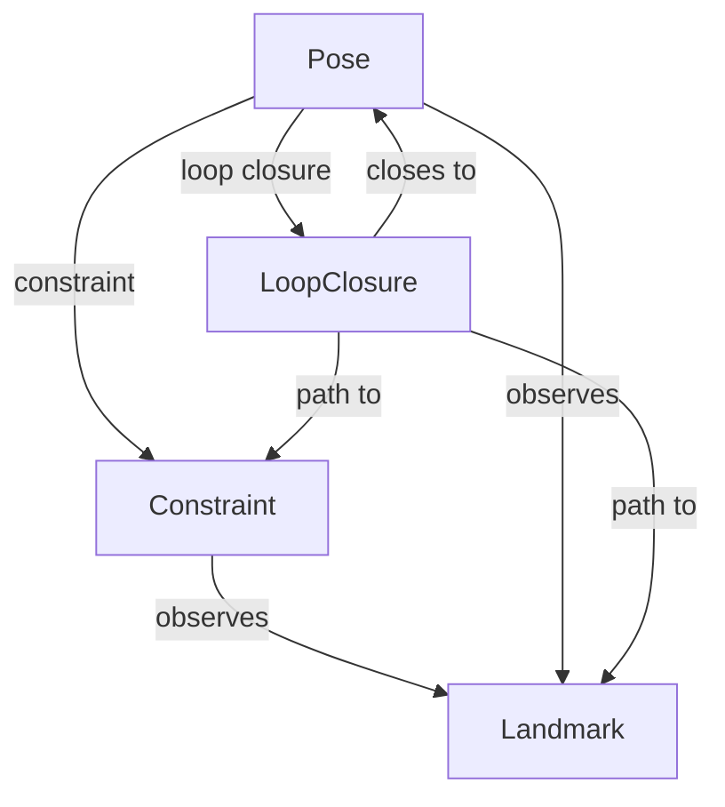

# SLAM -- Graph-based Simultaneous Localization and Mapping

Models the components of a graph-based SLAM back-end: poses, landmarks, constraints, and loop closures, arranged as a category whose morphisms express how each component type can observe or connect to the others. Loop closures are the information-recovering edges that let a robot correct accumulated drift by re-observing a previously visited location.

Key references:
- Grisetti, Kummerle, Stachniss, Burgard 2010: *A Tutorial on Graph-Based SLAM* (IEEE ITS Magazine)
- Thrun, Burgard, Fox 2005: *Probabilistic Robotics*, Chapter 10

## Entities (4)

| Category | Entities |
|---|---|
| Nodes (2) | Pose, Landmark |
| Edges (2) | Constraint, LoopClosure |

## Category structure

The transitive closure lets a loop closure edge reach any landmark observable from its endpoints.

## Qualities

| Quality | Type | Description |
|---|---|---|
| ComponentRole | &'static str | Textual description of each component's role (robot pose, environmental feature, sensor measurement, re-observation) |

## Axioms (2)

| Axiom | Description | Source |
|---|---|---|
| ConstraintReducesUncertainty | Adding a constraint to the SLAM graph reduces or maintains uncertainty | Grisetti et al. 2010 (information-matrix view) |
| LoopClosureConnectsPoses | Loop closures connect pose nodes to other pose nodes | Thrun et al. 2005 |

Plus the category laws verified by `check_category_laws`.

## Functors

No cross-domain functors yet — see [Compose via functor](../../../../../../docs/use/compose-via-functor.md) to add one. SLAM sits downstream of frame, state, and observation; once those bridges land, a SLAM → state estimation functor will express the pose-graph back-end in terms of the generic state ontology.

## Files

- `ontology.rs` -- `SlamConcept` entity, `SlamCategory`, `ComponentRole` quality, 2 axioms, tests
- `engine.rs` -- `Pose2D`, `Landmark2D`, `PoseGraphEdge`, `PoseGraph` runtime types
- `tests.rs` -- additional tests beyond `ontology.rs`
- `mod.rs` -- module declarations
