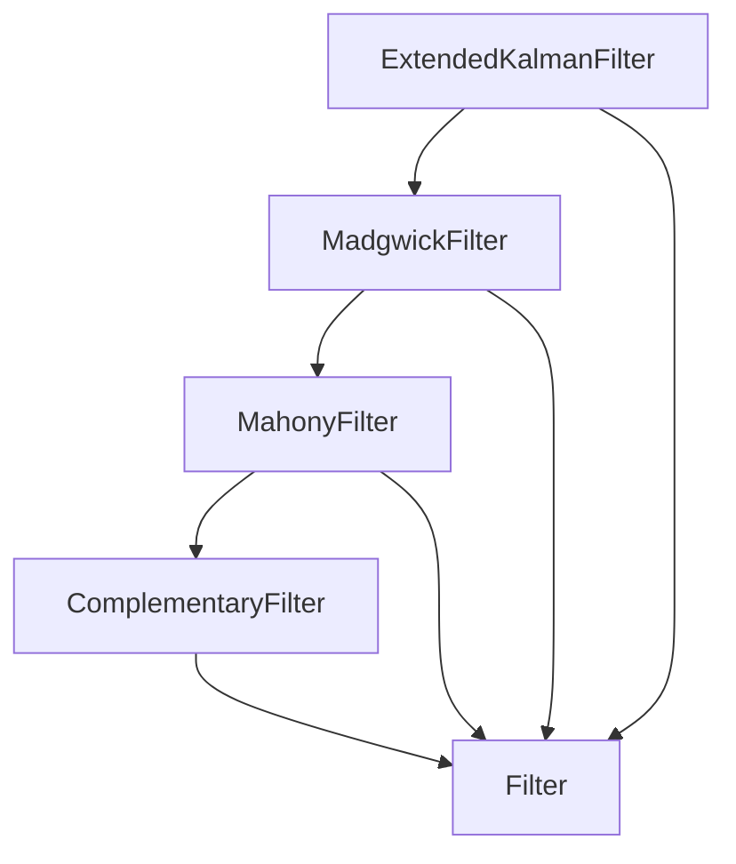

# AHRS -- Attitude and Heading Reference System

Models the family of AHRS filters that fuse accelerometer, gyroscope, and magnetometer measurements to estimate orientation (roll, pitch, yaw) without external position fixes. The primary entity is the filter type; a secondary `AttitudeState` entity captures the Euler-angle components of the estimate. The filter taxonomy reflects the historical progression from complementary filter through Mahony, Madgwick, to EKF-based attitude estimation.

Key references:
- Madgwick 2010: *An efficient orientation filter for inertial and inertial/magnetic sensor arrays*
- Mahony, Hamel, Pflimlin 2008: *Nonlinear Complementary Filters on the Special Orthogonal Group* (IEEE TAC)
- Titterton & Weston 2004: *Strapdown Inertial Navigation Technology*, Chapter 10
- Groves 2013: *Principles of GNSS, Inertial, and Multisensor Integrated Navigation*, Chapter 6

## Entities

**Primary — `AhrsFilterType` (5):**

| Category | Entities |
|---|---|
| Abstract (1) | Filter |
| Filters (4) | ComplementaryFilter, MahonyFilter, MadgwickFilter, ExtendedKalmanFilter |

**Secondary — `AttitudeState` (4):** Attitude, Roll, Pitch, Yaw

## Reasoning: Taxonomy

Each step extends the previous filter with additional accuracy at additional cost.

## Qualities

| Quality | Type | Description |
|---|---|---|
| AttitudeAccuracy | &'static str | Static RMS attitude accuracy per filter (from ~2–5 deg for complementary down to ~0.1–1 deg for EKF) |
| ComputationalCost | &'static str | Relative FLOPS per update (from ~20 for complementary up to ~500+ for EKF) |

## Axioms (4)

| Axiom | Description | Source |
|---|---|---|
| AttitudeStateTaxonomyIsDAG | Attitude-state taxonomy (Roll/Pitch/Yaw → Attitude) is acyclic | structural |
| GravityGivesLevelAttitude | Accelerometer at rest determines roll/pitch via the gravity vector | Titterton & Weston 2004 §10.3 |
| MagnetometerGivesHeading | Magnetometer plus level attitude determines yaw (heading) | Groves 2013 §6.4 |
| GyroIntegrationDrifts | Gyroscope-only attitude drifts over time and needs external correction | Titterton & Weston 2004 §10.2 |

Plus the auto-generated structural axioms from `define_ontology!` (category laws + filter-taxonomy DAG).

## Functors

No cross-domain functors yet — see [Compose via functor](../../../../../../docs/use/compose-via-functor.md) to add one. Natural targets: the IMU ontology (AHRS consumes IMU measurements) and the space/attitude ontology (which already reasons about attitude sensor accuracy at arcsecond level).

## Files

- `ontology.rs` -- `AhrsFilterType` and `AttitudeState` entities, filter taxonomy, qualities, 4 axioms, tests
- `engine.rs` -- `AttitudeEstimate`, `AhrsSituation`, `AhrsAction`, `apply_ahrs` transition function
- `tests.rs` -- additional tests beyond `ontology.rs`
- `mod.rs` -- module declarations
