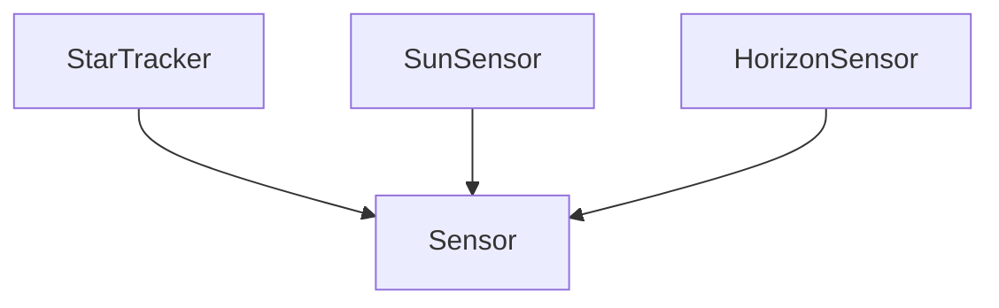

# Celestial -- Celestial navigation

Models celestial navigation as three linked taxonomies: the celestial bodies observed (Sun, Moon, stars, planets), the observables measured on them (altitude, azimuth, hour angle, declination), and the sensors that take those measurements (star tracker, sun sensor, horizon sensor). Each sensor class has an angular accuracy quality and axioms encode the two-sight position fix, star-tracker dominance, and horizon-refraction effects.

Key references:
- Wertz 2001: *Space Mission Analysis and Design*, Chapter 7
- Bowditch 2002: *The American Practical Navigator*, Chapters 17–19
- Groves 2013: *Principles of GNSS, Inertial, and Multisensor Integrated Navigation*, §6.5
- Meeus 1991: *Astronomical Algorithms* (atmospheric refraction formula)

## Entities

**Primary — `CelestialSensor` (4):** Sensor, StarTracker, SunSensor, HorizonSensor

**Secondary — `CelestialBody` (5):** Body, Sun, Moon, Star, Planet

**Secondary — `CelestialObservable` (5):** Observable, Altitude, Azimuth, HourAngle, Declination

## Reasoning: Taxonomy (primary sensors)

The two secondary taxonomies (`CelestialBodyTaxonomy`, `CelestialObservableTaxonomy`) are flat is-a relations into `Body` and `Observable` respectively.

## Qualities

| Quality | Type | Description |
|---|---|---|
| AngularAccuracy | &'static str | Per-sensor angular accuracy — star tracker 1–10 arcsec, sun sensor 0.01–0.1°, horizon sensor 0.05–0.25° |

## Axioms (5)

| Axiom | Description | Source |
|---|---|---|
| CelestialBodyTaxonomyIsDAG | Celestial body taxonomy is acyclic | structural |
| CelestialObservableTaxonomyIsDAG | Celestial observable taxonomy is acyclic | structural |
| TwoSightsFix | Two celestial observations determine a position fix (intersection of circles of position) | Bowditch 2002 Chapter 18 |
| StarTrackerMostAccurate | Star trackers provide arcsecond-level accuracy, exceeding sun and horizon sensors | Wertz 2001 Table 7-2 |
| AtmosphericRefraction | Near-horizon observations are corrupted by atmospheric refraction | Bowditch 2002 Chapter 19; Meeus 1991 |

Plus the auto-generated structural axioms from `define_ontology!` (category laws + sensor-taxonomy DAG).

## Functors

No cross-domain functors yet — see [Compose via functor](../../../../../../docs/use/compose-via-functor.md) to add one. The space/attitude ontology also names `StarTracker`, `SunSensor`, and horizon-like sensors; an explicit functor between the two would unify the celestial-navigation and spacecraft-attitude notions of celestial sensing.

## Files

- `ontology.rs` -- `CelestialSensor`, `CelestialBody`, `CelestialObservable` entities, taxonomies, quality, 5 axioms, refraction helper, tests
- `engine.rs` -- `CelestialObservation`, `CelestialFix`, `CelestialSituation`, `CelestialAction`, `apply_celestial`
- `tests.rs` -- additional tests beyond `ontology.rs`
- `mod.rs` -- module declarations
