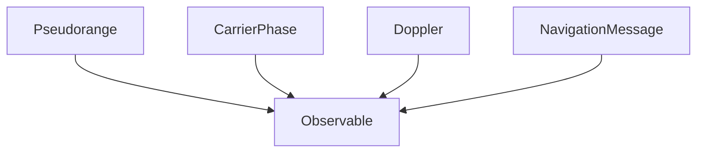

# GNSS -- Global Navigation Satellite System

Models GNSS positioning as two linked taxonomies: the observables produced by a receiver (pseudorange, carrier phase, Doppler, navigation message) and the global constellations (GPS, GLONASS, Galileo, BeiDou, SBAS). Axioms encode the four-satellite 3D-fix requirement, the geometric effect of satellite spread on dilution of precision, and the physical non-negativity of pseudorange. DOP is computed from the geometry matrix H built from satellite elevations and azimuths.

Key references:
- IS-GPS-200 2022: *GPS Interface Specification*
- Groves 2013: *Principles of GNSS, Inertial, and Multisensor Integrated Navigation*, Chapter 8
- Misra & Enge 2011: *Global Positioning System: Signals, Measurements, and Performance*, Chapter 7
- Kaplan & Hegarty 2006: *Understanding GPS/GNSS*

## Entities

**Primary — `GnssObservable` (5):** Observable, Pseudorange, CarrierPhase, Doppler, NavigationMessage

**Secondary — `GnssConstellation` (6):** Constellation, GPS, GLONASS, Galileo, BeiDou, SBAS

## Reasoning: Taxonomy (primary observables)

The `GnssConstellationTaxonomy` is a flat is-a relation from each constellation to `Constellation`.

## Qualities

| Quality | Type | Description |
|---|---|---|
| DilutionOfPrecision | &'static str | Per-observable DOP description — pseudorange vs carrier phase |
| SignalStrength | &'static str | C/N0 in dB-Hz — typical open-sky 35–50 dB-Hz, decode threshold ~25 dB-Hz |

## Axioms (4)

| Axiom | Description | Source |
|---|---|---|
| GnssConstellationTaxonomyIsDAG | GNSS constellation taxonomy is acyclic | structural |
| MinimumSatellites | Four satellites are required for a 3D fix (3 spatial + 1 clock unknown) | IS-GPS-200; Groves 2013 §8.5 |
| DopGeometry | DOP improves with wider satellite angular spread (verified by 5-satellite H^T·H comparison) | Misra & Enge 2011 Chapter 7 |
| PseudorangePositive | Pseudorange is non-negative (signal travel time × speed of light) | IS-GPS-200 |

Plus the auto-generated structural axioms from `define_ontology!` (category laws + observable-taxonomy DAG).

## Functors

No cross-domain functors yet — see [Compose via functor](../../../../../../docs/use/compose-via-functor.md) to add one. The INS/GNSS integration ontology already references GNSS concepts at the coupling level; an explicit GNSS → INS/GNSS functor would formalize that bridge.

## Files

- `ontology.rs` -- `GnssObservable` and `GnssConstellation` entities, taxonomies, qualities, 4 axioms, 4×4 GDOP helper, tests
- `engine.rs` -- `GnssMeasurement`, `GnssSolution`, `GnssSituation`, `GnssAction`, `apply_gnss`
- `tests.rs` -- additional tests beyond `ontology.rs`
- `mod.rs` -- module declarations
