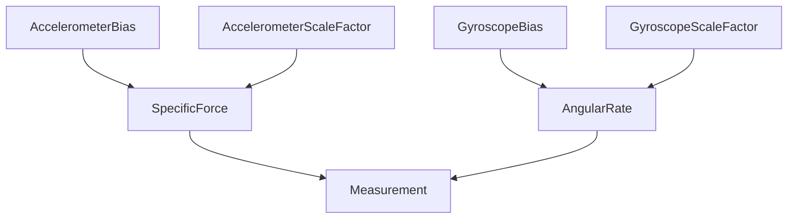

# IMU -- Inertial Measurement Unit

Models the quantities an IMU produces: specific force, angular rate, and the error-term refinements (bias and scale factor) that a strapdown navigator must track. The taxonomy separates the two ideal measurements from their observable error components, and axioms encode the non-obvious specific-force definition (f = a − g, not acceleration) together with the body-frame convention for the gyroscope.

Key references:
- Titterton & Weston 2004: *Strapdown Inertial Navigation Technology*, Chapter 4
- Groves 2013: *Principles of GNSS, Inertial, and Multisensor Integrated Navigation*, Chapter 4
- Savage 2000: *Strapdown Analytics*

## Entities (7)

| Category | Entities |
|---|---|
| Abstract (1) | Measurement |
| Ideal (2) | SpecificForce, AngularRate |
| Error terms (4) | AccelerometerBias, GyroscopeBias, AccelerometerScaleFactor, GyroscopeScaleFactor |

## Reasoning: Taxonomy

Error terms are is-a of the ideal measurement they corrupt.

## Qualities

| Quality | Type | Description |
|---|---|---|
| MeasurementUnit | &'static str | SI unit per measurement (m/s² for force, rad/s for rate, dimensionless ppm for scale factors) |

## Axioms (3)

| Axiom | Description | Source |
|---|---|---|
| BiasIsAMeasurement | Accelerometer bias is-a specific force measurement (an error in that quantity) | Titterton & Weston 2004 |
| SpecificForceDefinition | Specific force = acceleration − gravity; at rest, accelerometer reads −g | Groves 2013 Eq. 4.1 |
| GyroscopeBodyFrame | Gyroscope measures angular rate in the body frame | Titterton & Weston 2004 Chapter 4 |

Plus the auto-generated structural axioms from `define_ontology!` (category laws + IMU-taxonomy DAG).

## Functors

No cross-domain functors yet — see [Compose via functor](../../../../../../docs/use/compose-via-functor.md) to add one. Natural targets: the sensor-fusion sensor ontology (which already classifies `Accelerometer`, `Gyroscope`, and composite `IMU`) and the AHRS / INS-GNSS ontologies that consume IMU output.

## Files

- `ontology.rs` -- `ImuMeasurement` entity, taxonomy, `MeasurementUnit` quality, 3 axioms, tests
- `strapdown.rs` -- `NavState`, `ImuSample`, `gravity_ned`, `filter_imu_sample`, `mechanize` (strapdown mechanization)
- `engine.rs` -- `InsSituation`, `InsAction`, `apply_ins` transition function
- `tests.rs` -- additional tests beyond `ontology.rs`
- `mod.rs` -- module declarations
