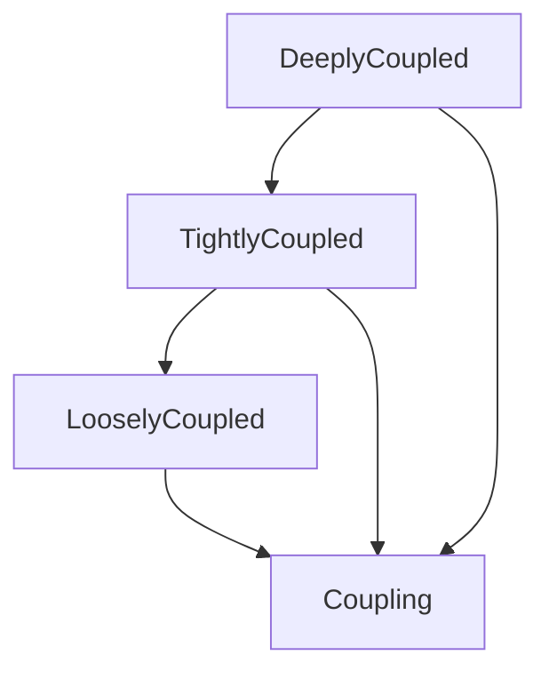

# INS/GNSS -- Integrated Inertial and Satellite Navigation

Models the three classical coupling architectures for combining an Inertial Navigation System with GNSS (loosely, tightly, deeply coupled) together with the system-level operating modes (navigation, coasting, reacquired, initializing). The coupling taxonomy orders the architectures by integration depth: each tighter level extends the looser one, reflecting the literature's progression in which richer INS/GNSS interfaces trade complexity for better performance in degraded environments.

Key references:
- Groves 2013: *Principles of GNSS, Inertial, and Multisensor Integrated Navigation*, Chapters 14–17
- Titterton & Weston 2004: *Strapdown Inertial Navigation Technology*, Chapter 13
- Brown & Hwang 2012: *Introduction to Random Signals and Applied Kalman Filtering*, Chapter 5

## Entities

**Primary — `CouplingLevel` (4):** Coupling, LooselyCoupled, TightlyCoupled, DeeplyCoupled

**Secondary — `InsGnssState` (5):** State, NavigationMode, Coasting, GnssReacquired, Initializing

## Reasoning: Taxonomy (primary coupling levels)

The `InsGnssStateTaxonomy` is a flat is-a relation from each mode to `State`.

## Qualities

| Quality | Type | Description |
|---|---|---|
| ErrorStateDescription | &'static str | Typical error-state dimension per coupling level (15-state loose, 17-state tight, 17+ deep) |
| CouplingBandwidth | &'static str | Bandwidth of corrections — 1–10 Hz (loose/tight) to 100+ Hz (deep) |

## Axioms (4)

| Axiom | Description | Source |
|---|---|---|
| InsGnssStateTaxonomyIsDAG | INS/GNSS operating-state taxonomy is acyclic | structural |
| CoastingDegrades | Without GNSS, INS position error grows quadratically from accelerometer bias | Groves 2013 Eq. 14.1 |
| GnssUpdateReducesError | A valid GNSS measurement update decreases (scalar) position uncertainty | Brown & Hwang 2012 Chapter 5 |
| TighterCouplingBetter | Tighter coupling extends looser coupling (tight is-a loose, deep is-a tight) | Groves 2013 §14.5 |

Plus the auto-generated structural axioms from `define_ontology!` (category laws + coupling-taxonomy DAG).

## Functors

No cross-domain functors yet — see [Compose via functor](../../../../../../docs/use/compose-via-functor.md) to add one. Natural targets: the IMU and GNSS ontologies (which supply the raw measurements) and the sensor-fusion state ontology (which formalizes the Kalman filter structure invoked by `GnssUpdateReducesError`).

## Files

- `ontology.rs` -- `CouplingLevel` and `InsGnssState` entities, coupling taxonomy, state taxonomy, qualities, 4 axioms, tests
- `coupling.rs` -- `CouplingMode`, `coasting_position_error`, `scalar_kalman_gain`, `scalar_kalman_update` helpers
- `engine.rs` -- `InsGnssSituation`, `InsGnssAction`, `apply_ins_gnss`
- `tests.rs` -- additional tests beyond `ontology.rs`
- `mod.rs` -- module declarations
