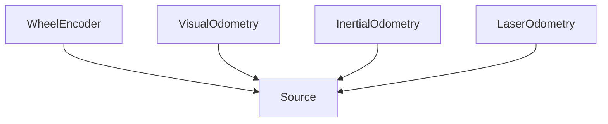

# Odometry -- Dead reckoning from motion sensors

Models the sources of relative-motion information available to a mobile platform — wheel encoders, visual odometry, inertial odometry, laser odometry — and the state components they estimate (position, heading, velocity). The axioms encode the fundamental limitation of dead reckoning: error accumulates without bound because odometry measures change rather than absolute pose, and physical effects such as wheel slip corrupt individual sources.

Key references:
- Borenstein, Everett, Feng 1996: *Where Am I? Sensors and Methods for Mobile Robot Positioning*
- Thrun, Burgard, Fox 2005: *Probabilistic Robotics*, Chapter 5
- Scaramuzza & Fraundorfer 2011: *Visual Odometry* (IEEE RAM)

## Entities

**Primary — `OdometrySource` (5):** Source, WheelEncoder, VisualOdometry, InertialOdometry, LaserOdometry

**Secondary — `OdometryState` (4):** State, Position2D, Heading, Velocity

## Reasoning: Taxonomy (primary sources)

The `OdometryStateTaxonomy` is a flat is-a relation from each state component to `State`.

## Qualities

| Quality | Type | Description |
|---|---|---|
| DriftRate | &'static str | Per-source error growth — wheel 1–5%, visual 0.5–2%, inertial O(t³), laser 0.5–1% |
| UpdateRate | &'static str | Per-source update rate — wheel ~100 Hz, visual ~30 Hz, inertial 200–400 Hz, laser 10–20 Hz |

## Axioms (4)

| Axiom | Description | Source |
|---|---|---|
| OdometryStateTaxonomyIsDAG | Odometry state taxonomy is acyclic | structural |
| DriftIsUnbounded | Odometry error grows without bound (no absolute reference) | Thrun et al. 2005 §5.4 |
| RelativeMotionOnly | Odometry measures change in position, not absolute position | Borenstein et al. 1996 |
| SlipCorruptsWheelOdometry | Wheel slip corrupts encoder-based distance estimates | Borenstein et al. 1996 §3.2 |

Plus the auto-generated structural axioms from `define_ontology!` (category laws + source-taxonomy DAG).

## Functors

No cross-domain functors yet — see [Compose via functor](../../../../../../docs/use/compose-via-functor.md) to add one. Odometry is a natural source for both the SLAM and sensor-fusion state ontologies; explicit functors would express dead-reckoning as a restricted state-estimation problem.

## Files

- `ontology.rs` -- `OdometrySource` and `OdometryState` entities, taxonomies, qualities, 4 axioms, tests
- `engine.rs` -- `OdometryPose`, `OdometrySituation`, `OdometryAction`, `apply_odometry` transition function
- `tests.rs` -- additional tests beyond `ontology.rs`
- `mod.rs` -- module declarations
