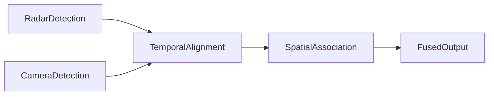

# Radar-Camera -- Fusion Pipeline Ontology

Models the radar+camera sensor-fusion pipeline as a category whose objects are the five pipeline stages (two modality-specific inputs, temporal alignment, spatial association, fused output) and whose morphisms are the valid pipeline transitions plus their transitive closures. Both modalities must reach temporal alignment before fusion, and the fused output is a terminal (absorbing) stage.

Key references:
- Nobis, Geisslinger, Weber, Betz & Lienkamp 2019: *A Deep Learning-based Radar and Camera Sensor Fusion Architecture*
- Chadwick, Maddern & Newman 2019: *Distant Vehicle Detection Using Radar and Vision*

## Entities (5)

| Category | Entities |
|---|---|
| Pipeline stages (5) | RadarDetection, CameraDetection, TemporalAlignment, SpatialAssociation, FusedOutput |

## Pipeline

Category: `RadarCameraCategory`. Forward morphisms only, with transitive closures. `FusedOutput` has no outgoing non-identity morphisms.

## Qualities

| Quality | Type | Description |
|---|---|---|
| StageDescription | &'static str | Natural-language description of each pipeline stage |

## Axioms

| Axiom | Description | Source |
|---|---|---|
| BothModalitiesRequired | Both radar and camera detections must feed into temporal alignment | Nobis et al. 2019 |
| FusedOutputIsTerminal | Fused output is the terminal (absorbing) stage of the pipeline | Nobis et al. 2019 |
| (structural) | Identity and composition laws over the RadarCameraCategory | auto-generated |

## Functors

No cross-domain functors yet — see [Compose via functor](../../../../../../docs/use/compose-via-functor.md) to add one.

## Files

- `ontology.rs` -- `RadarCameraStage`, `RadarCameraStep`, `RadarCameraCategory`, pipeline axioms
- `engine.rs` -- fusion engine used by tests
- `tests.rs` -- additional tests beyond `ontology.rs`
- `mod.rs` -- module declarations
