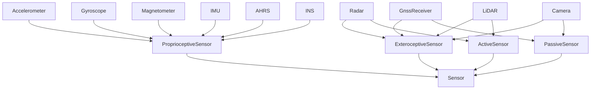
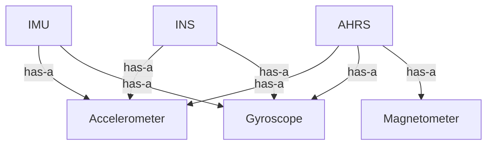

# Sensor -- Sensor taxonomy and composition

Models the sensors a fusion system can use as a double-classified taxonomy: every sensor is either proprioceptive (measures internal state) or exteroceptive (measures the environment), and independently either active (emits energy and measures return) or passive (measures ambient energy). A small mereology records that composite sensors (IMU, AHRS, INS) are built from accelerometers, gyroscopes, and magnetometers, expressing the has-a structure alongside the is-a one.

Key references:
- Groves 2013: *Principles of GNSS, Inertial, and Multisensor Integrated Navigation*, Chapter 1
- Bar-Shalom, Li, Kirubarajan 2001: *Estimation with Applications to Tracking and Navigation*, Chapter 1
- Everett 1995: *Sensors for Mobile Robots*

## Entities (24)

| Category | Entities |
|---|---|
| Abstract (5) | Sensor, ProprioceptiveSensor, ExteroceptiveSensor, ActiveSensor, PassiveSensor |
| Inertial (3) | Accelerometer, Gyroscope, Magnetometer |
| Position / stellar (2) | GnssReceiver, StarTracker |
| Range (3) | Radar, LiDAR, Sonar |
| Vision (3) | Camera, InfraredCamera, DepthCamera |
| Pressure (2) | Barometer, DepthSensor |
| Velocity (1) | DopplerVelocityLog |
| Composite (3) | IMU, AHRS, INS |

## Reasoning: Taxonomy (selected)

Sensors such as `Radar`, `LiDAR`, and `Sonar` participate in both the extero/proprio axis and the active/passive axis via multiple is-a edges.

## Reasoning: Mereology

## Qualities

| Quality | Type | Description |
|---|---|---|
| IsProprioceptive | bool | `true` iff the sensor is-a `ProprioceptiveSensor` in the taxonomy |

## Axioms (4)

| Axiom | Description | Source |
|---|---|---|
| AccelerometerIsSensor | Accelerometer is-a Sensor (transitive via ProprioceptiveSensor) | structural |
| ImuComposition | IMU has-a Accelerometer and has-a Gyroscope | Groves 2013 Chapter 4 |
| RadarDualClassification | Radar is-a ExteroceptiveSensor AND is-a ActiveSensor | Bar-Shalom et al. 2001 Chapter 1 |
| CameraIsPassive | Camera is-a PassiveSensor and is NOT ActiveSensor | Everett 1995 |

Plus the auto-generated structural axioms from `define_ontology!` (category laws + sensor taxonomy DAG + mereology DAG).

## Functors

No cross-domain functors yet — see [Compose via functor](../../../../../../docs/use/compose-via-functor.md) to add one. This ontology is a natural sink for functors from the IMU, GNSS, celestial, and attitude ontologies, each of which names a subset of these sensor classes.

## Files

- `ontology.rs` -- `SensorOntology`, taxonomy, mereology, `IsProprioceptive` quality, `parts_of` helper, 4 axioms, tests
- `modality.rs` -- `SensorType` enum (24 variants) and its `Entity` implementation
- `model.rs` -- `SensorModel` generic sensor model
- `characteristic.rs` -- `MeasurementDimension`, `SensorCharacteristics`
- `calibration.rs` -- `SensorCalibration` parameters
- `allan_variance.rs` -- `AllanVarianceProfile` (noise characterization)
- `tests.rs` -- additional tests beyond `ontology.rs`
- `mod.rs` -- module declarations
