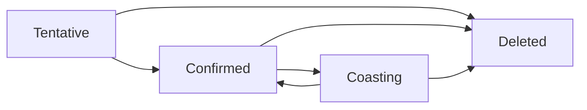

# Multi-Target -- Track Lifecycle Ontology

Models the lifecycle of a radar/sensor track as a category whose objects are the four lifecycle states (Tentative, Confirmed, Coasting, Deleted) and whose morphisms are the valid transitions. `Deleted` is an absorbing state, tracks begin in `Tentative`, and `Coasting` can return to `Confirmed` on re-detection. Composition of transitions is the usual relational composition over a finite state machine.

Key references:
- Bar-Shalom, Li & Kirubarajan 2001: *Estimation with Applications to Tracking and Navigation*, ch. 7
- Blackman & Popoli 1999: *Design and Analysis of Modern Tracking Systems*
- Bar-Shalom, Willett & Tian 2011: *Tracking and Data Fusion*

## Entities (4)

| Category | Entities |
|---|---|
| Track states (4) | Tentative, Confirmed, Coasting, Deleted |

## Lifecycle

Category: `TrackLifecycleCategory`. Morphisms: identities plus the transitions above, with transitive closure (e.g., Tentative → Coasting). `Deleted` is absorbing.

## Qualities

| Quality | Type | Description |
|---|---|---|
| TrackStateDescription | &'static str | Natural-language description of each lifecycle state |

## Axioms

| Axiom | Description | Source |
|---|---|---|
| DeletedIsAbsorbing | Once deleted, a track cannot return to any other state | Blackman & Popoli 1999 |
| TrackStartsTentative | Every track begins in the Tentative state | Bar-Shalom et al. 2001 |
| ReDetectionPossible | A coasting track can return to Confirmed on re-detection | Bar-Shalom et al. 2001 |
| (structural) | Identity and composition laws over the TrackLifecycleCategory | auto-generated |

## Functors

No cross-domain functors yet — see [Compose via functor](../../../../../../docs/use/compose-via-functor.md) to add one.

## Files

- `ontology.rs` -- `TrackState`, `TrackTransition`, `TrackLifecycleCategory`, lifecycle axioms
- `association.rs` -- measurement-to-track association (GNN / JPDA scaffolding)
- `track_management.rs` -- M-of-N confirmation and deletion logic
- `engine.rs` -- multi-target tracking engine used by tests
- `tests.rs` -- additional tests beyond `ontology.rs`
- `mod.rs` -- module declarations
