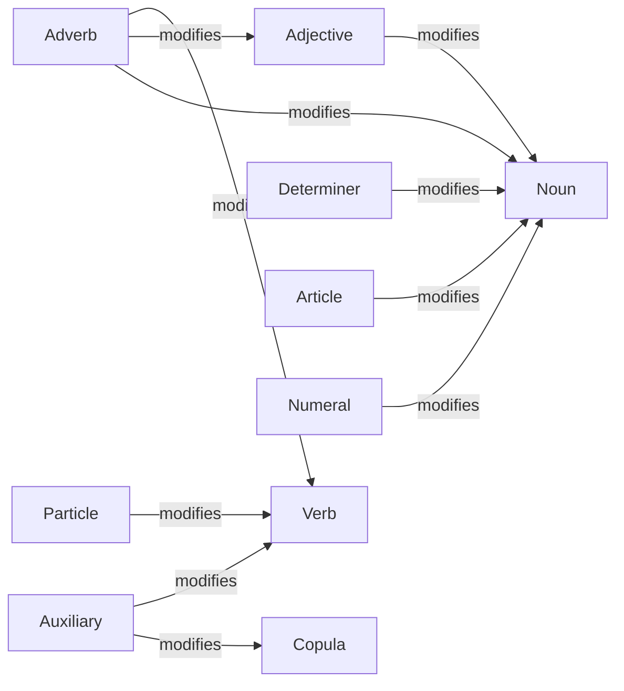

# Lexicon -- Parts-of-Speech and Modification Ontology

Models the lexical category system: parts of speech as entities, modification as the category morphism (e.g., adjective modifies noun, adverb modifies verb). Rich types for each POS (`Noun`, `Verb`, `Determiner`, `Adjective`, `Adverb`, `Preposition`, `Conjunction`, `Pronoun`, `Copula`, `Auxiliary`, `Article`, `Interjection`, `Particle`, `Numeral`) carry their inflectional features (number, person, tense, countability, transitivity, definiteness). Category tags are aligned with OLiA (Ontologies of Linguistic Annotation).

Key references:
- Lambek 1958: *The Mathematics of Sentence Structure* (composition of lexical types)
- Levin 1993: *English Verb Classes and Alternations* (transitivity classes)
- Pustejovsky 1995: *The Generative Lexicon*
- Chiarcos & Sukhareva 2015: *OLiA — Ontologies of Linguistic Annotation* (Semantic Web journal)

## Entities (14)

| Category | Entities |
|---|---|
| Content POS (5) | Noun, Verb, Adjective, Adverb, Interjection |
| Function POS (9) | Determiner, Preposition, Conjunction, Pronoun, Copula, Auxiliary, Article, Particle, Numeral |

Rich types per POS (with inflectional features) live in `pos.rs`; `PosTag` is the thin entity used for category-theoretic operations.

## Modification category

Objects: `PosTag`. Morphisms: `Modifies { modifier, head }`. Identity: self-modification. Composition: `(a modifies b) ∘ (b modifies c) = (a modifies c)` (transitive closure included for Adverb → Adjective → Noun).

## Qualities

| Quality | Type | Description |
|---|---|---|
| IsContentWord | bool | true for Noun/Verb/Adjective/Adverb/Interjection; false for function POS |

Additional POS-level predicates: `is_function`, `is_copula`, `is_auxiliary`, `is_pronoun`, `is_noun`, `is_adjective`, `is_question_forming`.

## Axioms

| Axiom | Description | Source |
|---|---|---|
| (structural) | Identity and composition laws over the LexicalCategory | auto-generated |

## Functors

No cross-domain functors yet — see [Compose via functor](../../../../../../docs/use/compose-via-functor.md) to add one. The lexicon is consumed by `cognitive::linguistics::english` (which assigns `PosTag` via the LMF functor) and by `cognitive::linguistics::lambek::pregroup` (which maps lexical entries to pregroup types).

## Files

- `ontology.rs` -- `Modifies` morphism, `LexicalCategory`, `IsContentWord` quality
- `pos.rs` -- `PosTag` entity plus rich types (`Noun`, `Verb`, `Determiner`, `Adjective`, `Adverb`, `Preposition`, `Conjunction`, `Pronoun`, `Copula`, `Auxiliary`, `Article`, `Interjection`, `Particle`, `Numeral`) and their inflectional features
- `olia.rs` -- OLiA alignment (Chiarcos & Sukhareva 2015) for the function-word categories
- `tests.rs` -- additional tests beyond `ontology.rs`
- `mod.rs` -- module declarations
