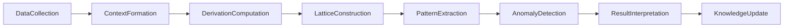

# Analytical Methods -- Structural analysis, Formal Concept Analysis, pipeline

Formalizes the science of analyzing structure in data: methods for extracting patterns, detecting anomalies, and building concept lattices. Not an implementation of analysis — it is the ontology the diagnostic layer reasons over when it performs structural analysis on other ontologies.

Key references:
- Wille 1982: *Restructuring Lattice Theory* (Formal Concept Analysis)
- Ganter & Wille 1999: *Formal Concept Analysis: Mathematical Foundations*
- Birkhoff 1940: *Lattice Theory*

## Entities (19)

| Category | Entities |
|---|---|
| Methods (6) | StructuralAnalysis, PatternAnalysis, StatisticalAnalysis, ComparativeAnalysis, AbsorptionAnalysis, ClusterAnalysis |
| Components (6) | FormalContext, ConceptLattice, GaloisConnection, ObjectSet, AttributeSet, BinaryRelation |
| Outputs (4) | Pattern, Cluster, Anomaly, Invariant |
| Abstract categories (3) | AnalysisMethod, AnalysisComponent, AnalysisOutput |

Plus an 8-step `AnalysisStep` enum for the causation graph.

## Taxonomy (is-a)

```mermaid
graph TD
    StructuralAnalysis --> AnalysisMethod
    PatternAnalysis --> AnalysisMethod
    StatisticalAnalysis --> AnalysisMethod
    ComparativeAnalysis --> AnalysisMethod
    AbsorptionAnalysis --> AnalysisMethod
    ClusterAnalysis --> AnalysisMethod
    FormalContext --> AnalysisComponent
    ConceptLattice --> AnalysisComponent
    GaloisConnection --> AnalysisComponent
    ObjectSet --> AnalysisComponent
    AttributeSet --> AnalysisComponent
    BinaryRelation --> AnalysisComponent
    Pattern --> AnalysisOutput
    Cluster --> AnalysisOutput
    Anomaly --> AnalysisOutput
    Invariant --> AnalysisOutput
```

## Causal Graph (analysis pipeline)

## Opposition Pairs

| Pair | Meaning |
|---|---|
| StructuralAnalysis / StatisticalAnalysis | Different lenses on data: structure vs distribution |
| Pattern / Anomaly | What you find: regular vs irregular |

## Qualities

| Quality | Type | Description |
|---|---|---|
| IsAutomatable | bool | StructuralAnalysis, PatternAnalysis, StatisticalAnalysis, ClusterAnalysis = true; ComparativeAnalysis, AbsorptionAnalysis = false |
| RequiresHumanJudgment | bool | ComparativeAnalysis, AbsorptionAnalysis = true; others = false |
| Complexity | ComplexityClass | StatisticalAnalysis = Linear; PatternAnalysis/ClusterAnalysis/ComparativeAnalysis/AbsorptionAnalysis = Quadratic; StructuralAnalysis = Exponential |

## Axioms

| Axiom | Description | Source |
|---|---|---|
| DataCollectionCausesKnowledgeUpdate | Data collection transitively causes knowledge update (full pipeline) | structural |
| GaloisConnectionIsComponent | Galois connection is classified as an analysis component | Wille 1982 / Ganter & Wille 1999 |
| PatternAndAnomalyAreOutputs | Pattern and anomaly are both analysis outputs | structural |
| SomeMethodsAutomatableSomeNot | Some methods are automatable and some require human judgment | quality split |

Plus the auto-generated structural axioms from `define_ontology!` (category laws on the dense category, the taxonomy, and the causal graph).

## Functors

No cross-domain functors yet — see [Compose via functor](../../../../../docs/use/compose-via-functor.md) to add one. Analytical methods is a reasoning substrate that ontology_diagnostics composes against informally.

## Files

- `ontology.rs` -- `AnalyticalEntity`, `AnalysisStep`, taxonomy/causation/opposition, qualities, axioms, tests
- `mod.rs` -- module declarations
