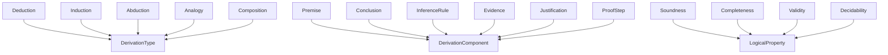

# Derivation -- Logical derivation and proof construction

Formalizes the science of building logical chains: types of inference (deduction, induction, abduction, analogy, composition), proof components (premise, conclusion, rule, evidence, justification, step), and logical properties (soundness, completeness, validity, decidability). This is the pure-science ontology of derivation — not a theorem prover. It is the reasoning that ontology_diagnostics uses when constructing proof chains for axiom verification.

Key references:
- Gentzen 1935: *Untersuchungen über das logische Schließen* (natural deduction, sequent calculus)
- Prawitz 1965: *Natural Deduction* (normalization)
- Martin-Löf 1984: *Intuitionistic Type Theory*
- Peirce 1903: abductive inference (inference to the best explanation)

## Entities (18)

| Category | Entities |
|---|---|
| Types of derivation (5) | Deduction, Induction, Abduction, Analogy, Composition |
| Components (6) | Premise, Conclusion, InferenceRule, Evidence, Justification, ProofStep |
| Properties (4) | Soundness, Completeness, Validity, Decidability |
| Abstract categories (3) | DerivationType, DerivationComponent, LogicalProperty |

Plus an 8-step `DerivationStep` enum for the causation graph.

## Taxonomy (is-a)

## Causal Graph (derivation pipeline)

## Opposition Pairs

| Pair | Meaning |
|---|---|
| Deduction / Abduction | Certain → certain vs uncertain → plausible |
| Soundness / Completeness | All proved are true vs all true are provable |

## Qualities

| Quality | Type | Description |
|---|---|---|
| IsMonotonic | bool | Deduction, Composition = true; Induction, Abduction, Analogy = false |
| PreservesTruth | bool | Deduction, Composition = true; Induction, Abduction, Analogy = false |
| RequiresAllPremises | bool | Deduction, Composition = true; Induction, Abduction, Analogy = false |

## Axioms

| Axiom | Description | Source |
|---|---|---|
| PremiseCausesKnowledge | Premise establishment transitively causes knowledge extension | structural |
| DeductionMonotonicAbductionNot | Deduction is monotonic, abduction is not | Gentzen 1935 / Peirce 1903 |
| DeductionPreservesTruthInductionNot | Deduction preserves truth, induction does not (deductive vs ampliative) | standard |
| DeductionRequiresAllAbductionNot | Deduction requires all premises; abduction works with incomplete evidence | Peirce 1903 |

Plus the auto-generated structural axioms from `define_ontology!` (category laws on the dense category, the taxonomy, and the causal graph).

## Functors

No cross-domain functors yet — see [Compose via functor](../../../../../docs/use/compose-via-functor.md) to add one. Derivation is a reasoning substrate for other ontologies' axiom-verification layers.

## Files

- `ontology.rs` -- `DerivationEntity`, `DerivationStep`, taxonomy/causation/opposition, qualities, axioms, tests
- `mod.rs` -- module declarations
