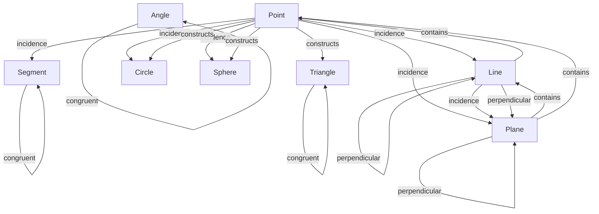

# Geometry -- Euclidean Geometry Ontology

Models the primitive notions and derived objects of three-dimensional Euclidean geometry, with metric-space, vector-space, and Hilbert-style axioms verified at test time. The category structure follows Hilbert's groups: incidence, betweenness, congruence, parallelism, perpendicularity, plus containment and construction.

Key references:
- Hilbert 1899: *Grundlagen der Geometrie* (the primitive notions and the four groups)
- Avigad et al. 2009: *A Formal System for Euclid's Elements* (formalization approach)
- Kahan: *Axioms for Fields and Vector Spaces* (vector-space axiomatization)

## Entities (10)

| Category | Entities |
|---|---|
| Hilbert primitives (3) | Point, Line, Plane |
| Linear constructs (3) | Ray, Segment, Vector |
| Planar constructs (3) | Angle, Triangle, Circle |
| Spatial constructs (1) | Sphere |

## Relation kinds (7)

| Kind | Hilbert group | Meaning |
|---|---|---|
| Incidence | Group I | A point lies on a line/plane, a line lies in a plane |
| Betweenness | Group II | A point lies between two others on a line |
| Congruence | Group III | Segments, angles, or triangles are congruent |
| Parallelism | Group IV | Lines that do not intersect |
| Perpendicularity | — | Lines/planes meeting at right angles |
| Containment | — | One object contains another (plane contains line) |
| Construction | — | One object is defined from another (triangle from points) |

## Category structure

The transitive closure adds `Point → Plane` (a point on a line that lies in a plane is in that plane).

## Qualities

| Quality | Type | Description |
|---|---|---|
| Dimension | usize | Topological dimension: Point=0, Line/Ray/Segment/Vector=1, Plane/Triangle/Circle/Sphere=2, Angle=0 (scalar) |
| DegreesOfFreedom | usize | Free parameters in 3D: Point=3, Line=4, Ray=5, Segment=6, Plane=3, Angle=1, Triangle=9, Circle=4, Sphere=4, Vector=3 |

## Axioms (13)

| Axiom | Description | Source |
|---|---|---|
| MetricNonNegativity | d(a,b) ≥ 0 | metric space |
| MetricIdentity | d(a,b) = 0 iff a = b | metric space |
| MetricSymmetry | d(a,b) = d(b,a) | metric space |
| TriangleInequality | d(a,c) ≤ d(a,b) + d(b,c) | metric space |
| TriangleAngleSum | Triangle interior angles sum to π | Euclidean theorem |
| PythagoreanTheorem | a² + b² = c² for right triangles | Euclidean theorem |
| VectorAdditionCommutativity | u + v = v + u | vector space |
| VectorAdditionAssociativity | (u+v)+w = u+(v+w) | vector space |
| DotProductCommutativity | a · b = b · a | inner product |
| CrossProductAnticommutativity | a × b = −(b × a) | cross product |
| CrossProductPerpendicularity | (a × b) · a = 0 | cross product |
| ProjectionIdempotent | proj(proj(v)) = proj(v) | projection |
| BetweennessSymmetry | If B is between A and C, B is also between C and A | Hilbert II |

Plus the auto-generated structural axioms from `define_ontology!` (category laws for the kinded relation graph).

## Functors

No cross-domain functors yet — see [Compose via functor](../../../../../docs/use/compose-via-functor.md) to add one. Geometry is a foundational ontology that other domains (rotation, rigid motion, control theory) compose against; the functors will land as those other domains gain explicit geometric morphisms.

## Files

- `ontology.rs` -- Entity, kinded relation graph, qualities, 13 axioms, tests
- `point.rs` -- `Point3` type and metric distance
- `vector.rs` -- `Vec3` type and vector-space operations
- `line.rs` -- `Line` type
- `plane.rs` -- `Plane` type
- `angle.rs` -- `Angle` type
- `distance.rs` -- distance functions between primitives
- `projection.rs` -- vector projection operations
- `shape.rs` -- `Triangle` and other planar/spatial shapes
- `tests.rs` -- additional tests beyond `ontology.rs`
- `mod.rs` -- module declarations
