# Artifact Identity -- How external artifacts carry their identity

A meta ontology for the schemes pr4xis uses to trust upstream data sources. Grounded in four distinct families of identity mechanism, each with its own literature and trust model.

The key insight: many data sources already declare their own version or hash internally — pr4xis respects whatever the upstream provides rather than hand-maintain a duplicate hash in source code. WordNet LMF has `<Lexicon version="2025">` as a mandatory attribute; that IS the identity, and an `XmlElementAttribute` extractor reads it directly.

Key references:
- Dolstra 2006: *The Purely Functional Software Deployment Model* — fixed-output derivations, content-addressed store (grounds `ContentHash::RawHash`)
- Benet 2014: *IPFS — Content Addressed, Versioned, P2P File System* (grounds `ContentHash::IpfsCid`)
- W3C Subresource Integrity 2016 — hash-verified external resources in HTTP
- Wilkinson et al. 2016: *The FAIR Guiding Principles* (Scientific Data 3:160018) — F1 requires a globally unique persistent identifier
- RFC 4880 — OpenPGP Message Format (grounds `CryptographicSignature::OpenPgp`)
- ISO 26324:2022 — Digital object identifier system (grounds `PersistentIdentifier::Doi`)
- W3C OWL 2 Structural Specification §3.5 — ontology versioning (grounds `SelfDescribingMetadata::OwlVersionIri`)
- ISO 15836-1:2017 — Dublin Core Terms (grounds `DctIdentifier`)
- Global WordNet Association WN-LMF 1.3 — `<Lexicon version>` attribute
- FIPS 180-4 — SHA-2 family specification

## Entities (25)

25 concepts organized in a three-level taxonomy: root → 4 families → 20 leaves.

| Category | Entities |
|---|---|
| Root (1) | Identity |
| Families (4) | CryptographicSignature, ContentHash, PersistentIdentifier, SelfDescribingMetadata |
| CryptographicSignature leaves (6) | OpenPgp, SigstoreAttestation, SshSignature, Minisign, X509Signature, Ed25519Raw |
| ContentHash leaves (5) | RawHash, GitObjectSha, IpfsCid, NixStorePath, BittorrentInfoHash |
| PersistentIdentifier leaves (4) | Doi, Handle, Ark, Purl |
| SelfDescribingMetadata leaves (5) | OwlVersionIri, OwlVersionInfo, DctIdentifier, XmlElementAttribute, XmlSchemaVersion |

## Taxonomy (is-a)

```mermaid
graph TD
    CryptographicSignature --> Identity
    ContentHash --> Identity
    PersistentIdentifier --> Identity
    SelfDescribingMetadata --> Identity

    OpenPgp --> CryptographicSignature
    SigstoreAttestation --> CryptographicSignature
    SshSignature --> CryptographicSignature
    Minisign --> CryptographicSignature
    X509Signature --> CryptographicSignature
    Ed25519Raw --> CryptographicSignature

    RawHash --> ContentHash
    GitObjectSha --> ContentHash
    IpfsCid --> ContentHash
    NixStorePath --> ContentHash
    BittorrentInfoHash --> ContentHash

    Doi --> PersistentIdentifier
    Handle --> PersistentIdentifier
    Ark --> PersistentIdentifier
    Purl --> PersistentIdentifier

    OwlVersionIri --> SelfDescribingMetadata
    OwlVersionInfo --> SelfDescribingMetadata
    DctIdentifier --> SelfDescribingMetadata
    XmlElementAttribute --> SelfDescribingMetadata
    XmlSchemaVersion --> SelfDescribingMetadata
```



## Opposition Pairs

| Pair | Meaning |
|---|---|
| ContentHash / PersistentIdentifier | Offline (cryptographic) vs online (resolver-dependent) verification |
| ContentHash / SelfDescribingMetadata | Strong (cryptographic) vs weak (source self-asserts) trust |
| CryptographicSignature / SelfDescribingMetadata | Strong (attested) vs weak (self-asserted) trust |

## Qualities

| Quality | Type | Description |
|---|---|---|
| TrustTierOf | `TrustTier` enum | Strong (Signature, Hash) / Resolver (PID) / Declarative (SelfDescribing) / NotApplicable (families/root) |
| VerifiabilityOffline | bool | Whether the scheme can verify without network access |

## Axioms

| Axiom | Description | Source |
|---|---|---|
| EverySchemeHasAnExtractor | Every leaf `IdentityConcept` has a defined extractor function | structural |
| ExtractorIsDeterministic | Every extractor is a pure function of its input bytes | structural + proptest |
| VerificationFailClosed | Verification failures reject the artifact — never fail open | security principle |
| CompositeRequiresAll | CompositeIdentity verifies only when every claim verifies | structural |
| ContentHashIsInjective | Content hash schemes are injective under collision-resistant algorithms | Dolstra 2006 §4 |
| ContentHashIsOffline | Content hash schemes are always verifiable offline | trust-tier definition |
| PersistentIdentifierRequiresResolver | PIDs require network access to a resolver | ISO 26324, RFC 3650 |
| SelfDescribingIsWeakestTrust | Self-describing metadata is the weakest trust tier (Declarative) | trust-tier definition |

Plus the auto-generated structural axioms from `define_ontology!` (category laws, taxonomy NoCycles).

## Scope of the initial implementation

**Real extractors (2):**
- `RawHash` with `Sha256` in the `ContentHash` family — uses `sha2` crate, bit-for-bit verification
- `XmlElementAttribute` in the `SelfDescribingMetadata` family — wraps the existing `xml_reader::read_xml` to parse the XML and confirm an element's attribute matches

**Stubbed extractors (18):** the other 18 leaves return `Unverifiable { reason: "not yet implemented" }` until their real implementations land. Tracked follow-ups:
- Sigstore: [issue #70](https://github.com/i-am-logger/pr4xis/issues/70)
- Others: one follow-up PR per leaf

The axiom `VerificationFailClosed` ensures stubbed schemes never silently accept an artifact; they always reject.

## Composite identity — the WordNet use case

`applied/data_provisioning/` registers WordNet with **both** a `RawHash` and an `XmlElementAttribute` claim, wrapped in `CompositeIdentity`:

```rust
CompositeIdentity(vec![
    IdentityClaim {
        concept: IdentityConcept::XmlElementAttribute,
        data: ClaimData::XmlAttribute {
            element: "Lexicon",
            attribute: "version",
            expected: "2025".into(),
        },
    },
    IdentityClaim {
        concept: IdentityConcept::RawHash,
        data: ClaimData::Sha256("...".into()),
    },
])
```

Both must verify (`CompositeRequiresAll`). So WordNet gets self-description ("the upstream says it's 2025") AND cryptographic integrity ("the bytes match the declared sha256").

## Functors

No cross-domain functors yet — see [Compose via functor](../../../../../../docs/use/compose-via-functor.md) to add one. This is a meta ontology that other ontologies (notably `applied/data_provisioning/`) compose against.

## Files

- `ontology.rs` -- Entity enum (25 concepts), define_ontology! with three-level taxonomy, ClaimData, IdentityClaim, VerificationResult, qualities, 8 domain axioms
- `schemes/mod.rs` -- module list of per-leaf extractors
- `schemes/raw_hash.rs` -- real sha2 verification for the `RawHash` leaf
- `schemes/xml_element_attribute.rs` -- real XML attribute extractor for the `XmlElementAttribute` leaf
- `schemes/openpgp.rs` .. `schemes/ed25519_raw.rs` -- 6 CryptographicSignature stubs
- `schemes/bittorrent_info_hash.rs` .. `schemes/nix_store_path.rs` -- 4 ContentHash stubs
- `schemes/ark.rs` .. `schemes/purl.rs` -- 4 PersistentIdentifier stubs
- `schemes/dct_identifier.rs` .. `schemes/xml_schema_version.rs` -- 4 SelfDescribingMetadata stubs
- `tests.rs` -- 30 tests: category laws, entity counts, taxonomy walks, family-level axioms, real extractor unit tests, 3 proptest properties
- `papers/` -- vendored source PDFs (Dolstra 2006, plus more to add)
- `README.md` -- this file
- `citings.md` -- per-ontology bibliography
- `mod.rs` -- module declarations
