# Ontology Diagnostics (Meta-Ontology)

A meta-level ontology that formalizes the gap detection methodology itself
as a domain. This ontology treats ontology engineering -- the process of
building, connecting, and diagnosing scientific ontologies -- as a subject
of formal analysis.

This is the only domain with no outgoing functors to other science domains.
Instead, it encodes the methodology that produces and validates all the
other domains and their connections.

## Structure

| Component | Count |
|---|---|
| Entities | 29 |
| Methodology steps (causal events) | 14 |
| Taxonomy relations | 25 |
| Axioms | 13 |
| Opposition pairs | 4 |
| Qualities | 4 (IsAutoDetectable, PreservesFunctorValidity, SuggestedForLossLevel, IsAutomated) |

## Entity Taxonomy

```mermaid
graph TD
    Structure --> DomainOntology
    Structure --> CategoryStructure
    Structure --> TaxonomyStructure
    Structure --> CausalStructure
    Structure --> QualityStructure
    Structure --> AxiomSet
    Connection --> Functor
    Connection --> Adjunction
    Connection --> UnitMorphism
    Connection --> CounitMorphism
    Connection --> NaturalTransformation
    Adjunction --> UnitMorphism
    Adjunction --> CounitMorphism
    Gap --> UnitGap
    Gap --> CounitGap
    Gap --> GranularityMismatch
    Gap --> MissingDistinction
    Gap --> InformationLoss
    Gap --> CanonicalRepresentative
    Resolution --> ContextResolution
    Resolution --> OntologyEnrichment
    Resolution --> IntermediateDomain
    Resolution --> GranularityRefinement
    Verification --> LiteratureVerification
    Verification --> MachineProof
    Verification --> PropertyTest
```

## Methodology Pipeline (Causal Graph)

```mermaid
graph LR
    FormalizeDomains --> ConstructFunctors
    ConstructFunctors --> VerifyFunctorLaws
    VerifyFunctorLaws --> ConstructAdjunction
    ConstructAdjunction --> ComputeUnit
    ConstructAdjunction --> ComputeCounit
    ComputeUnit --> DetectGaps
    ComputeCounit --> DetectGaps
    DetectGaps --> ClassifyGaps
    DetectGaps --> ComputeLossRatios
    ClassifyGaps --> ProposeResolution
    ComputeLossRatios --> ProposeResolution
    ProposeResolution --> VerifyAgainstLiterature
    VerifyAgainstLiterature --> ImplementResolution
    ImplementResolution --> RunMachineProofs
    RunMachineProofs --> AssessImprovement
```

## Opposition Pairs

| Entity A | Entity B | Semantic contrast |
|---|---|---|
| Gap | Resolution | Problem vs solution |
| UnitGap | CounitGap | Forward vs backward round-trip failure |
| MachineProof | LiteratureVerification | Automated vs manual verification |
| ContextResolution | OntologyEnrichment | Non-destructive vs potentially destructive fix |

## Key Axioms

- **PipelineIsComplete**: the full pipeline from FormalizeDomains to AssessImprovement is transitively connected
- **GapDetectionRequiresBothDirections**: detecting all gaps requires computing both unit and counit
- **LiteratureBeforeImplementation**: literature verification occurs after proposal, before implementation
- **MostGapsAreAutoDetectable**: 5 of 6 gap types are automatically detectable by adjunction analysis
- **ContextResolutionPreservesFunctors**: context resolution adds distinctions without breaking existing functors
- **EnrichmentMayBreakFunctors**: ontology enrichment (adding new entities) may invalidate existing functors
- **HighLossSuggestsIntermediateDomain**: >80% loss ratio suggests the two domains need an intermediate domain
- **EveryAdjunctionHasGaps**: every adjunction between domains at different scales has gaps (empirical, proven by gap_analysis.rs across 3 adjunctions)

## Loss Threshold Classification

| Resolution type | Loss level | When to use |
|---|---|---|
| GranularityRefinement | Low (<40%) | Minor collapse, refine within existing structure |
| ContextResolution | Moderate (40-80%) | Moderate collapse, add disambiguating context |
| IntermediateDomain | High (>80%) | Severe collapse, domains too far apart in granularity |

## Methodological ideas encoded

This meta-ontology encodes several methodological ideas:

1. **Adjunction-based gap detection**: using unit/counit deviation from identity to find missing ontological distinctions
2. **ContextDef resolution**: resolving detected gaps without breaking existing functors
3. **Loss ratio quantification**: measuring information loss as a fraction of collapsing entities
4. **The meta-ontology itself**: formalizing the methodology as a domain subject to the same verification

## References

- Spivak and Kent 2012: ologs as categorical ontologies
- Spivak 2014: functors for cross-domain mapping
- Mac Lane 1971: adjunctions in category theory
- Euzenat and Shvaiko 2013: ontology alignment
- Schlobach and Cornet 2003: ontology debugging
