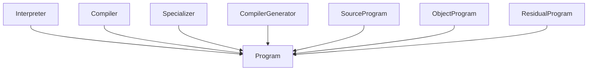
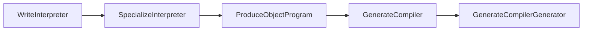

# Staging -- Multi-stage computation and partial evaluation

Models Futamura's partial-evaluation framework as a meta-ontology. The central operator is α (a `Specializer`): given a program π and a static input c, α produces a residual program that accepts only the remaining dynamic input r and returns the same observable result as running π on (c, r) directly.

This ontology unifies several pr4xis patterns as instances of the same `freeze: Dynamic → Static` functor: codegen (partial evaluation at build time), async ontology loading (total evaluation at runtime), report generation (partial evaluation of an interactive visualization), and session archival (freezing a live chat into a static log).

Key references:
- Futamura 1971: *Partial Evaluation of Computation Process — an Approach to a Compiler-Compiler* (Systems, Computers, Controls 2.5) — the paper that introduced the three projections
- Jones, Gomard & Sestoft 1993: *Partial Evaluation and Automatic Program Generation* (Prentice Hall) — book-length treatment
- Taha & Sheard 1997: *Multi-Stage Programming with Explicit Annotations* (PEPM 1997) — the staged-computation lineage

## Entities (10)

| Category | Entities |
|---|---|
| Programs (5) | Program, Interpreter, Compiler, Specializer, CompilerGenerator |
| Artifacts (3) | SourceProgram, ObjectProgram, ResidualProgram |
| Inputs (2) | StaticInput, DynamicInput |

## Taxonomy (is-a)

Every program-like concept — including the artifacts — descends from `Program`. The artifacts are themselves programs (they can be run); the distinction is what role they play in a staging transformation.

## Causation — Futamura's three projections

The chain:
1. Write an interpreter `int`.
2. Apply α to (int, s). By Futamura's Eq. (1): α(int, s)(r) = int(s, r).
3. The residual is an **object program** — this is the **first projection**.
4. Apply α to (α, int). The result is a program that, given any source, produces an object program. This is the **second projection** — a **compiler**.
5. Apply α to (α, α). The result is a program that, given any interpreter, produces a compiler. This is the **third projection** — a **compiler-generator** (cogen).

## Opposition Pairs

| Pair | Meaning |
|---|---|
| StaticInput / DynamicInput | The fundamental dynamic/static axis — the whole ontology is about moving computation between these two sides |
| Interpreter / Compiler | Same semantics, different staging: interpretation keeps everything dynamic, compilation lifts as much as possible to static |

## Qualities

| Quality | Type | Description |
|---|---|---|
| TemporalityTag | `Temporality` enum (Dynamic, Static, Mixed) | `StaticInput` is Static, `DynamicInput` is Dynamic, all program concepts are Mixed |
| StagingLevel | `usize` | Interpreter / SourceProgram / DynamicInput = 0; ObjectProgram / ResidualProgram / StaticInput = 1; Compiler / Specializer = 2; CompilerGenerator = 3 |

## Axioms (5 + structural)

| Axiom | Description | Source |
|---|---|---|
| EveryProgramKindIsAProgram | Every program-like concept descends from Program in the taxonomy | structural prerequisite |
| FutamuraChainIsComplete | The three projections form a connected causal chain from WriteInterpreter to GenerateCompilerGenerator | Futamura 1971 §3 |
| CompilationFollowsSpecialization | Producing an object program is caused by specializing the interpreter (Eq. 2) | Futamura 1971 Eq. (2) |
| EachProjectionRaisesStagingByOne | Each Futamura projection raises the staging level by exactly 1 | Futamura 1971 |
| StaticDynamicPartitionsInputs | Static and dynamic inputs form the only two temporality classes | Futamura 1971 §2 |

Plus the auto-generated structural axioms from `define_ontology!` (category laws, taxonomy NoCycles, causation DAG).

## Property-based tests

Five proptest properties cover the randomized surface:

- `prop_every_concept_has_temporality` — no concept escapes the trichotomy
- `prop_staging_level_bounded` — every concept has a staging level in [0, 3]
- `prop_specialization_raises_level_by_at_most_one` — staging levels never differ by more than the ladder depth
- `prop_futamura_causation_is_well_founded` — the causal graph is acyclic
- `prop_program_like_concepts_are_programs` — taxonomy membership is preserved across random samples

## Where pr4xis already has Futamura instances

| pr4xis pattern | Futamura operation |
|---|---|
| Codegen at build time (e.g. `English::from_wordnet` compiled into a const) | Partial evaluation of the ontology loader with respect to a static dataset — produces a residual loader (const table) |
| Async ontology load at runtime (`scan_themes(path)`) | Total evaluation — no specialization, dynamic and static inputs arrive together at runtime |
| `applied/hmi/report/generator.rs` freezing an interactive visualization to HTML/PDF | Partial evaluation of the report pipeline with respect to a specific point in time |
| Session archive of a live chat into a static log | Freeze the running interpreter state into an immutable transcript |

The `project_async_functor.md` memory ("codegen and async are functors") is the informal version of Futamura's second projection. This ontology is the formal statement.

## Functors

No cross-domain functors yet — see [Compose via functor](../../../../../../docs/use/compose-via-functor.md) to add one. This is a meta-ontology that other ontologies compose against; the functors will land when the `applied/hmi/surfaces/` PDF/print surfaces are added and need to formally name themselves as instances of the freeze functor.

## Files

- `ontology.rs` -- Entity, dense category, taxonomy, causation, opposition, qualities, 5 domain axioms
- `tests.rs` -- 22 unit tests + 5 proptest properties covering category laws, taxonomy, causation, qualities, and all domain axioms
- `papers/` -- local PDFs of cited sources
- `README.md` -- this file
- `citings.md` -- per-ontology bibliography
- `mod.rs` -- module declarations
