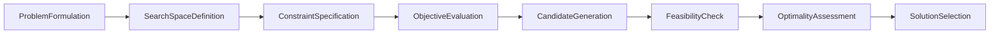

# Optimization -- Finding best configurations under constraints

Formalizes the science of searching solution spaces, evaluating objectives, and characterizing optimal points. Covers six methods (exhaustive search, gradient descent, genetic algorithms, simulated annealing, Pareto optimization, grid search), their components (objective function, constraint, search space, feasible region, optimal point, Pareto front), and the properties of solutions (convergence, local/global optimum, tradeoff).

Key references:
- Boyd & Vandenberghe 2004: *Convex Optimization*
- Pareto 1906: *Manual of Political Economy* (Pareto optimality)
- Holland 1975: *Adaptation in Natural and Artificial Systems* (genetic algorithms)
- Kirkpatrick, Gelatt & Vecchi 1983: *Optimization by Simulated Annealing*

## Entities (19)

| Category | Entities |
|---|---|
| Methods (6) | ExhaustiveSearch, GradientDescent, GeneticAlgorithm, SimulatedAnnealing, ParetoOptimization, GridSearch |
| Components (6) | ObjectiveFunction, Constraint, SearchSpace, FeasibleRegion, OptimalPoint, ParetoFront |
| Properties (4) | Convergence, LocalOptimum, GlobalOptimum, Tradeoff |
| Abstract categories (3) | OptimizationMethod, OptimizationComponent, OptimalityProperty |

Plus an 8-step `OptimizationStep` enum for the causation graph.

## Taxonomy (is-a)

```mermaid
graph TD
    ExhaustiveSearch --> OptimizationMethod
    GradientDescent --> OptimizationMethod
    GeneticAlgorithm --> OptimizationMethod
    SimulatedAnnealing --> OptimizationMethod
    ParetoOptimization --> OptimizationMethod
    GridSearch --> OptimizationMethod
    ObjectiveFunction --> OptimizationComponent
    Constraint --> OptimizationComponent
    SearchSpace --> OptimizationComponent
    FeasibleRegion --> OptimizationComponent
    OptimalPoint --> OptimizationComponent
    ParetoFront --> OptimizationComponent
    Convergence --> OptimalityProperty
    LocalOptimum --> OptimalityProperty
    GlobalOptimum --> OptimalityProperty
    Tradeoff --> OptimalityProperty
```

## Causal Graph (optimization pipeline)

## Opposition Pairs

| Pair | Meaning |
|---|---|
| LocalOptimum / GlobalOptimum | Partial vs complete optimality |
| ExhaustiveSearch / GeneticAlgorithm | Exact (guaranteed) vs heuristic (approximate) |

## Qualities

| Quality | Type | Description |
|---|---|---|
| GuaranteesGlobal | bool | ExhaustiveSearch, GridSearch = true; gradient/genetic/annealing/Pareto = false |
| TimeComplexity | TimeComplexityClass | ExhaustiveSearch, GridSearch = Exponential; GradientDescent, GeneticAlgorithm, SimulatedAnnealing, ParetoOptimization = Polynomial |
| HandlesMultiObjective | bool | ParetoOptimization, GeneticAlgorithm, ExhaustiveSearch, GridSearch = true; GradientDescent, SimulatedAnnealing = false |

## Axioms

| Axiom | Description | Source |
|---|---|---|
| FormulationCausesSolution | Problem formulation transitively causes solution selection | structural |
| ExhaustiveGuaranteesGradientDoesNot | Exhaustive search guarantees global optimum; gradient descent does not | Boyd & Vandenberghe 2004 |
| ExactExponentialHeuristicPolynomial | Exact methods are exponential; heuristic methods are polynomial | complexity theory |
| ParetoMultiObjectiveGradientNot | Pareto optimization handles multi-objective; gradient descent does not | Pareto 1906 |

Plus the auto-generated structural axioms from `define_ontology!` (category laws on the dense category, the taxonomy, and the causal graph).

## Functors

No cross-domain functors yet — see [Compose via functor](../../../../../docs/use/compose-via-functor.md) to add one. Optimization is a reasoning substrate for diagnosis-time search over ontological configurations.

## Files

- `ontology.rs` -- `OptimizationEntity`, `OptimizationStep`, taxonomy/causation/opposition, qualities, axioms, tests
- `mod.rs` -- module declarations
