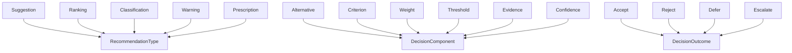
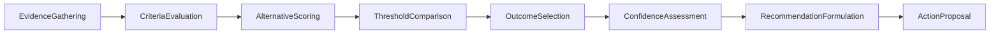

# Recommendation -- Decision-making and ranked suggestions

Formalizes the science of suggesting actions: evaluating alternatives against criteria, assessing confidence, producing ranked recommendations, and selecting outcomes (accept/reject/defer/escalate). This is the ontology that ontology_diagnostics uses when suggesting resolutions — not a recommender system implementation.

Key references:
- Von Neumann & Morgenstern 1944: *Theory of Games and Economic Behavior* (expected utility theory)
- Keeney & Raiffa 1976: *Decisions with Multiple Objectives* (multi-attribute utility theory)
- Multi-Criteria Decision Analysis (MCDA): weighted scoring, threshold comparison

## Entities (18)

| Category | Entities |
|---|---|
| Recommendation types (5) | Suggestion, Ranking, Classification, Warning, Prescription |
| Decision components (6) | Alternative, Criterion, Weight, Threshold, Evidence, Confidence |
| Outcomes (4) | Accept, Reject, Defer, Escalate |
| Abstract categories (3) | RecommendationType, DecisionComponent, DecisionOutcome |

Plus an 8-step `RecommendationStep` enum for the causation graph.

## Taxonomy (is-a)

## Causal Graph (recommendation pipeline)

## Opposition Pairs

| Pair | Meaning |
|---|---|
| Accept / Reject | Proceed vs stop (asymmetric commitment) |
| Suggestion / Warning | Positive (do this) vs cautionary (watch out) |

## Qualities

| Quality | Type | Description |
|---|---|---|
| ConfidenceLevel | ConfidenceLevelValue | Prescription, Classification = High; Ranking, Suggestion = Medium; Warning = Low |
| IsReversible | bool | Accept = false; Reject, Defer, Escalate = true |
| RequiresExpertValidation | bool | Prescription, Warning = true; Suggestion, Ranking, Classification = false |

## Axioms

| Axiom | Description | Source |
|---|---|---|
| EvidenceCausesAction | Evidence gathering transitively causes action proposal | structural |
| AcceptAndRejectAreOutcomes | Accept and reject are both decision outcomes | structural |
| PrescriptionsNeedExperts | Prescriptions require expert validation; suggestions do not | MCDA practice |
| RejectReversibleAcceptNot | Rejection is reversible; acceptance is not (asymmetric commitment) | decision theory |

Plus the auto-generated structural axioms from `define_ontology!` (category laws on the dense category, the taxonomy, and the causal graph).

## Functors

No cross-domain functors yet — see [Compose via functor](../../../../../docs/use/compose-via-functor.md) to add one. Recommendation is a reasoning substrate for diagnostic resolution proposals.

## Files

- `ontology.rs` -- `RecommendationEntity`, `RecommendationStep`, taxonomy/causation/opposition, qualities, axioms, tests
- `mod.rs` -- module declarations
