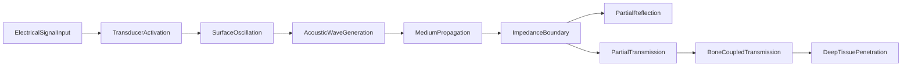

# Acoustics Ontology

Formal ontology of acoustic wave physics for bone conduction therapy,
encoded as category-theoretic structures with machine-verified axioms.

This is the entry point of the full bone conduction chain:
**acoustics -> biophysics -> molecular -> bioelectricity**.

## Structure

| Component | Count |
|---|---|
| Entities | 26 |
| Causal events | 10 |
| Taxonomy relations | 22 |
| Axioms | 10 |
| Opposition pairs | 2 |
| Qualities | 3 (ImpedanceValue, TransmissionEfficiency, FrequencyRange) |

## Entity Taxonomy

```mermaid
graph TD
    WaveProperty --> SoundWave
    WaveProperty --> AcousticPressure
    WaveProperty --> AcousticIntensity
    WaveProperty --> AcousticFrequency
    WaveProperty --> AcousticWavelength
    WaveProperty --> AcousticAmplitude
    WaveProperty --> Waveform
    ImpedanceProperty --> AcousticImpedance
    ImpedanceProperty --> ImpedanceMismatch
    ImpedanceProperty --> ReflectionCoefficient
    ImpedanceProperty --> TransmissionCoefficient
    ConductionPath --> AirConduction
    ConductionPath --> BoneConduction
    ConductionPath --> SoftTissueConduction
    TransducerType --> ElectroacousticTransducer
    ElectroacousticTransducer --> PiezoelectricTransducer
    ElectroacousticTransducer --> ElectromagneticTransducer
    AcousticMedium --> Air
    AcousticMedium --> Bone
    AcousticMedium --> SoftTissue
    AcousticMedium --> Fluid
```

## Causal Graph

## Opposition Pairs

| Entity A | Entity B | Semantic contrast |
|---|---|---|
| AirConduction | BoneConduction | Inefficient air path vs efficient bone path |
| ReflectionCoefficient | TransmissionCoefficient | Energy reflected vs transmitted at boundary |

## Functor: AcousticsToBiophysics

Structure-preserving map into the biophysics domain. Key mappings:

| Acoustics | Biophysics |
|---|---|
| SoundWave | MechanicalWave |
| AcousticPressure | MechanicalStress |
| BoneConduction | BoneMatrix |
| AirConduction | FluidMedium |
| AcousticFrequency | Frequency |
| PiezoelectricTransducer | MechanicalWave |

## Key Axioms

- **BoneImpedanceFarExceedsAir**: bone impedance 7,400,000 Pa.s/m vs air 415 Pa.s/m (>1000x mismatch, Stenfelt 2005)
- **BoneConductionHighEfficiency**: bone conduction bypasses the air-tissue impedance mismatch
- **ElectricalSignalCausesDeepPenetration**: full transitive causal chain from electrical input to deep tissue penetration
- **ImpedanceBoundaryCausesBranch**: impedance boundary is a branch point causing both reflection and transmission

## References

- Stenfelt 2005, 2016: bone conduction transmission physics
- Gupta 2021: acoustic impedance mismatch at bone-soft tissue interface
- Eeg-Olofsson 2008: bone-conducted sound measured by cochlear vibrations
- Chang 2016: whole-head finite-element model
