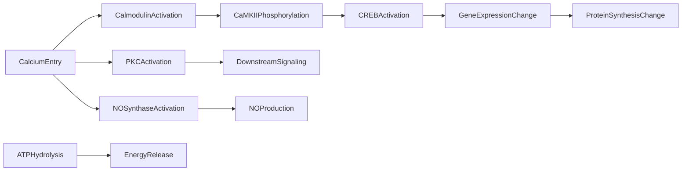

# Biochemistry -- Biochemical Signaling Ontology

Models biochemical signaling cascades relevant to bioelectric repair, including
the calcium-calmodulin-CaMKII-CREB pathway, PKC branch, nitric oxide/vasodilation
branch, and energy metabolism (ATP/ADP).

Key references:
- Bhatt 2000: CaMKII activation by calmodulin
- Sheng & Greenberg 1990: CREB phosphorylation and gene expression
- Bhargava 2012: cAMP/IP3 as second messengers
- Ignarro 1987: nitric oxide as signaling molecule
- Krebs 1957: ATP in phosphorylation cascades

## Entities (20)

| Category | Entities |
|---|---|
| Signaling molecules (6) | CalciumIon, Calmodulin, CaMKII, ProteinKinaseC, CREB, NitricOxide |
| Second messengers (2) | CAMP, IP3 |
| Processes (5) | SignalTransduction, PhosphorylationCascade, GeneTranscription, ProteinSynthesis, SecondMessenger |
| Metabolic (4) | ATP, ADP, Glycolysis, OxidativePhosphorylation |
| Abstract (3) | SignalingMolecule, BiochemicalProcess, EnergyMetabolite |

## Taxonomy (is-a)

```mermaid
graph TD
    CalciumIon --> SignalingMolecule
    Calmodulin --> SignalingMolecule
    CaMKII --> SignalingMolecule
    ProteinKinaseC --> SignalingMolecule
    CREB --> SignalingMolecule
    NitricOxide --> SignalingMolecule
    CAMP --> SignalingMolecule
    IP3 --> SignalingMolecule
    SignalTransduction --> BiochemicalProcess
    PhosphorylationCascade --> BiochemicalProcess
    GeneTranscription --> BiochemicalProcess
    ProteinSynthesis --> BiochemicalProcess
    SecondMessenger --> BiochemicalProcess
    Glycolysis --> BiochemicalProcess
    OxidativePhosphorylation --> BiochemicalProcess
    ATP --> EnergyMetabolite
    ADP --> EnergyMetabolite
```

## Causal Graph

12 causal events: CalciumEntry, CalmodulinActivation, CaMKIIPhosphorylation,
CREBActivation, GeneExpressionChange, ProteinSynthesisChange, PKCActivation,
DownstreamSignaling, NOSynthaseActivation, NOProduction, ATPHydrolysis, EnergyRelease.

## Opposition Pairs

| Pair | Meaning |
|---|---|
| ATP / ADP | Charged vs discharged energy currency |
| Glycolysis / OxidativePhosphorylation | Anaerobic vs aerobic metabolism |
| PhosphorylationCascade / GeneTranscription | Fast signaling vs slow expression |

## Qualities

| Quality | Type | Description |
|---|---|---|
| IsSecondMessenger | bool | CalciumIon, CAMP, IP3, NitricOxide = true |
| IsKinase | bool | CaMKII, ProteinKinaseC = true |
| RequiresATP | bool | PhosphorylationCascade, ProteinSynthesis = true |
| ProcessTimeScale | Milliseconds/Seconds/Minutes/Hours | Characteristic time scale of biochemical processes |
| IsReversible | bool | PhosphorylationCascade, SignalTransduction, SecondMessenger = true |

## Axioms (10)

| Axiom | Description | Source |
|---|---|---|
| BiochemistryTaxonomyIsDAG | Biochemistry taxonomy is a directed acyclic graph | structural |
| BiochemistryCausalAsymmetric | Biochemistry causal graph is asymmetric | structural |
| BiochemistryCausalNoSelfCause | No biochemical event directly causes itself | structural |
| CalciumEntryCausesGeneExpression | Calcium entry transitively causes gene expression change | Bhatt 2000 |
| CalciumEntryCausesNOProduction | Calcium entry causes NO production via NOS activation | Ignarro 1987 |
| CalciumIsSecondMessenger | Calcium ion is a second messenger | Bhargava 2012 |
| CaMKIIIsKinase | CaMKII is a kinase | Bhatt 2000 |
| PhosphorylationRequiresATP | Phosphorylation cascade requires ATP | Krebs 1957 |
| BiochemistryOppositionSymmetric | Biochemistry opposition is symmetric | structural |
| BiochemistryOppositionIrreflexive | Biochemistry opposition is irreflexive | structural |

## Functors

**Outgoing (1):**

| Functor | Target | File |
|---|---|---|
| BiochemistryToMolecular | molecular | `molecular_functor.rs` |

**Incoming (0):**

None.

## Files

- `ontology.rs` -- Entity, taxonomy, causal graph, category, qualities, axioms, tests
- `molecular_functor.rs` -- BiochemistryToMolecular functor
- `mod.rs` -- Module declarations
