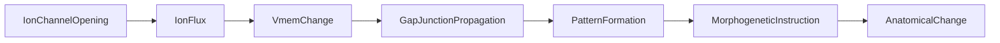

# Bioelectricity -- Levin Bioelectric Framework Ontology

Models Dr. Michael Levin's TAME (Technological Approach to Mind Everywhere)
framework as formal ontology. Covers the competency hierarchy
(Molecular to Cellular to Tissue to Organ to Organism), bioelectric code
(Vmem patterns encode morphogenetic information), gap junction networks,
cognitive lightcone, morphospace, and interventions.

Key references:
- Levin 2019: The Computational Boundary of a "Self"
- Fields & Levin 2022: Competency in Navigating Arbitrary Spaces
- Levin 2014: Molecular bioelectricity in developmental biology
- Chernet & Levin 2013: depolarization as oncogene-like transformation

## Entities (19)

| Category | Entities |
|---|---|
| Signals (4) | MembranePotential, VoltageGradient, BioelectricPrepattern, TransepithelialPotential |
| Networks (3) | GapJunctionNetwork, BioelectricCircuit, CognitiveLightcone |
| Morphospace (3) | TargetMorphology, CurrentMorphology, MorphogeneticField |
| Interventions (5) | IonChannelModulation, GapJunctionModulation, BioelectricCocktail, MechanicalStimulation, ProtonPumpInhibition |
| Abstract (4) | Signal, Network, Morphospace, Intervention |

Also models 5 TAME competency levels: Molecular, Cellular, Tissue, Organ, Organism.

## Taxonomy (is-a)

```mermaid
graph TD
    MembranePotential --> Signal
    VoltageGradient --> Signal
    BioelectricPrepattern --> Signal
    TransepithelialPotential --> Signal
    GapJunctionNetwork --> Network
    BioelectricCircuit --> Network
    CognitiveLightcone --> Network
    TargetMorphology --> Morphospace
    CurrentMorphology --> Morphospace
    MorphogeneticField --> Morphospace
    IonChannelModulation --> Intervention
    GapJunctionModulation --> Intervention
    BioelectricCocktail --> Intervention
    MechanicalStimulation --> Intervention
    ProtonPumpInhibition --> Intervention
```

## Causal Graph

7 signal events in the bioelectric signal causal chain.

## Opposition Pairs

| Pair | Meaning |
|---|---|
| IonChannelModulation / ProtonPumpInhibition | Direct bioelectric intervention vs indirect acid removal |
| Signal / Intervention | What IS (observable) vs what you DO (action) |

## Qualities

| Quality | Type | Description |
|---|---|---|
| OperatingLevel | CompetencyLevel | TAME level this entity operates at (total for all 19 entities) |
| IsHardwareAccessible | bool | Only MechanicalStimulation = true |
| RequiresGapJunctions | bool | VoltageGradient, BioelectricPrepattern, GapJunctionNetwork, BioelectricCircuit, CognitiveLightcone, MorphogeneticField, BioelectricCocktail = true |

## Axioms (14)

| Axiom | Description | Source |
|---|---|---|
| BioelectricCodeAxiom | Healthy Vmem is polarized, cancer is depolarized | Levin 2014 |
| GapJunctionCommunicationAxiom | Tissue signals require gap junctions, single-cell signals do not | Levin framework |
| RepolarizationRepairAxiom | Both ion channel modulation and PPI are interventions | structural |
| TwoMechanismRepairAxiom | PPI does not require gap junctions, bioelectric cocktail does | mechanism |
| TAMEHierarchyAxiom | TAME hierarchy has no cycles and exactly 5 levels | Levin 2022 TAME |
| CognitiveLightconeAxiom | Cognitive lightcone requires gap junctions and operates at organ level | Fields & Levin 2022 |
| MechanicalStimulationIsHardwareAccessible | Exactly one hardware-accessible intervention: MechanicalStimulation | design |
| BioelectricTaxonomyIsDAG | Bioelectric taxonomy is a directed acyclic graph | structural |
| AllTAMELevelsRepresented | All 5 TAME competency levels are represented | Levin 2022 |
| BioelectricOppositionSymmetric | Bioelectric opposition is symmetric | structural |
| BioelectricOppositionIrreflexive | Bioelectric opposition is irreflexive | structural |
| BioelectricSignalCausalAsymmetric | Bioelectric signal causal graph is asymmetric | structural |
| BioelectricSignalCausalNoSelfCausation | No bioelectric signal event directly causes itself | structural |
| TargetMorphologyCrossDomainEquivalence | TargetMorphology is the same entity in bioelectricity and regeneration | cross-domain |

## Functors

**Outgoing (1):**

| Functor | Target | File |
|---|---|---|
| BioelectricToRegeneration | regeneration | `regeneration_functor.rs` |

**Incoming (6):**

| Functor | Source | File |
|---|---|---|
| BiologyToBioelectric | biology | `../biology/bioelectricity_functor.rs` |
| MolecularToBioelectric | molecular | `../molecular/bioelectricity_functor.rs` |
| ImmunologyToBioelectric | immunology | `../immunology/bioelectricity_functor.rs` |
| ElectrophysiologyToBioelectric | electrophysiology | `../electrophysiology/bioelectricity_functor.rs` |
| RegenerationToBioelectric | regeneration | `../regeneration/bioelectricity_functor.rs` |
| PathologyToBioelectric | pathology | `../pathology/bioelectricity_functor.rs` |

## Files

- `ontology.rs` -- Entity, taxonomy, category, qualities, axioms, tests
- `morphospace.rs` -- Morphospace attractor landscape ontology
- `regeneration_functor.rs` -- BioelectricToRegeneration functor
- `mod.rs` -- Module declarations
