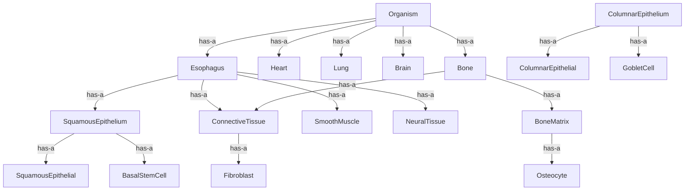
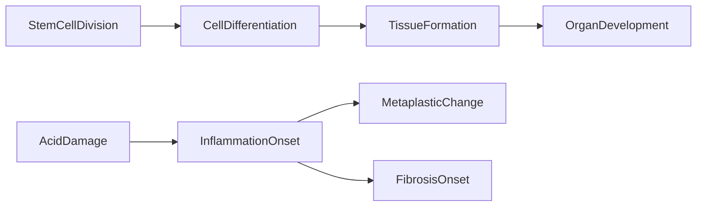

# Biology -- Biological Organization Ontology

Models the hierarchy of biological organization from cells through tissues and
organs to the organism level, focused on esophageal repair. Encodes both
subsumption (is-a) and part-whole (has-a) relationships with category-theoretic
rigor.

Key references:
- Hooper 1956; Piedrafita et al. 2020 (basal stem cell differentiation)
- Levin bioelectric framework (mechanosensitivity is multi-scale)

## Entities (23)

| Category | Entities |
|---|---|
| Cells (8) | SquamousEpithelial, ColumnarEpithelial, GobletCell, BasalStemCell, Fibroblast, MacrophageM1, MacrophageM2, Osteocyte |
| Tissues (6) | SquamousEpithelium, ColumnarEpithelium, ConnectiveTissue, SmoothMuscle, NeuralTissue, BoneMatrix |
| Organs (5) | Esophagus, Heart, Lung, Brain, Bone |
| Abstract (4) | Cell, Tissue, Organ, Organism |

## Taxonomy (is-a)

```mermaid
graph TD
    SquamousEpithelial --> Cell
    ColumnarEpithelial --> Cell
    GobletCell --> Cell
    BasalStemCell --> Cell
    Fibroblast --> Cell
    MacrophageM1 --> Cell
    MacrophageM2 --> Cell
    Osteocyte --> Cell
    SquamousEpithelium --> Tissue
    ColumnarEpithelium --> Tissue
    ConnectiveTissue --> Tissue
    SmoothMuscle --> Tissue
    NeuralTissue --> Tissue
    BoneMatrix --> Tissue
    Esophagus --> Organ
    Heart --> Organ
    Lung --> Organ
    Brain --> Organ
    Bone --> Organ
```

## Mereology (has-a)

## Causal Graph

8 causal events: StemCellDivision, CellDifferentiation, TissueFormation,
OrganDevelopment, AcidDamage, InflammationOnset, MetaplasticChange, FibrosisOnset.

## Opposition Pairs

| Pair | Meaning |
|---|---|
| SquamousEpithelial / ColumnarEpithelial | Normal esophageal lining vs Barrett's metaplasia |
| MacrophageM1 / MacrophageM2 | Pro-inflammatory vs pro-repair phenotypes |
| Cell / Organism | Micro scale vs macro scale |

## Qualities

| Quality | Type | Description |
|---|---|---|
| OrganizationLevel | Cellular, TissueLevel, OrganLevel, OrganismLevel, Abstract | What level this entity belongs to (total for all 23 entities) |
| IsProliferative | bool | BasalStemCell, MacrophageM1, MacrophageM2, Fibroblast = true |
| IsMechanosensitive | bool | SquamousEpithelial, ColumnarEpithelial, Osteocyte, BoneMatrix = true |

## Axioms (16)

| Axiom | Description | Source |
|---|---|---|
| TaxonomyIsDAG | Biological taxonomy is a directed acyclic graph | structural |
| TaxonomyIsAntisymmetric | Biological taxonomy is antisymmetric | structural |
| MereologyIsDAG | Biological mereology is a directed acyclic graph | structural |
| AllCellsAreCell | All 8 cell types are subsumed by Cell | structural |
| EsophagusHasSquamousEpithelium | Esophagus has squamous epithelium as a part | anatomy |
| EpitheliumHasStemCells | Squamous epithelium contains squamous epithelial and basal stem cells | anatomy |
| AllLevelsRepresented | All four non-abstract organization levels are represented | structural |
| MechanosensitivityIsMultiscale | Mechanosensitive entities at both cellular and tissue levels | multi-scale |
| BiologicalOppositionSymmetric | Biological opposition is symmetric | structural |
| BiologicalOppositionIrreflexive | Biological opposition is irreflexive | structural |
| BiologicalCausalAsymmetric | Biological causal graph is asymmetric | structural |
| BiologicalCausalNoSelfCausation | No biological event directly causes itself | structural |
| MacrophageM1CrossDomainEquivalence | MacrophageM1 is the same entity in immunology and biology | cross-domain |
| MacrophageM2CrossDomainEquivalence | MacrophageM2 is the same entity in immunology and biology | cross-domain |
| FibroblastCrossDomainEquivalence | Fibroblast is the same entity in immunology and biology | cross-domain |
| StemCellDifferentiation | Basal stem cells and squamous epithelial cells coexist in squamous epithelium | Hooper 1956; Piedrafita 2020 |

## Functors

**Outgoing (2):**

| Functor | Target | File |
|---|---|---|
| BiologyToMolecular | molecular | `molecular_functor.rs` |
| BiologyToBioelectric | bioelectricity | `bioelectricity_functor.rs` |

**Incoming (2):**

| Functor | Source | File |
|---|---|---|
| ImmunologyToBiology | immunology | `../immunology/biology_functor.rs` |
| RegenerationToBiology | regeneration | `../regeneration/biology_functor.rs` |

## Files

- `ontology.rs` -- Entity, taxonomy, mereology, category, qualities, axioms, tests
- `molecular_functor.rs` -- BiologyToMolecular functor
- `bioelectricity_functor.rs` -- BiologyToBioelectric functor
- `mod.rs` -- Module declarations
