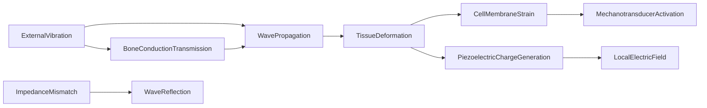

# Biophysics -- Mechanical and Wave Physics Ontology

Models how physical forces act on biological systems: tissue mechanics,
piezoelectricity, wave propagation, membrane biophysics, and acoustic impedance.
Bridges physics (stress, strain, frequency) to biology (bone, tissue, membranes)
through measurable biophysical quantities.

Key references:
- Fukada & Yasuda 1957: piezoelectricity of bone (collagen)
- Duck 1990: acoustic properties of biological tissue
- Cowin & Doty 2007: tissue mechanics

## Entities (28)

| Category | Entities |
|---|---|
| Mechanical properties (7) | Viscoelasticity, Elasticity, Viscosity, StiffnessModulus, StrainRate, MechanicalStress, MechanicalStrain |
| Wave physics (6) | MechanicalWave, AcousticImpedance, Attenuation, Frequency, Wavelength, ResonanceFrequency |
| Piezoelectricity (4) | PiezoelectricEffect, DirectPiezoelectric, ConversePiezoelectric, CollagenPiezoelectricity |
| Membrane biophysics (3) | MembraneCapacitance, MembraneTension, CellDeformation |
| Media (4) | BoneMatrix, SoftTissue, FluidMedium, CellMembrane |
| Abstract (4) | MechanicalProperty, WaveProperty, PiezoelectricProperty, BiologicalMedium |

## Taxonomy (is-a)

```mermaid
graph TD
    Viscoelasticity --> MechanicalProperty
    Elasticity --> MechanicalProperty
    Viscosity --> MechanicalProperty
    StiffnessModulus --> MechanicalProperty
    StrainRate --> MechanicalProperty
    MechanicalStress --> MechanicalProperty
    MechanicalStrain --> MechanicalProperty
    MembraneCapacitance --> MechanicalProperty
    MembraneTension --> MechanicalProperty
    CellDeformation --> MechanicalProperty
    MechanicalWave --> WaveProperty
    AcousticImpedance --> WaveProperty
    Attenuation --> WaveProperty
    Frequency --> WaveProperty
    Wavelength --> WaveProperty
    ResonanceFrequency --> WaveProperty
    PiezoelectricEffect --> PiezoelectricProperty
    DirectPiezoelectric --> PiezoelectricProperty
    ConversePiezoelectric --> PiezoelectricProperty
    CollagenPiezoelectricity --> PiezoelectricProperty
    DirectPiezoelectric --> PiezoelectricEffect
    ConversePiezoelectric --> PiezoelectricEffect
    BoneMatrix --> BiologicalMedium
    SoftTissue --> BiologicalMedium
    FluidMedium --> BiologicalMedium
    CellMembrane --> BiologicalMedium
```

## Causal Graph

10 causal events: ExternalVibration, WavePropagation, TissueDeformation,
CellMembraneStrain, MechanotransducerActivation, BoneConductionTransmission,
PiezoelectricChargeGeneration, LocalElectricField, ImpedanceMismatch, WaveReflection.

## Opposition Pairs

| Pair | Meaning |
|---|---|
| DirectPiezoelectric / ConversePiezoelectric | Strain-to-voltage vs voltage-to-strain |
| Elasticity / Viscosity | Energy storage vs energy dissipation |
| MechanicalStress / MechanicalStrain | Cause vs effect in materials |

## Qualities

| Quality | Type | Description |
|---|---|---|
| AcousticImpedanceValue | f64 (MRayls) | BoneMatrix=7.4, SoftTissue=1.6, FluidMedium=1.5, CellMembrane=1.6 |
| IsPiezoelectric | bool | CollagenPiezoelectricity, BoneMatrix = true |
| TransmitsVibration | bool | All 4 media = true |
| FrequencyRange | (f64, f64) Hz | MechanicalWave=(1,200), ResonanceFrequency=(20,120) |

## Axioms (10)

| Axiom | Description | Source |
|---|---|---|
| BiophysicsTaxonomyIsDAG | Biophysics taxonomy is a directed acyclic graph | structural |
| BiophysicsCausalAsymmetric | Biophysics causal graph is asymmetric | structural |
| BiophysicsCausalNoSelfCausation | No biophysics causal event directly causes itself | structural |
| VibrationCausesMechanotransduction | External vibration transitively causes mechanotransducer activation | causal chain |
| PiezoelectricFollowsDeformation | Piezoelectric charge generation follows tissue deformation | Fukada & Yasuda 1957 |
| BoneMatrixIsPiezoelectric | Bone matrix is piezoelectric due to collagen content | Fukada & Yasuda 1957 |
| BoneImpedanceGreaterThanSoftTissue | Bone acoustic impedance exceeds soft tissue impedance | Duck 1990 |
| ImpedanceMismatchCausesReflection | Impedance mismatch causes wave reflection | physics |
| BiophysicsOppositionSymmetric | Biophysics opposition is symmetric | structural |
| BiophysicsOppositionIrreflexive | Biophysics opposition is irreflexive | structural |

## Functors

**Outgoing (2):**

| Functor | Target | File |
|---|---|---|
| BiophysicsToMolecular | molecular | `molecular_functor.rs` |
| BiophysicsToBioelectric | bioelectricity | `bioelectricity_functor.rs` |

**Incoming (0):**

None.

## Files

- `ontology.rs` -- Entity, taxonomy, causal graph, category, qualities, axioms, tests
- `molecular_functor.rs` -- BiophysicsToMolecular functor
- `bioelectricity_functor.rs` -- BiophysicsToBioelectric functor
- `mod.rs` -- Module declarations
