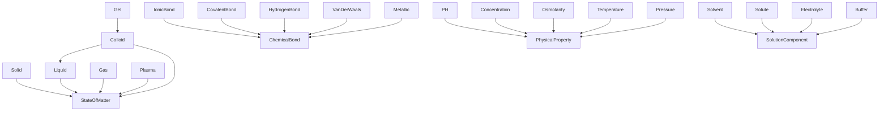
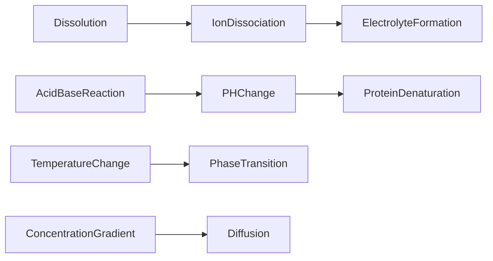

# Chemistry -- Foundational Chemistry Ontology

Models foundational chemistry of matter: states of matter, chemical bonding types,
physical properties, and solution components. Causal chains cover dissolution,
acid-base reactions, phase transitions, and diffusion.

## Entities (24)

| Category | Entities |
|---|---|
| States of matter (6) | Solid, Liquid, Gas, Plasma, Gel, Colloid |
| Bonding (5) | IonicBond, CovalentBond, HydrogenBond, VanDerWaals, Metallic |
| Properties (5) | PH, Concentration, Osmolarity, Temperature, Pressure |
| Solutions (4) | Solvent, Solute, Electrolyte, Buffer |
| Abstract (4) | StateOfMatter, ChemicalBond, PhysicalProperty, SolutionComponent |

## Taxonomy (is-a)

## Causal Graph

10 causal events: Dissolution, IonDissociation, ElectrolyteFormation,
AcidBaseReaction, PHChange, ProteinDenaturation, TemperatureChange,
PhaseTransition, ConcentrationGradient, Diffusion.

## Opposition Pairs

| Pair | Meaning |
|---|---|
| Solvent / Solute | Dissolving agent vs dissolved substance |
| IonicBond / CovalentBond | Electrostatic transfer vs shared electrons |

## Qualities

| Quality | Type | Description |
|---|---|---|
| ConductsElectricity | bool | Electrolyte, Plasma = true; most others = false |
| IsAqueous | bool | Liquid, Gel, Colloid = true |
| BondStrength | Strong/Moderate/Weak | CovalentBond/IonicBond/Metallic=Strong, HydrogenBond=Moderate, VanDerWaals=Weak |

## Axioms (9)

| Axiom | Description | Source |
|---|---|---|
| ChemistryTaxonomyIsDAG | Chemistry taxonomy is a directed acyclic graph | structural |
| ChemistryTaxonomyAntisymmetric | Chemistry taxonomy is antisymmetric | structural |
| ChemistryCausalAsymmetric | Chemistry causal graph is asymmetric | structural |
| ChemistryCausalNoSelfCausation | No chemistry event directly causes itself | structural |
| DissolutionCausesIonDissociation | Dissolution causes ion dissociation | causal |
| AcidBaseCausesPHChange | Acid-base reaction causes pH change | causal |
| ElectrolytesConductElectricity | Electrolytes conduct electricity | quality |
| ChemistryOppositionSymmetric | Chemistry opposition is symmetric | structural |
| ChemistryOppositionIrreflexive | Chemistry opposition is irreflexive | structural |

## Functors

**Outgoing (1):**

| Functor | Target | File |
|---|---|---|
| ChemistryToMolecular | molecular | `molecular_functor.rs` |

**Incoming (0):**

None.

## Files

- `ontology.rs` -- Entity, taxonomy, causal graph, category, qualities, axioms, tests
- `molecular_functor.rs` -- ChemistryToMolecular functor
- `mod.rs` -- Module declarations
