# Electrophysiology -- Bioelectric Measurement Ontology

Models the science of measuring bioelectric signals: measurement techniques
(patch clamp, voltage-sensitive dyes, bioimpedance, etc.), measured quantities
(resting potential, action potential, impedance), and recording modes
(whole-cell, current clamp, voltage clamp). No causal graph -- this domain
is purely about measurement.

Key references:
- Levin 2024: Optical Estimation of Bioelectric Patterns
- Neher & Sakmann 1976: Patch clamp technique
- Bhatt et al. 2015: Bioimpedance spectroscopy

## Entities (23)

| Category | Entities |
|---|---|
| Measurement techniques (8) | PatchClamp, SharpElectrode, VoltageSensitiveDye, CalciumImaging, Bioimpedance, ExtracellularRecording, MultiElectrodeArray, OpticalMapping |
| Measured quantities (6) | RestingPotential, ActionPotential, TransepithelialPotential, FieldPotential, Impedance, IntracellularCalcium |
| Recording modes (6) | WholeCell, CellAttached, InsideOut, OutsideOut, CurrentClamp, VoltageClamp |
| Abstract (3) | MeasurementTechnique, MeasuredQuantity, RecordingMode |

## Taxonomy (is-a)

```mermaid
graph TD
    PatchClamp --> MeasurementTechnique
    SharpElectrode --> MeasurementTechnique
    VoltageSensitiveDye --> MeasurementTechnique
    CalciumImaging --> MeasurementTechnique
    Bioimpedance --> MeasurementTechnique
    ExtracellularRecording --> MeasurementTechnique
    MultiElectrodeArray --> MeasurementTechnique
    OpticalMapping --> MeasurementTechnique
    RestingPotential --> MeasuredQuantity
    ActionPotential --> MeasuredQuantity
    TransepithelialPotential --> MeasuredQuantity
    FieldPotential --> MeasuredQuantity
    Impedance --> MeasuredQuantity
    IntracellularCalcium --> MeasuredQuantity
    WholeCell --> RecordingMode
    CellAttached --> RecordingMode
    InsideOut --> RecordingMode
    OutsideOut --> RecordingMode
    CurrentClamp --> RecordingMode
    VoltageClamp --> RecordingMode
```

## Opposition Pairs

| Pair | Meaning |
|---|---|
| PatchClamp / OpticalMapping | Invasive/single-cell vs non-invasive/spatial |
| CurrentClamp / VoltageClamp | Measure voltage vs measure current |
| RestingPotential / ActionPotential | Steady-state vs transient |

## Qualities

| Quality | Type | Description |
|---|---|---|
| IsInvasive | bool | PatchClamp, SharpElectrode = true; 6 others = false |
| SpatialResolution | SingleCell, CellCluster, Tissue, Organ | PatchClamp/SharpElectrode=SingleCell, VSD/CalciumImaging/OpticalMapping=Tissue, ExtracellularRecording/MEA=CellCluster, Bioimpedance=Organ |
| TemporalResolution | Microseconds, Milliseconds, Seconds, Minutes | PatchClamp/SharpElectrode=Microseconds, most others=Milliseconds, Bioimpedance=Seconds |
| MeasuresVmem | bool | PatchClamp, SharpElectrode, VoltageSensitiveDye, OpticalMapping = true |
| CanMeasureInVivo | bool | VSD, CalciumImaging, Bioimpedance, ExtracellularRecording, OpticalMapping = true |
| RequiresContactWithCell | bool | PatchClamp, SharpElectrode, ExtracellularRecording, MEA = true; optical methods = false |

## Axioms (11)

| Axiom | Description | Source |
|---|---|---|
| TaxonomyIsDAG | Electrophysiology taxonomy is a directed acyclic graph | structural |
| CategoryLawsHold | Electrophysiology category satisfies identity, associativity, and closure | structural |
| NonInvasiveMethodExists | At least one non-invasive measurement technique exists | design |
| MultiscaleMethods | Both single-cell and tissue-level spatial resolution methods exist | multi-scale |
| VmemInVivoMethodExists | At least one method measures Vmem in vivo (VSD) | Levin's primary tool |
| PatchClampGoldStandard | Patch clamp is invasive with single-cell resolution (gold standard) | Neher & Sakmann |
| BioimpedanceNonInvasive | Bioimpedance is non-invasive (surface electrodes) | Bhatt 2015 |
| OpticalMethodsNoContact | Optical methods do not require direct cell contact | methodology |
| VmemAndNonVmemTechniques | Both Vmem-measuring and non-Vmem-measuring techniques exist | design |
| ElectrophysiologyOppositionSymmetric | Electrophysiology opposition is symmetric | structural |
| ElectrophysiologyOppositionIrreflexive | Electrophysiology opposition is irreflexive | structural |

## Functors

**Outgoing (1):**

| Functor | Target | File |
|---|---|---|
| ElectrophysiologyToBioelectric | bioelectricity | `bioelectricity_functor.rs` |

**Incoming (0):**

No incoming functors.

## Files

- `ontology.rs` -- Entity, taxonomy, category, qualities, axioms, tests
- `bioelectricity_functor.rs` -- ElectrophysiologyToBioelectric functor
- `mod.rs` -- Module declarations
