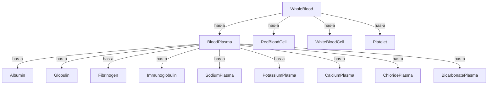
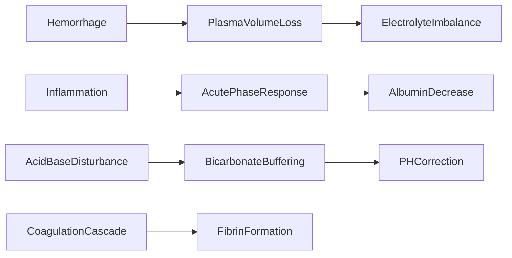

# Hematology -- Blood and Plasma Ontology

Models blood components (whole blood, plasma, serum, cells, platelets), plasma
proteins (albumin, globulin, fibrinogen, immunoglobulin), plasma electrolytes
(Na+, K+, Ca2+, Cl-, HCO3-), and blood properties (osmotic pressure, oncotic
pressure, pH, hematocrit, viscosity). Includes mereology (part-whole) since
blood has a clear compositional hierarchy.

## Entities (24)

| Category | Entities |
|---|---|
| Blood components (6) | WholeBlood, BloodPlasma, Serum, RedBloodCell, WhiteBloodCell, Platelet |
| Plasma proteins (4) | Albumin, Globulin, Fibrinogen, Immunoglobulin |
| Plasma electrolytes (5) | SodiumPlasma, PotassiumPlasma, CalciumPlasma, ChloridePlasma, BicarbonatePlasma |
| Properties (5) | OsmoticPressure, OncoticPressure, BloodPH, Hematocrit, Viscosity |
| Abstract (4) | BloodComponent, PlasmaProtein, PlasmaElectrolyte, BloodProperty |

## Taxonomy (is-a)

```mermaid
graph TD
    WholeBlood --> BloodComponent
    BloodPlasma --> BloodComponent
    Serum --> BloodComponent
    RedBloodCell --> BloodComponent
    WhiteBloodCell --> BloodComponent
    Platelet --> BloodComponent
    Albumin --> PlasmaProtein
    Globulin --> PlasmaProtein
    Fibrinogen --> PlasmaProtein
    Immunoglobulin --> PlasmaProtein
    SodiumPlasma --> PlasmaElectrolyte
    PotassiumPlasma --> PlasmaElectrolyte
    CalciumPlasma --> PlasmaElectrolyte
    ChloridePlasma --> PlasmaElectrolyte
    BicarbonatePlasma --> PlasmaElectrolyte
    OsmoticPressure --> BloodProperty
    OncoticPressure --> BloodProperty
    BloodPH --> BloodProperty
    Hematocrit --> BloodProperty
    Viscosity --> BloodProperty
```

## Mereology (has-a)

## Causal Graph

11 causal events: Hemorrhage, PlasmaVolumeLoss, ElectrolyteImbalance,
Inflammation, AcutePhaseResponse, AlbuminDecrease, AcidBaseDisturbance,
BicarbonateBuffering, PHCorrection, CoagulationCascade, FibrinFormation.

## Opposition Pairs

| Pair | Meaning |
|---|---|
| Albumin / Globulin | Transport function vs immune function |
| RedBloodCell / WhiteBloodCell | Oxygen transport vs immune defense |

## Qualities

| Quality | Type | Description |
|---|---|---|
| NormalConcentration | f64 (mmol/L) | Na=140, K=4.5, Ca=2.5, Cl=100, HCO3=24 |
| IsClottingFactor | bool | Fibrinogen, Platelet = true |
| AffectsOsmolarity | bool | All 5 electrolytes + Albumin = true |

## Axioms (12)

| Axiom | Description | Source |
|---|---|---|
| HematologyTaxonomyIsDAG | Hematology taxonomy is a directed acyclic graph | structural |
| HematologyTaxonomyAntisymmetric | Hematology taxonomy is antisymmetric | structural |
| HematologyMereologyIsDAG | Hematology mereology is a directed acyclic graph | structural |
| HematologyCausalAsymmetric | Hematology causal graph is asymmetric | structural |
| HematologyCausalNoSelfCausation | No hematology event directly causes itself | structural |
| WholeBloodContainsPlasma | Whole blood contains blood plasma | mereology |
| PlasmaContainsAllElectrolytes | Blood plasma contains all plasma electrolytes | mereology |
| SodiumIsDominantCation | Sodium is the dominant plasma cation (140 >> 4.5 mmol/L potassium) | physiology |
| BloodPHRegulated | Blood pH is tightly regulated between 7.35 and 7.45 | physiology |
| HemorrhageCausesElectrolyteImbalance | Hemorrhage transitively causes electrolyte imbalance | causal |
| HematologyOppositionSymmetric | Hematology opposition is symmetric | structural |
| HematologyOppositionIrreflexive | Hematology opposition is irreflexive | structural |

## Functors

**Outgoing (1):**

| Functor | Target | File |
|---|---|---|
| HematologyToBiology | biology | `biology_functor.rs` |

**Incoming (0):**

None.

## Files

- `ontology.rs` -- Entity, taxonomy, mereology, causal graph, category, qualities, axioms, tests
- `biology_functor.rs` -- HematologyToBiology functor
- `mod.rs` -- Module declarations
