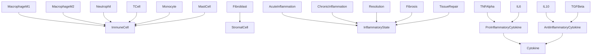
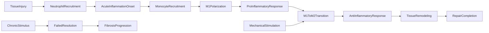

# Immunology -- Tissue Repair Immunology Ontology

Models the inflammatory cascade, macrophage polarization (M1/M2), cytokine
signaling, and the causal chain from tissue injury to repair or fibrosis.
The key scientific insight: mechanical stimulation (whole-body vibration)
promotes M1-to-M2 macrophage transition, shifting the immune response from
pro-inflammatory to pro-repair (Weinheimer-Haus 2014, Yu 2019).

Key references:
- Weinheimer-Haus 2014: Low-intensity vibration improves angiogenesis and
  wound healing via shifts in macrophage polarization
- Yu 2019: Mechanical loading promotes tissue repair through immune modulation

## Entities (22)

| Category | Entities |
|---|---|
| Cells (7) | MacrophageM1, MacrophageM2, Neutrophil, TCell, Monocyte, MastCell, Fibroblast |
| States (5) | AcuteInflammation, ChronicInflammation, Resolution, Fibrosis, TissueRepair |
| Cytokines (6) | ProInflammatoryCytokine, AntiInflammatoryCytokine, TNFAlpha, IL6, IL10, TGFBeta |
| Abstract (4) | ImmuneCell, StromalCell, InflammatoryState, Cytokine |

## Taxonomy (is-a)

## Causal Graph

14 causal events: normal healing, pathological, and vibration intervention paths.

## Opposition Pairs

| Pair | Meaning |
|---|---|
| MacrophageM1 / MacrophageM2 | Pro-inflammatory vs pro-repair phenotypes |
| AcuteInflammation / Resolution | Onset vs resolution of inflammation |
| ChronicInflammation / TissueRepair | Pathological persistence vs healing |
| ProInflammatoryCytokine / AntiInflammatoryCytokine | Opposing signaling classes |
| TNFAlpha / IL10 | Canonical pro- vs anti-inflammatory cytokines |

## Qualities

| Quality | Type | Description |
|---|---|---|
| IsProInflammatory | bool | M1, Neutrophil, MastCell, TNFAlpha, IL6, AcuteInflammation, ChronicInflammation = true |
| IsProRepair | bool | M2, Fibroblast, IL10, TGFBeta, TissueRepair, Resolution = true |
| PolarizationState | M1Classical, M2Alternative, Unpolarized, NotApplicable | Macrophage polarization state |
| TimeScale | Hours, Days, Weeks | AcuteInflammation=Hours, Resolution/TissueRepair=Days, ChronicInflammation/Fibrosis=Weeks |
| IsModulableByVibration | bool (on events) | M1ToM2Transition, AntiInflammatoryResponse, TissueRemodeling, RepairCompletion = true |

## Axioms (13)

| Axiom | Description | Source |
|---|---|---|
| ImmunologyTaxonomyIsDAG | Immunology taxonomy is a DAG | structural |
| CausalAsymmetry | Inflammatory causation is asymmetric | structural |
| CausalNoSelfCausation | No inflammatory event directly causes itself | structural |
| InjuryCausesRepair | Tissue injury transitively causes repair completion (normal healing) | cascade |
| ChronicStimulusCausesFibrosis | Chronic stimulus causes fibrosis, not repair | pathological path |
| VibrationCausesM1ToM2 | Mechanical stimulation causes M1-to-M2 transition | Weinheimer-Haus 2014 |
| M1M2MutuallyExclusive | M1 is pro-inflammatory (not pro-repair), M2 is pro-repair (not pro-inflammatory) | phenotypes |
| CytokineBranchesDisjoint | Pro-inflammatory and anti-inflammatory cytokines are disjoint taxonomy branches | structural |
| M1ToM2LeadsToRepair | M1-to-M2 transition eventually leads to repair completion | cascade |
| AllImmuneCellsClassified | All immune cells classified under ImmuneCell; Fibroblast under StromalCell | structural |
| InflammationTimeScales | Acute inflammation is Hours, chronic inflammation is Weeks | temporal |
| ImmunologyOppositionSymmetric | Immunology opposition is symmetric | structural |
| ImmunologyOppositionIrreflexive | Immunology opposition is irreflexive | structural |

## Functors

**Outgoing (3):**

| Functor | Target | File |
|---|---|---|
| ImmunologyToBioelectric | bioelectricity | `bioelectricity_functor.rs` |
| ImmunologyToBiology | biology | `biology_functor.rs` |
| ImmunologyToRegeneration | regeneration | `regeneration_functor.rs` |

**Incoming (1):**

| Functor | Source | File |
|---|---|---|
| PharmacologyToImmunology | pharmacology | `../pharmacology/immunology_functor.rs` |

## Files

- `ontology.rs` -- Entity, taxonomy, category, qualities, axioms, tests
- `bioelectricity_functor.rs` -- ImmunologyToBioelectric functor
- `biology_functor.rs` -- ImmunologyToBiology functor
- `regeneration_functor.rs` -- ImmunologyToRegeneration functor
- `mod.rs` -- Module declarations
