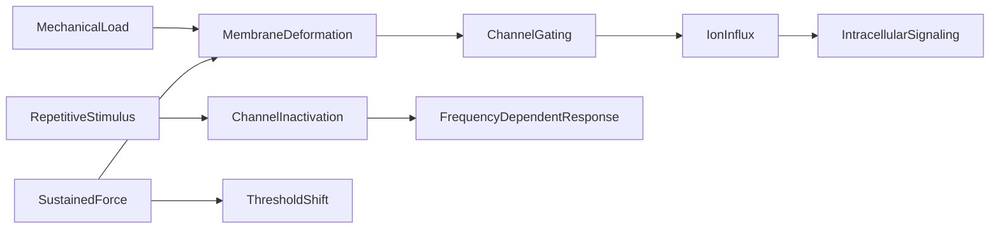

# Mechanobiology Ontology

Formal ontology of mechanotransduction -- how mechanical forces activate
ion channels and cellular responses -- encoded as category-theoretic
structures with machine-verified axioms.

This domain connects mechanical stimulation to ion channel behavior,
providing the critical bridge between biophysical forces and molecular
signaling via Piezo1/2 mechanosensitive channels.

## Structure

| Component | Count |
|---|---|
| Entities | 22 |
| Causal events | 10 |
| Taxonomy relations | 17 |
| Axioms | 10 |
| Opposition pairs | 2 |
| Qualities | 4 (ActivationThresholdValue, IsFrequencyDependent, InactivationTimeMs, RequiresMembraneTension) |

## Entity Taxonomy

```mermaid
graph TD
    MechanicalForce --> MembraneTension
    MechanicalForce --> ShearStress
    MechanicalForce --> CompressiveStress
    MechanicalForce --> TensileStress
    MechanicalForce --> SubstrateStiffness
    ChannelState --> OpenState
    ChannelState --> ClosedState
    ChannelState --> InactivatedState
    ChannelState --> MechanosensitiveChannel
    ChannelState --> ChannelConformation
    FrequencyProperty --> FrequencyFiltering
    FrequencyProperty --> ActivationThreshold
    FrequencyProperty --> InactivationKinetics
    FrequencyProperty --> RecoveryTime
    CellularResponse --> CalciumTransient
    CellularResponse --> CytoskeletalRemodeling
    CellularResponse --> FocalAdhesion
    CellularResponse --> Mechanoadaptation
```

## Causal Graph

## Opposition Pairs

| Entity A | Entity B | Semantic contrast |
|---|---|---|
| OpenState | ClosedState | Mutually exclusive channel conformations |
| ActivationThreshold | Mechanoadaptation | Fixed threshold vs adaptive threshold shift under sustained force |

## Functor: MechanobiologyToMolecular

Structure-preserving map into the molecular domain. Key mappings:

| Mechanobiology | Molecular |
|---|---|
| MechanosensitiveChannel | Piezo1 |
| CalciumTransient | Calcium |
| MembraneTension | Mechanosensitive |
| SubstrateStiffness | Collagen |
| OpenState | Piezo1 |
| CytoskeletalRemodeling | Protein |

## Key Axioms

- **MechanicalLoadCausesSignaling**: full chain from load through deformation, gating, influx to intracellular signaling
- **RepetitiveStimulusCausesFrequencyResponse**: Piezo channels are frequency filters (Lewis 2017, PMID:28636944)
- **MechanosensitiveChannelIsFrequencyDependent**: inactivation kinetics (~20 ms) determine maximum trackable frequency (~33-67 Hz)
- **ChannelGatingRequiresTension**: channel opening requires membrane tension (~3 mN/m for Piezo1)
- **SustainedForceCausesAdaptation**: chronic loading shifts the activation threshold (mechanoadaptation)

## References

- Lewis et al 2017 (PMID:28636944): Piezo1/2 frequency filtering
- PMID:37459546 (2023): Piezo1 membrane stretch threshold lambda=1.9
- Coste 2010: Piezo1 discovery (2021 Nobel Prize)
