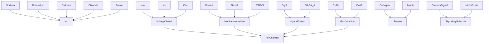
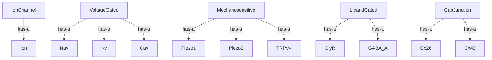
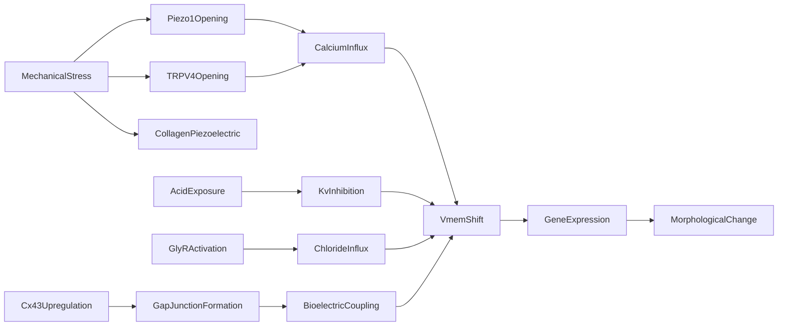

# Molecular -- Molecular Biology Ontology

Models ions, ion channels, gap junctions, structural proteins, and signaling
molecules relevant to bioelectric signaling in esophageal repair. Includes the
mechanotransduction causal graph from mechanical stress through channel
activation to morphological change, plus acid and gap junction pathways.

Key references:
- Coste 2010: Piezo1/Piezo2 discovery (2021 Nobel Prize)
- Mihara 2011: TRPV4 in esophageal epithelium
- Fukada & Yasuda 1957: collagen piezoelectricity
- Inose 2009: Cx26/Cx43 in esophagus
- Khalbuss 1995: acid effects on esophageal ion channels

## Entities (27)

| Category | Entities |
|---|---|
| Ions (5) | Sodium, Potassium, Calcium, Chloride, Proton |
| Voltage-gated channels (3) | Nav, Kv, Cav |
| Mechanosensitive channels (3) | Piezo1, Piezo2, TRPV4 |
| Ligand-gated channels (2) | GlyR, GABA_A |
| Gap junctions (2) | Cx26, Cx43 |
| Structural proteins (2) | Collagen, Mucin |
| Signaling molecules (2) | CalciumSignal, NitricOxide |
| Abstract (8) | Ion, IonChannel, VoltageGated, Mechanosensitive, LigandGated, GapJunction, Protein, SignalingMolecule |

## Taxonomy (is-a)

## Mereology (has-a)

## Causal Graph

15 causal events in the mechanotransduction pathway.

## Opposition Pairs

| Pair | Meaning |
|---|---|
| Sodium / Potassium | Depolarizing vs repolarizing primary ions |
| Calcium / Chloride | Excitatory vs inhibitory signaling ions |
| Nav / Kv | Depolarization channel vs repolarization channel |

## Qualities

| Quality | Type | Description |
|---|---|---|
| IonCharge | i32 | Ionic charge in elementary units (Na+=1, K+=1, Ca2+=2, Cl-=-1, H+=1) |
| EquilibriumPotential | f64 (mV) | Nernst equilibrium potential (K=-90, Na=67, Ca=131, Cl=-70, H=-24) |
| ChannelActivation | Voltage, Mechanical, Ligand, GapJunctionCoupling | How the channel is activated |
| IonSelectivity | MolecularEntity | Which ion the channel primarily conducts |
| ExpressedInEsophagus | bool | Whether expressed in esophageal tissue |

## Axioms (13)

| Axiom | Description | Source |
|---|---|---|
| MolecularTaxonomyIsDAG | Molecular taxonomy is a directed acyclic graph | structural |
| MolecularMereologyNoCycles | Molecular mereology has no cycles | structural |
| Piezo1IsMechanosensitiveChannel | Piezo1 is-a Mechanosensitive is-a IonChannel | Coste 2010 |
| TRPV4InEsophagus | TRPV4 is mechanosensitive and expressed in the esophagus | Mihara 2011 |
| MechanosensitiveChannelsPassCalcium | All mechanosensitive channels conduct calcium | biophysics |
| CausalGraphIsAsymmetric | Causal graph is asymmetric | structural |
| CausalGraphNoSelfCause | No event directly causes itself | structural |
| MechanicalStressCausesMorphology | Mechanical stress transitively causes morphological change | mechanotransduction |
| AcidCausesVmemShift | Acid exposure causes Vmem shift via Kv inhibition | Khalbuss 1995 |
| GlyRCausesHyperpolarization | GlyR activation causes Vmem shift via chloride influx | Chernet & Levin 2013 |
| NernstPotentialsConsistent | Nernst equilibrium potentials have correct signs | biophysics |
| MolecularOppositionSymmetric | Molecular opposition is symmetric | structural |
| MolecularOppositionIrreflexive | Molecular opposition is irreflexive | structural |

## Functors

**Outgoing (1):**

| Functor | Target | File |
|---|---|---|
| MolecularToBioelectric | bioelectricity | `bioelectricity_functor.rs` |

**Incoming (2):**

| Functor | Source | File |
|---|---|---|
| BiologyToMolecular | biology | `../biology/molecular_functor.rs` |
| PharmacologyToMolecular | pharmacology | `../pharmacology/molecular_functor.rs` |

## Files

- `ontology.rs` -- Entity, taxonomy, mereology, category, qualities, axioms, tests
- `bioelectricity_functor.rs` -- MolecularToBioelectric functor
- `mod.rs` -- Module declarations
