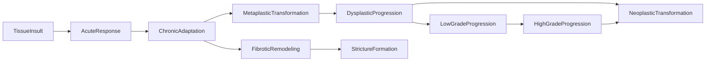

# Pathology -- Disease Pathology Ontology

Models the ontology of disease states, staging, classifications, and
pathological processes. General pathology science encoding disease progression
from normal tissue through injury, metaplasia, dysplasia, to neoplasia, plus
the fibrotic branch leading to stricture formation.

Key scientific facts:
- Normal tissue to acute injury to chronic adaptation to metaplasia to dysplasia to neoplasia
- Chronic adaptation also leads to fibrosis to stricture (fibrotic pathway)
- Dysplasia progresses through low-grade to high-grade to neoplastic transformation
- Metaplasia is reversible with intervention (Levin's bioelectric approach)
- Neoplasia is irreversible once established
- Depolarized Vmem (-15 mV) correlates with dysplasia/neoplasia
- Normal tissue maintains polarized Vmem (-50 mV)

Key references:
- Levin 2014: Bioelectric correlates of neoplastic transformation
- Chernet & Levin 2013: Repolarization suppresses tumors
- Binns et al. 2019: Bioelectric reversal of metaplasia
- Strasser 2025; Nolan lab: Spatial proteomics of Barrett's progression

## Entities (21)

| Category | Entities |
|---|---|
| Disease states (8) | Normal, AcuteInjury, ChronicInjury, Metaplasia, Dysplasia, Neoplasia, Fibrosis, Stricture |
| Staging (2) | LowGrade, HighGrade |
| Classifications (3) | Benign, Premalignant, Malignant |
| Processes (4) | Inflammation, CellularAdaptation, AtypicalGrowth, Invasion |
| Abstract (4) | DiseaseState, Stage, Classification, PathologicalProcess |

## Taxonomy (is-a)

```mermaid
graph TD
    Normal --> DiseaseState
    AcuteInjury --> DiseaseState
    ChronicInjury --> DiseaseState
    Metaplasia --> DiseaseState
    Dysplasia --> DiseaseState
    Neoplasia --> DiseaseState
    Fibrosis --> DiseaseState
    Stricture --> DiseaseState
    LowGrade --> Stage
    HighGrade --> Stage
    Benign --> Classification
    Premalignant --> Classification
    Malignant --> Classification
    Inflammation --> PathologicalProcess
    CellularAdaptation --> PathologicalProcess
    AtypicalGrowth --> PathologicalProcess
    Invasion --> PathologicalProcess
```

## Causal Graph

10 causal events across three pathways.

## Opposition Pairs

| Pair | Meaning |
|---|---|
| Normal / Neoplasia | Health vs disease endpoint |
| Benign / Malignant | Non-progressive vs invasive |
| LowGrade / HighGrade | Mild vs severe dysplasia |
| Inflammation / CellularAdaptation | Acute vs chronic response |

## Qualities

| Quality | Type | Description |
|---|---|---|
| IsReversible | bool | Normal, AcuteInjury, ChronicInjury, Metaplasia, Dysplasia = true; Neoplasia, Fibrosis, Stricture = false |
| MalignantPotential | None, Low, High, IsMalignant | Normal/AcuteInjury=None, ChronicInjury/Metaplasia=Low, Dysplasia=High, Neoplasia=IsMalignant |
| RequiresIntervention | bool | ChronicInjury through Stricture = true; Normal, AcuteInjury = false |
| BioelectricCorrelate | f64 (mV) | Normal=-50, AcuteInjury=-30, Metaplasia=-25, Dysplasia=-15, Neoplasia=-10, Fibrosis/Stricture=-35 |
| BarrettsStage | NoBarretts, NonDysplastic, BarrettsLGD, BarrettsHGD, Adenocarcinoma | Barrett's esophagus staging mapping |

## Axioms (12)

| Axiom | Description | Source |
|---|---|---|
| PathologyTaxonomyIsDAG | Pathology taxonomy is a directed acyclic graph | structural |
| DiseaseProgressionCausalAsymmetric | Disease progression causal graph is asymmetric | structural |
| DiseaseProgressionNoSelfCausation | No disease progression event directly causes itself | structural |
| TissueInsultCausesNeoplasia | Tissue insult transitively causes neoplastic transformation | full progression |
| TissueInsultCausesStricture | Tissue insult transitively causes stricture formation (fibrotic pathway) | fibrotic branch |
| DysplasiaIsPremalignant | Dysplasia has high malignant potential (premalignant) | pathology |
| NormalHasNoMalignantPotential | Normal tissue has no malignant potential | baseline |
| NeoplasiaIsMalignant | Neoplasia is malignant | definition |
| MetaplasiaIsReversible | Metaplasia is reversible with intervention | Levin bioelectric; Binns 2019 |
| PathologyOppositionSymmetric | Pathology opposition is symmetric | structural |
| PathologyOppositionIrreflexive | Pathology opposition is irreflexive | structural |
| AcuteReversibleNeoplasiaIrreversible | Acute injury is reversible but neoplasia is irreversible | clinical |

## Functors

**Outgoing (1):**

| Functor | Target | File |
|---|---|---|
| PathologyToBioelectric | bioelectricity | `bioelectricity_functor.rs` |

**Incoming (0):**

No incoming functors.

## Files

- `ontology.rs` -- Entity, taxonomy, category, qualities, axioms, tests
- `bioelectricity_functor.rs` -- PathologyToBioelectric functor
- `mod.rs` -- Module declarations
