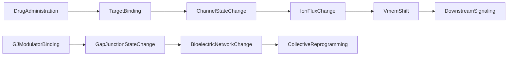

# Pharmacology -- Bioelectric Pharmacology Ontology

Models bioelectric pharmacology as a formal ontology: drug classes, specific
agents, molecular targets, and bioelectric effects. Encodes the causal graph
from drug administration through Vmem shift to downstream signaling, plus the
gap junction modulation pathway to collective reprogramming.

Key references:
- Kofman & Levin 2024: Bioelectric pharmacology of cancer
- Levin 2023: Morphoceuticals -- drugs targeting anatomical outcomes
- Adams & Levin 2013: Vmem manipulation via ion channel/pump cocktails
- Chernet & Levin 2013: depolarization as oncogene-like transformation

## Entities (25)

| Category | Entities |
|---|---|
| Drug classes (7) | IonChannelModulator, GapJunctionModulator, VoltageGatedBlocker, VoltageGatedOpener, MechanosensitiveModulator, ProtonPumpInhibitor, Morphoceutical |
| Agents (5) | Ivermectin, Decamethonium, Glibenclamide, Minoxidil, Omeprazole |
| Targets (4) | IonChannel, GapJunction, Transporter, Receptor |
| Effects (5) | Hyperpolarization, Depolarization, GapJunctionOpening, GapJunctionClosing, AntiInflammatory |
| Abstract (4) | DrugClass, Agent, Target, Effect |

## Taxonomy (is-a)

```mermaid
graph TD
    IonChannelModulator --> DrugClass
    GapJunctionModulator --> DrugClass
    VoltageGatedBlocker --> DrugClass
    VoltageGatedOpener --> DrugClass
    MechanosensitiveModulator --> DrugClass
    ProtonPumpInhibitor --> DrugClass
    Morphoceutical --> DrugClass
    Ivermectin --> Agent
    Ivermectin --> IonChannelModulator
    Decamethonium --> Agent
    Decamethonium --> IonChannelModulator
    Glibenclamide --> Agent
    Glibenclamide --> VoltageGatedBlocker
    Minoxidil --> Agent
    Minoxidil --> VoltageGatedOpener
    Omeprazole --> Agent
    Omeprazole --> ProtonPumpInhibitor
    IonChannel --> Target
    GapJunction --> Target
    Transporter --> Target
    Receptor --> Target
    Hyperpolarization --> Effect
    Depolarization --> Effect
    GapJunctionOpening --> Effect
    GapJunctionClosing --> Effect
    AntiInflammatory --> Effect
```

## Causal Graph

10 causal events across two chains.

## Opposition Pairs

| Pair | Meaning |
|---|---|
| Hyperpolarization / Depolarization | Opposite Vmem effects |
| GapJunctionOpening / GapJunctionClosing | Opposite GJ modulations |
| VoltageGatedBlocker / VoltageGatedOpener | Opposite drug classes |

## Qualities

| Quality | Type | Description |
|---|---|---|
| DrugTarget | PharmacologyEntity | What target does the agent act on (Ivermectin=Receptor, Omeprazole=Transporter, etc.) |
| VmemEffect | Hyperpolarizing, Depolarizing, Neutral | Direction of Vmem effect |
| IsMorphoceutical | bool | Whether the drug targets anatomical outcomes (Ivermectin, Minoxidil = true; Omeprazole = false) |
| RequiresPrescription | bool | Ivermectin, Decamethonium, Glibenclamide = true; Minoxidil, Omeprazole = false |
| IsEndogenouslyDerivable | bool | Whether the effect can be achieved without drugs (MechanosensitiveModulator = true) |

## Axioms (11)

| Axiom | Description | Source |
|---|---|---|
| PharmacologyTaxonomyIsDAG | Pharmacology taxonomy is a DAG | structural |
| PharmacologyCausalAsymmetry | Pharmacology causal graph is asymmetric | structural |
| DrugAdministrationCausesVmemShift | Drug administration transitively causes Vmem shift | chain 1 |
| GJModulatorCausesCollectiveReprogramming | Gap junction modulator causes collective reprogramming | Levin network effect |
| IvermectinIsHyperpolarizing | Ivermectin is hyperpolarizing (GlyR agonist, Cl- influx) | Chernet & Levin 2013 |
| OmeprazoleIsNotMorphoceutical | Omeprazole is not a morphoceutical (targets acid, not anatomy) | classification |
| MorphoceuticalsTargetAnatomy | Morphoceuticals target anatomical outcomes (subset of drugs) | Levin 2023 |
| MechanosensitiveIsEndogenous | Mechanosensitive modulator is endogenously derivable (vibration suffices) | mechanism |
| EveryAgentHasTarget | Every agent has a drug target | structural |
| PharmacologyOppositionSymmetric | Pharmacology opposition is symmetric | structural |
| PharmacologyOppositionIrreflexive | Pharmacology opposition is irreflexive | structural |

## Functors

**Outgoing (2):**

| Functor | Target | File |
|---|---|---|
| PharmacologyToMolecular | molecular | `molecular_functor.rs` |
| PharmacologyToImmunology | immunology | `immunology_functor.rs` |

**Incoming (0):**

No incoming functors.

## Files

- `ontology.rs` -- Entity, taxonomy, category, qualities, axioms, tests
- `molecular_functor.rs` -- PharmacologyToMolecular functor
- `immunology_functor.rs` -- PharmacologyToImmunology functor
- `mod.rs` -- Module declarations
