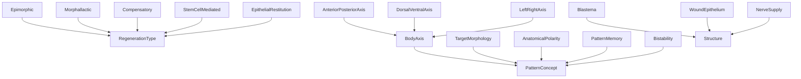
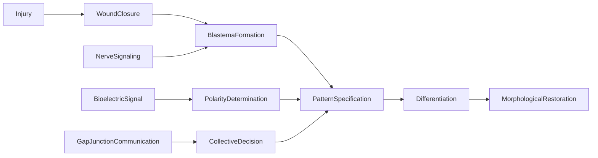

# Regeneration -- Regeneration Science Ontology

Models the biology of regeneration based on Dr. Michael Levin's research -- how
organisms restore lost or damaged structures. Covers five regeneration types
(epimorphic, morphallactic, compensatory, stem-cell-mediated, epithelial
restitution), pattern concepts (target morphology, polarity, bistability),
body axes, and structures (blastema, wound epithelium, nerve supply).

Key references:
- Levin 2012: Molecular bioelectricity in developmental biology
- Levin 2015: Planarian anterior/posterior polarity editing (PMID:26610482)
- Kumar & Brockes 2012: Nerve dependence in amphibian regeneration
- Oviedo et al. 2010: Gap junctions in planarian regeneration

## Entities (19)

| Category | Entities |
|---|---|
| Regeneration types (5) | Epimorphic, Morphallactic, Compensatory, StemCellMediated, EpithelialRestitution |
| Pattern concepts (4) | TargetMorphology, AnatomicalPolarity, PatternMemory, Bistability |
| Body axes (3) | AnteriorPosteriorAxis, DorsalVentralAxis, LeftRightAxis |
| Structures (3) | Blastema, WoundEpithelium, NerveSupply |
| Abstract (4) | RegenerationType, BodyAxis, PatternConcept, Structure |

## Taxonomy (is-a)

## Causal Graph

11 causal events in the regenerative cascade.

## Opposition Pairs

| Pair | Meaning |
|---|---|
| Epimorphic / EpithelialRestitution | Most complex vs simplest regeneration |
| Blastema / WoundEpithelium | Proliferative structure vs protective barrier |
| TargetMorphology / Bistability | Single attractor vs multiple stable states |

## Qualities

| Quality | Type | Description |
|---|---|---|
| RequiresBlastema | bool | Only Epimorphic = true |
| RequiresNerveSupply | bool | Only Epimorphic = true |
| IsReversible | bool | AnatomicalPolarity, Bistability, body axes = true; TargetMorphology, PatternMemory = false |
| RegenerationSpeed | Hours, Days, Weeks, Months | EpithelialRestitution=Hours, Morphallactic=Days, Epimorphic/StemCellMediated=Weeks, Compensatory=Months |
| RequiresBioelectricSignal | bool | All types except EpithelialRestitution = true |
| PrimaryModelOrganism | Salamander, Planarian, Zebrafish, Mouse, Human | Canonical model organism for each type |

## Axioms (13)

| Axiom | Description | Source |
|---|---|---|
| TaxonomyIsDAG | Regeneration taxonomy is a directed acyclic graph | structural |
| CausalAsymmetric | Regeneration causal graph is asymmetric | structural |
| CausalNoSelfCausation | No regeneration event directly causes itself | structural |
| InjuryCausesRestoration | Injury transitively causes morphological restoration | cascade |
| BioelectricCausesPattern | Bioelectric signal causes pattern specification | Levin's core insight |
| GapJunctionCausesCollectiveDecision | Gap junction communication causes collective decision | Oviedo 2010 |
| PatternMemoryIsNotRegenerationType | PatternMemory is a PatternConcept, not a RegenerationType | structural |
| BistabilityIsPatterning | Bistability is a pattern concept and is reversible | Levin 2015 |
| EpimorphicRequiresBlastemaAndNerve | Epimorphic regeneration requires both blastema and nerve supply | Kumar & Brockes 2012 |
| EpithelialRestitutionNoBioelectric | Epithelial restitution does not require bioelectric signal | biology |
| AllBodyAxesRepresented | All three body axes (AP, DV, LR) are represented | structural |
| RegenerationOppositionSymmetric | Regeneration opposition is symmetric | structural |
| RegenerationOppositionIrreflexive | Regeneration opposition is irreflexive | structural |

## Functors

**Outgoing (2):**

| Functor | Target | File |
|---|---|---|
| RegenerationToBioelectric | bioelectricity | `bioelectricity_functor.rs` |
| RegenerationToBiology | biology | `biology_functor.rs` |

**Incoming (2):**

| Functor | Source | File |
|---|---|---|
| BioelectricToRegeneration | bioelectricity | `../bioelectricity/regeneration_functor.rs` |
| ImmunologyToRegeneration | immunology | `../immunology/regeneration_functor.rs` |

## Files

- `ontology.rs` -- Entity, taxonomy, category, qualities, axioms, tests
- `bioelectricity_functor.rs` -- RegenerationToBioelectric functor
- `biology_functor.rs` -- RegenerationToBiology functor
- `mod.rs` -- Module declarations
