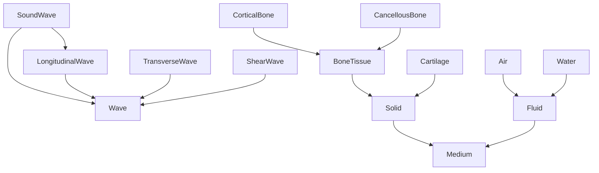
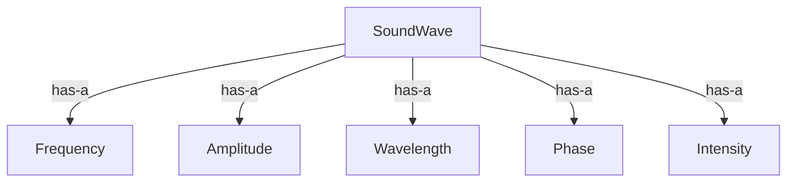
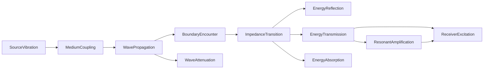

# Acoustics -- Physics of sound: waves, media, propagation

Models the physics of sound as a category of wave types, propagation media, and acoustic phenomena, layered with a mereology (a sound wave has-a frequency/amplitude/wavelength/phase/intensity), a causal chain from source vibration to receiver excitation, and opposition pairs. Qualities encode speed of sound, acoustic impedance, shear-wave support, and medium phase for bone-conduction-relevant media.

Key references:
- Kinsler et al. 2000: *Fundamentals of Acoustics* (4th ed.)
- Pierce 2019: *Acoustics: An Introduction to Its Physical Principles*
- Rossing 2007: *Springer Handbook of Acoustics*
- Stenfelt & Goode 2005: bone vs air conduction impedance
- von Békésy 1960: *Experiments in Hearing*

## Entities (28)

| Category | Entities |
|---|---|
| Wave properties (5) | Frequency, Amplitude, Wavelength, Phase, Intensity |
| Wave types (4) | SoundWave, LongitudinalWave, TransverseWave, ShearWave |
| Propagation media (7) | Air, Water, CorticalBone, CancellousBone, SoftTissue, Cartilage, Fluid |
| Acoustic phenomena (7) | Resonance, Reflection, Refraction, Diffraction, Absorption, Attenuation, ImpedanceMismatch |
| Abstract (5) | Wave, Medium, WaveProperty, AcousticPhenomenon, Solid, BoneTissue |

## Taxonomy

## Mereology

## Causal graph

## Opposition

| Pair | Meaning |
|---|---|
| Reflection / Refraction | Return vs bend at boundary |
| Absorption / Resonance | Energy lost vs energy stored |
| LongitudinalWave / TransverseWave | Particle motion parallel vs perpendicular to propagation |

## Qualities

| Quality | Type | Description |
|---|---|---|
| SpeedOfSound | f64 (m/s) | Air 343, Water 1480, CorticalBone 4080, CancellousBone 1800, SoftTissue 1540, Cartilage 1665 |
| AcousticImpedance | f64 (Pa·s/m) | rho·c; bone ~7.38e6, air 413 |
| SupportsShearWaves | bool | True for solids (bone, cartilage), false for fluids |
| MediumPhase | MediumState | Gas, Liquid, or SolidState |

## Axioms

| Axiom | Description | Source |
|---|---|---|
| BoneFasterThanAir | Speed of sound in cortical bone exceeds speed in air | Stenfelt & Goode 2005 |
| BoneAirImpedanceMismatch | Bone impedance > 1000x air impedance | Stenfelt & Goode 2005 |
| SoftTissueMatchesWater | Soft tissue impedance within 15% of water | Kinsler et al. 2000 |
| OnlySolidsHaveShearWaves | Only solid media support shear waves | Kinsler et al. 2000 Ch. 6 |
| SourceCausesReceiver | Source vibration transitively causes receiver excitation | auto-generated |

Plus the auto-generated structural axioms from `define_ontology!` (category laws over the kinded relation graph).

## Functors

Outgoing:

| Functor | Target | File |
|---|---|---|
| AcousticsToSpeech | speech | `speech_functor.rs` |
| AcousticsToSignalProcessing | signal_processing | `signal_functor.rs` |
| AcousticsToEnvironmentalAcoustics | environmental_acoustics | `environment_functor.rs` |

Incoming:

| Functor | Source | File |
|---|---|---|
| AcousticsToBoneConduction | bone_conduction | `../bone_conduction/acoustics_functor.rs` |

See [Compose via functor](../../../../../../docs/use/compose-via-functor.md) to add more.

## Files

- `ontology.rs` -- `AcousticEntity`, taxonomy, mereology, causal graph, opposition, qualities, 5 domain axioms, tests
- `speech_functor.rs` -- Functor into the speech ontology
- `signal_functor.rs` -- Functor into the signal processing ontology
- `environment_functor.rs` -- Functor into the environmental acoustics ontology
- `mod.rs` -- Module declarations
