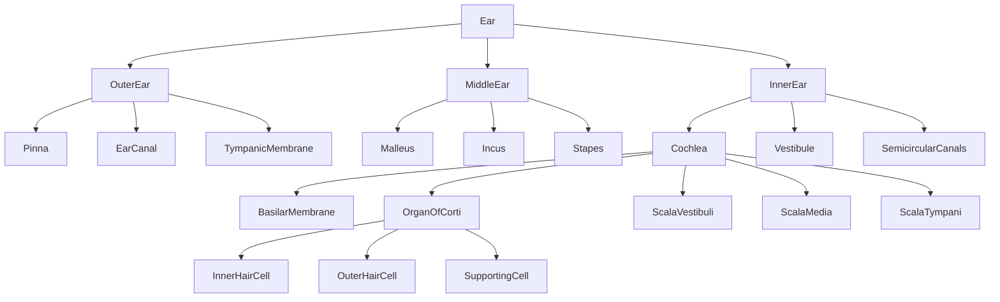

# Auditory Anatomy -- Ear → outer/middle/inner → structures → cells

Models the structural hierarchy of the human auditory system: outer/middle/inner ear, cochlear compartments, hair cell types, and the afferent neural pathway from auditory nerve to cortex. The ontology combines a taxonomy (Malleus is-a Ossicle) with a mereology (Ear has-a Cochlea has-a OrganOfCorti has-a InnerHairCell) and qualities for anatomical region, mechanical activity, and characteristic resonance frequency.

Key references:
- Pickles 2012: *An Introduction to the Physiology of Hearing* (4th ed.)
- Raphael & Altschuler 2003: structure and innervation of the cochlea
- Dallos, Popper & Fay 1996: *The Cochlea* (Springer)
- von Békésy 1960: *Experiments in Hearing*
- Hudspeth 2014: integrating the active process of hair cells

## Entities (43)

| Category | Entities |
|---|---|
| Outer ear (3) | Pinna, EarCanal, TympanicMembrane |
| Ossicles + middle ear (8) | Malleus, Incus, Stapes, OvalWindow, RoundWindow, EustachianTube, TensorTympani, Stapedius |
| Cochlear structures (11) | Cochlea, BasilarMembrane, OrganOfCorti, TectorialMembrane, ScalaVestibuli, ScalaMedia, ScalaTympani, Endolymph, Perilymph, StriVascularis, ReissnersMembrane |
| Vestibular (2) | Vestibule, SemicircularCanals |
| Cells (4) | InnerHairCell, OuterHairCell, SupportingCell, SpiralGanglionNeuron |
| Neural pathway (6) | AuditoryNerve, CochlearNucleus, SuperiorOlivaryComplex, InferiorColliculus, MedialGeniculateBody, AuditoryCortex |
| Abstract (9) | Ear, OuterEar, MiddleEar, InnerEar, Ossicle, HairCell, CochlearFluid, CochlearMembrane, AuditoryNucleus |

## Taxonomy

```mermaid
graph TD
    OuterEar --> Ear
    MiddleEar --> Ear
    InnerEar --> Ear
    Malleus --> Ossicle
    Incus --> Ossicle
    Stapes --> Ossicle
    InnerHairCell --> HairCell
    OuterHairCell --> HairCell
    BasilarMembrane --> CochlearMembrane
    TectorialMembrane --> CochlearMembrane
    ReissnersMembrane --> CochlearMembrane
    Endolymph --> CochlearFluid
    Perilymph --> CochlearFluid
    CochlearNucleus --> AuditoryNucleus
    SuperiorOlivaryComplex --> AuditoryNucleus
    InferiorColliculus --> AuditoryNucleus
    MedialGeniculateBody --> AuditoryNucleus
```

## Mereology

## Opposition

| Pair | Meaning |
|---|---|
| OuterEar / InnerEar | Air-side vs fluid-side |
| Endolymph / Perilymph | Scala media vs scala vestibuli/tympani |
| InnerHairCell / OuterHairCell | Afferent sensor vs cochlear amplifier |

## Qualities

| Quality | Type | Description |
|---|---|---|
| RegionQuality | AnatomicalRegion | External / MiddleEarRegion / InnerEarRegion / Neural / Abstract (total) |
| IsMechanicallyActive | bool | Tympanic membrane, ossicles, windows, basilar/tectorial membrane, hair cells |
| CharacteristicFrequency | f64 (Hz) | Pinna 2700, EarCanal 3000, TympanicMembrane 1000, Stapes 1000 |

## Axioms

| Axiom | Description | Source |
|---|---|---|
| ThreeOssicles | Malleus, incus, and stapes are ossicles | standard |
| CochleaContainsHairCells | Cochlea transitively contains inner and outer hair cells | standard |
| EarContainsHairCells | Ear transitively contains inner and outer hair cells | standard |
| CochleaHasThreeScalae | Cochlea contains scala vestibuli, media, and tympani | standard |
| AllRegionsRepresented | All four non-abstract regions populated | structural |
| HairCellsAreMechanicallyActive | Both inner and outer hair cells are mechanically active | Hudspeth 2014 |

Plus the auto-generated structural axioms from `define_ontology!`.

## Functors

Outgoing:

| Functor | Target | File |
|---|---|---|
| AnatomyToVestibular | vestibular | `vestibular_functor.rs` |

Incoming:

| Functor | Source | File |
|---|---|---|
| AnatomyToTransduction | transduction | `../transduction/anatomy_functor.rs` |

See [Compose via functor](../../../../../../docs/use/compose-via-functor.md) to add more.

## Files

- `ontology.rs` -- `AuditoryEntity`, taxonomy, mereology, opposition, qualities, 6 domain axioms, tests
- `vestibular_functor.rs` -- Functor into the vestibular ontology (shared inner ear)
- `mod.rs` -- Module declarations
