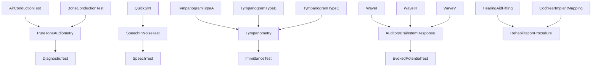
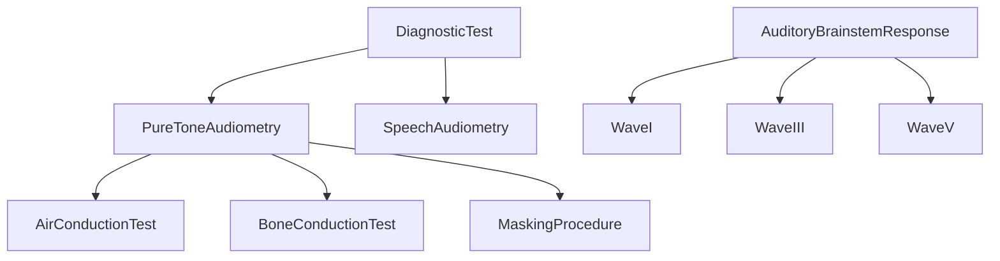
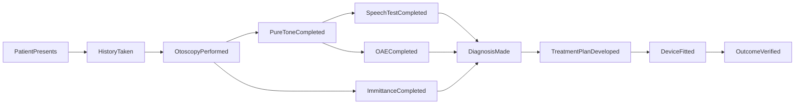

# Audiology -- Clinical assessment and rehabilitation

Models clinical audiological procedures: pure-tone and speech audiometry, tympanometry, otoacoustic emissions, auditory brainstem response, and the full clinical workflow from patient presentation through outcome verification. Qualities capture ABR wave latencies, test durations, and whether a procedure requires patient cooperation.

Key references:
- Katz et al. 2015: *Handbook of Clinical Audiology* (7th ed.)
- Stach 2010: *Clinical Audiology: An Introduction*
- Carhart 1950: clinical bone conduction testing
- Jerger 1970: tympanometry Type A/B/C classification
- ASHA 2005: Guidelines for Manual Pure-Tone Threshold Audiometry
- Kemp 1978: otoacoustic emissions discovery

## Entities (45)

| Category | Entities |
|---|---|
| Pure-tone audiometry (6) | PureToneAudiometry, AirConductionTest, BoneConductionTest, MaskingProcedure, AirBoneGap, PureToneAverage |
| Speech testing (6) | SpeechAudiometry, SpeechRecognitionThreshold, WordRecognitionScore, SpeechInNoiseTest, QuickSIN, HINT |
| Immittance (7) | Tympanometry, TympanogramTypeA/B/C, AcousticReflex, AcousticReflexDecay, StaticCompliance |
| Emissions (3) | TransientOAE, DistortionProductOAE, OAEScreening |
| Evoked potentials (7) | AuditoryBrainstemResponse, WaveI/III/V, ElectroCochleography, AuditoryLateResponse |
| Rehabilitation (6) | AuralRehabilitation, HearingAidFitting, RealEarVerification, CochlearImplantMapping, AuditoryTraining, CommunicationStrategy |
| Clinical workflow (4) | CaseHistory, Otoscopy, Referral, Counseling |
| Abstract (6) | DiagnosticTest, SpeechTest, ImmittanceTest, EmissionTest, EvokedPotentialTest, RehabilitationProcedure, ClinicalWorkflow |

## Taxonomy

## Mereology

## Causal graph

## Opposition

| Pair | Meaning |
|---|---|
| AirConductionTest / BoneConductionTest | Transducer route through ear canal vs skull |
| TransientOAE / DistortionProductOAE | Transient click vs two-tone distortion product |
| PureToneAudiometry / SpeechAudiometry | Tonal threshold vs linguistic recognition |

## Qualities

| Quality | Type | Description |
|---|---|---|
| ABRLatencyMs | f64 | WaveI 1.5, WaveIII 3.5, WaveV 5.5 |
| TestDurationMinutes | f64 | PureToneAudiometry 20, ABR 30, Tympanometry 2 |
| RequiresCooperation | bool | True for behavioral tests; false for ABR, OAE, tympanometry |

## Axioms

| Axiom | Description | Source |
|---|---|---|
| DiagnosticTestContainsConductionTests | Diagnostic test transitively contains air and bone conduction tests | standard |
| ABRWavesOrdered | ABR wave latencies ordered I < III < V | standard |
| ThreeTympanogramTypes | Types A, B, C are all classified | Jerger 1970 |
| ABRLongerThanTympanometry | ABR takes longer than tympanometry | standard |
| ABRIsObjective | ABR does not require patient cooperation | standard |
| FullClinicalPathway | Patient presentation transitively leads to outcome verification | standard |
| QuickSINSubsumption | QuickSIN is-a speech-in-noise test is-a speech test | standard |

Plus the auto-generated structural axioms from `define_ontology!`.

## Functors

No outgoing functors yet.

Incoming:

| Functor | Source | File |
|---|---|---|
| AudiologyFromPathology | pathology | `../pathology/audiology_functor.rs` |

See [Compose via functor](../../../../../../docs/use/compose-via-functor.md) to add more.

## Files

- `ontology.rs` -- `AudiologyEntity`, taxonomy, mereology, causal graph, opposition, qualities, 7 domain axioms, tests
- `mod.rs` -- Module declarations
