# Auditory Neuroscience -- Neural processing from nerve to cortex

Models neural processing of sound: coding strategies (rate, temporal, phase locking, place, population, spike timing), response properties, tonotopic processing stages, binaural mechanisms, and higher functions such as auditory scene analysis. The causal chain runs from auditory nerve input through cochlear nucleus, binaural convergence, lemniscal relay, thalamic gating, and cortical analysis to perceptual binding.

Key references:
- Kandel et al. 2021: *Principles of Neural Science* (6th ed.)
- Schnupp, Nelken & King 2011: *Auditory Neuroscience*
- Pickles 2012: *Physiology of Hearing*
- Bregman 1990: *Auditory Scene Analysis*
- Sachs & Young 1979: rate-place coding in auditory nerve
- Goldberg & Brown 1969: phase locking in superior olive
- Joris, Schreiner & Rees 2004: neural processing of amplitude-modulated sounds

## Entities (39)

| Category | Entities |
|---|---|
| Coding strategies (6) | RateCoding, TemporalCoding, PhaseLocking, PlaceCoding, PopulationCoding, SpikeTimingCode |
| Response properties (10) | TonotopicMap, FrequencyTuningCurve, CharacteristicFrequency, RateLevelFunction, SpontaneousRate, DynamicRange, OnsetResponse, SustainedResponse, Adaptation, Inhibition |
| Processing stages (7) | AuditoryNerveFiber, CochlearNucleusProcessing, SuperiorOliveProcessing, LateralLemniscus, InferiorColliculusProcessing, MedialGeniculateProcessing, AuditoryCortexProcessing |
| Binaural mechanisms (4) | CoincidenceDetection, ExcitatoryInhibitory, MedialSuperiorOlive, LateralSuperiorOlive |
| Higher functions (6) | AuditorySceneAnalysis, StreamSegregation, GestaltGrouping, EchoSuppression, PrecedenceEffect, MismatchNegativity |
| Abstract (6) | BinauralProcessing, CodingStrategy, ResponseProperty, ProcessingStage, BinauralMechanism, HigherFunction |

## Taxonomy

```mermaid
graph TD
    RateCoding --> CodingStrategy
    TemporalCoding --> CodingStrategy
    PhaseLocking --> CodingStrategy
    PlaceCoding --> CodingStrategy
    PopulationCoding --> CodingStrategy
    SpikeTimingCode --> CodingStrategy
    AuditoryNerveFiber --> ProcessingStage
    CochlearNucleusProcessing --> ProcessingStage
    SuperiorOliveProcessing --> ProcessingStage
    InferiorColliculusProcessing --> ProcessingStage
    MedialGeniculateProcessing --> ProcessingStage
    AuditoryCortexProcessing --> ProcessingStage
    MedialSuperiorOlive --> BinauralMechanism
    LateralSuperiorOlive --> BinauralMechanism
    StreamSegregation --> HigherFunction
    AuditorySceneAnalysis --> HigherFunction
```

## Causal graph

```mermaid
graph LR
    AuditoryNerveInput --> CochlearNucleusIntegration
    CochlearNucleusIntegration --> BinauralConvergence
    BinauralConvergence --> LemniscalRelay
    LemniscalRelay --> MultisensoryIntegration
    MultisensoryIntegration --> ThalamicGating
    ThalamicGating --> CorticalAnalysis
    CorticalAnalysis --> StreamFormation
    StreamFormation --> PerceptualBinding
```

## Opposition

| Pair | Meaning |
|---|---|
| RateCoding / TemporalCoding | Spike count vs spike timing |
| OnsetResponse / SustainedResponse | Transient vs tonic |
| Inhibition / Adaptation | Active suppression vs gain reduction |

## Qualities

| Quality | Type | Description |
|---|---|---|
| PhaseLockingLimit | f64 (Hz) | AN fiber 4000, CN 4000, MSO 1500 |
| SynapticDelay | f64 (ms) | CN 0.8, SOC 1.2 |
| IsTonotopic | bool | True for AN, CN, SOC, IC, MGN, AC |

## Axioms

| Axiom | Description | Source |
|---|---|---|
| InputCausesBinding | Auditory nerve input transitively causes perceptual binding | standard |
| SixCodingStrategies | All six coding strategies classified under CodingStrategy | standard |
| SOCDelayLongerThanCN | Superior olive synaptic delay exceeds cochlear nucleus delay | standard |
| AllStagesAreTonotopic | All major processing stages are tonotopic | Pickles 2012 |

Plus the auto-generated structural axioms from `define_ontology!`.

## Functors

Outgoing:

| Functor | Target | File |
|---|---|---|
| NeuroscienceToMusic | music_perception | `music_functor.rs` |

Incoming:

| Functor | Source | File |
|---|---|---|
| TransductionToNeuroscience | transduction | `transduction_functor.rs` |

See [Compose via functor](../../../../../../docs/use/compose-via-functor.md) to add more.

## Files

- `ontology.rs` -- `NeuralEntity`, taxonomy, causal graph, opposition, qualities, 4 domain axioms, tests
- `transduction_functor.rs` -- Functor from the transduction ontology
- `music_functor.rs` -- Functor into the music perception ontology
- `mod.rs` -- Module declarations
