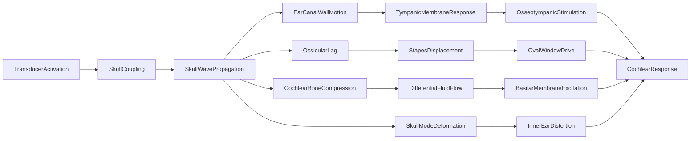

# Bone Conduction -- Vibration reaching the cochlea through skull bone

Models the three primary bone conduction mechanisms — osseotympanic, inertial, compressional — plus distortional mode, along with transducer types, skull application sites, and BC-specific phenomena (occlusion effect, transcranial attenuation, skull resonance). The causal graph has four parallel pathways from transducer activation through skull wave propagation to cochlear response, all converging on the same cochlear response node.

Key references:
- Stenfelt & Goode 2005: comprehensive review of BC pathways
- Stenfelt 2011: relative contributions of each BC mechanism
- Tonndorf 1966: original classification of BC mechanisms
- von Békésy 1960: foundational impedance measurements
- Stenfelt 2015: inner ear compressional mechanism
- Reinfeldt et al. 2015: estimation of BC pathways

## Entities (30)

| Category | Entities |
|---|---|
| BC mechanisms (4) | OsseotympanicBC, InertialBC, CompressionalBC, DistortionalBC |
| Motion intermediates (7) | SkullVibration, EarCanalWallVibration, OssicularInertia, CochlearWallCompression, FluidInertia, SkullDeformation, SoundRadiation |
| Transducers (6) | BoneAnchoredDevice, PercutaneousImplant, TranscutaneousDevice, SkinDriveTransducer, PiezoelectricTransducer, ElectromagneticTransducer |
| Application sites (5) | Mastoid, Forehead, TemporalBone, Vertex, Teeth |
| Phenomena (4) | OcclusionEffect, TranscranialAttenuation, SkullResonance, ForceLevel |
| Abstract (4) | BCMechanism, BCTransducer, ApplicationSite, BCPhenomenon |

## Taxonomy

```mermaid
graph TD
    OsseotympanicBC --> BCMechanism
    InertialBC --> BCMechanism
    CompressionalBC --> BCMechanism
    DistortionalBC --> BCMechanism
    BoneAnchoredDevice --> BCTransducer
    PercutaneousImplant --> BCTransducer
    TranscutaneousDevice --> BCTransducer
    SkinDriveTransducer --> BCTransducer
    PiezoelectricTransducer --> BCTransducer
    ElectromagneticTransducer --> BCTransducer
    Mastoid --> ApplicationSite
    Forehead --> ApplicationSite
    TemporalBone --> ApplicationSite
    Vertex --> ApplicationSite
    Teeth --> ApplicationSite
    OcclusionEffect --> BCPhenomenon
    TranscranialAttenuation --> BCPhenomenon
    SkullResonance --> BCPhenomenon
```

## Causal graph

## Opposition

| Pair | Meaning |
|---|---|
| OsseotympanicBC / CompressionalBC | Air-coupled bone path vs direct cochlear compression |
| PercutaneousImplant / TranscutaneousDevice | Through-skin abutment vs through-skin magnetic |
| Mastoid / Forehead | Lateral vs midline placement |

## Qualities

| Quality | Type | Description |
|---|---|---|
| DominantFrequencyRange | FrequencyRange {low, high} | Osseotympanic 20-1000, Inertial 100-3000, Compressional 4000-10000, Distortional 20-400 |
| TranscranialAttenuationDB | f64 | Mastoid 10, TemporalBone 12, Teeth 5, Forehead/Vertex 0 |
| SkullResonanceFrequency | f64 (Hz) | Mastoid 200, Forehead 800 |
| RequiresSurgery | bool | Implantable devices yes; skin-drive devices no |

## Axioms

| Axiom | Description | Source |
|---|---|---|
| FourBCMechanisms | All four BC mechanisms (osseotympanic, inertial, compressional, distortional) are classified | Tonndorf 1966; Stenfelt 2011 |
| TransducerCausesCochlearResponse | Transducer activation transitively causes cochlear response | standard |
| AllPathwaysConverge | Osseotympanic, inertial, and compressional pathways all reach cochlear response | Stenfelt & Goode 2005 |
| InertialCoversSpeechRange | Inertial BC covers the speech frequency range (100-3000 Hz) | Stenfelt 2011 |
| ForeheadResonanceHigherThanMastoid | Forehead skull resonance frequency exceeds mastoid | standard |
| MidlineSitesSymmetric | Midline application sites have zero transcranial attenuation | standard |

Plus the auto-generated structural axioms from `define_ontology!`.

## Functors

No outgoing functors yet.

Incoming:

| Functor | Source | File |
|---|---|---|
| AcousticsToBoneConduction | acoustics | `acoustics_functor.rs` |

See [Compose via functor](../../../../../../docs/use/compose-via-functor.md) to add more.

## Files

- `ontology.rs` -- `BoneCondEntity`, taxonomy, causal graph, opposition, qualities, 6 domain axioms, tests
- `acoustics_functor.rs` -- Functor from the acoustics ontology (AcousticsCategory → BoneConductionCategory)
- `mod.rs` -- Module declarations
