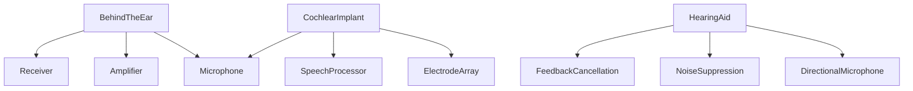

# Hearing Devices -- Assistive hearing technology and audiometric equipment

Models hearing aids, implantable devices, bone-conduction devices, signal processing features, diagnostic equipment, and shared device components. The mereology captures which components make up which devices (BTE contains microphone, amplifier, receiver; cochlear implant contains electrode array, speech processor, microphone). The causal graph follows the clinical device pathway from diagnosis through fitting to outcome improvement.

Key references:
- Dillon 2012: *Hearing Aids* (2nd ed.)
- Zeng et al. 2008: *Cochlear Implants* (Springer)
- Tjellström et al. 1981: bone-anchored hearing aid
- Håkansson et al. 2010: BC hearing devices review
- Chasin 2006: *Musicians and the Prevention of Hearing Loss*

## Entities (36)

| Category | Entities |
|---|---|
| Hearing aids (6) | BehindTheEar, InTheEar, CompletelyInCanal, ReceiverInCanal, CROS, BiCROS |
| Implantable (4) | CochlearImplant, BoneAnchoredHearingAid, MiddleEarImplant, AuditoryBrainstemImplant |
| BC devices (3) | BoneConductionHeadphone, SoftbandBAHA, AdhesiveBC |
| Signal processing features (7) | DirectionalMicrophone, NoiseSuppression, FeedbackCancellation, FrequencyCompression, WideAdaptiveDynamicRange, Telecoil, BluetoothStreaming |
| Diagnostic equipment (5) | Audiometer, Tympanometer, OAEProbe, ABRSystem, RealEarMeasurement |
| Components (5) | Microphone, Amplifier, Receiver, ElectrodeArray, SpeechProcessor |
| Abstract (6) | HearingAid, ImplantableDevice, BCDevice, SignalProcessingFeature, DiagnosticEquipment, DeviceComponent |

## Taxonomy

```mermaid
graph TD
    BehindTheEar --> HearingAid
    InTheEar --> HearingAid
    CompletelyInCanal --> HearingAid
    ReceiverInCanal --> HearingAid
    CROS --> HearingAid
    BiCROS --> HearingAid
    CochlearImplant --> ImplantableDevice
    BoneAnchoredHearingAid --> ImplantableDevice
    MiddleEarImplant --> ImplantableDevice
    AuditoryBrainstemImplant --> ImplantableDevice
    BoneAnchoredHearingAid --> BCDevice
    BoneConductionHeadphone --> BCDevice
    SoftbandBAHA --> BCDevice
    AdhesiveBC --> BCDevice
    DirectionalMicrophone --> SignalProcessingFeature
    NoiseSuppression --> SignalProcessingFeature
    FeedbackCancellation --> SignalProcessingFeature
```

## Mereology

## Causal graph

## Opposition

| Pair | Meaning |
|---|---|
| CochlearImplant / HearingAid | Direct electrical stimulation vs acoustic amplification |
| BehindTheEar / CompletelyInCanal | Largest vs smallest form factor |
| DirectionalMicrophone / Telecoil | Acoustic pickup vs magnetic induction |

## Qualities

| Quality | Type | Description |
|---|---|---|
| MaxGainDB | f64 | CIC 40, ITE 55, BTE 75, RIC 60, CI 120, BAHA 45, BC headphone 30 |
| BatteryLifeDays | f64 | BTE 7, CIC 5, CI 1 |
| RequiresSurgery | bool | Implantables yes; conventional/external no |

## Axioms

| Axiom | Description | Source |
|---|---|---|
| BTEContainsComponents | BTE contains microphone, amplifier, receiver | Dillon 2012 |
| CIHighestGain | Cochlear implant provides highest effective gain | standard |
| ImplantablesRequireSurgery | All implantable devices require surgery | standard |
| HearingAidsNoSurgery | Conventional hearing aids do not require surgery | standard |
| BAHADualClassification | BAHA is classified as both implantable and BC device | Tjellström et al. 1981 |
| BTELongestBattery | BTE has longest battery life among compared devices | standard |
| DiagnosisCausesOutcome | Hearing loss diagnosis transitively causes outcome improvement | standard |

Plus the auto-generated structural axioms from `define_ontology!`.

## Functors

No outgoing functors yet.

Incoming:

| Functor | Source | File |
|---|---|---|
| PathologyToDevices | pathology | `../pathology/devices_functor.rs` |

See [Compose via functor](../../../../../../docs/use/compose-via-functor.md) to add more.

## Files

- `ontology.rs` -- `DeviceEntity`, taxonomy, mereology, causal graph, opposition, qualities, 7 domain axioms, tests
- `mod.rs` -- Module declarations
