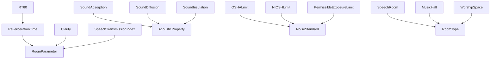
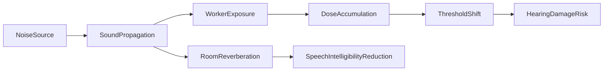

# Environmental Acoustics -- Room acoustics, noise exposure, soundscapes

Models applied acoustics: room parameters (RT60, clarity, STI), acoustic properties (absorption, diffusion, insulation), noise measures, occupational noise standards (OSHA, NIOSH), soundscape elements, and room types. The causal graph links noise source to hearing damage via dose accumulation and threshold shift, and links sound propagation to speech intelligibility reduction via room reverberation.

Key references:
- Kuttruff 2009: *Room Acoustics* (5th ed.)
- Sabine 1922: reverberation time formula (RT60 = 0.161V/A)
- OSHA 29 CFR 1910.95: 90 dBA TWA / 8 hr, 5 dB exchange rate
- NIOSH 1998: 85 dBA TWA / 8 hr, 3 dB exchange rate (recommended)
- ISO 3382-1:2009: room acoustic parameters
- Schafer 1977: *The Soundscape*

## Entities (45)

| Category | Entities |
|---|---|
| Room parameters (8) | ReverberationTime, RT60, EarlyDecayTime, Clarity, Definition, SpeechTransmissionIndex, CenterTime, LateralFraction |
| Acoustic properties (6) | SoundAbsorption, AbsorptionCoefficient, SoundDiffusion, SoundInsulation, TransmissionLoss, FlankingTransmission |
| Noise measures (8) | SoundPressureLevel, AWeighting, CWeighting, EquivalentContinuousLevel, PeakSoundLevel, SoundExposureLevel, NoiseDose, TimeWeightedAverage |
| Noise standards (5) | OSHALimit, NIOSHLimit, ExchangeRate, PermissibleExposureLimit, ActionLevel |
| Soundscape (4) | Keynote, SoundSignal, Soundmark, BackgroundNoise |
| Room types (3) | SpeechRoom, MusicHall, WorshipSpace |
| Measurement devices (3) | SoundLevelMeter, Dosimeter, CalibrationSource |
| Abstract (8) | Soundscape, RoomParameter, AcousticProperty, NoiseMeasure, NoiseStandard, SoundscapeElement, MeasurementDevice, RoomType |

## Taxonomy

## Causal graph

## Opposition

| Pair | Meaning |
|---|---|
| SoundAbsorption / SoundDiffusion | Energy removal vs energy scattering |
| AWeighting / CWeighting | Speech-band vs flat frequency weighting |

## Qualities

| Quality | Type | Description |
|---|---|---|
| RegulatoryLimitDB | f64 | OSHA 90, NIOSH 85, PEL 90, ActionLevel 85 |
| ExchangeRateDB | f64 | OSHA 5 dB, NIOSH 3 dB |
| IdealRT60Seconds | f64 | SpeechRoom 0.5, MusicHall 1.5, WorshipSpace 2.0 |

## Axioms

| Axiom | Description | Source |
|---|---|---|
| NIOSHStricterThanOSHA | NIOSH limit (85 dBA) is stricter than OSHA (90 dBA) | NIOSH 1998; OSHA 29 CFR 1910.95 |
| NIOSHUsesEqualEnergy | NIOSH uses 3 dB exchange rate (stricter than OSHA 5 dB) | NIOSH 1998 |
| RT60Subsumption | RT60 is-a ReverberationTime is-a RoomParameter | ISO 3382-1 |
| SpeechRoomShortestRT60 | Speech rooms have shortest ideal RT60 | Kuttruff 2009 |
| NoiseCausesHearingDamage | Noise source transitively causes hearing damage risk | standard |

Plus the auto-generated structural axioms from `define_ontology!`.

## Functors

Outgoing:

| Functor | Target | File |
|---|---|---|
| EnvironmentalAcousticsToPathology | pathology | `pathology_functor.rs` |

Incoming:

| Functor | Source | File |
|---|---|---|
| AcousticsToEnvironmentalAcoustics | acoustics | `../acoustics/environment_functor.rs` |

See [Compose via functor](../../../../../../docs/use/compose-via-functor.md) to add more.

## Files

- `ontology.rs` -- `EnvironmentEntity`, taxonomy, causal graph, opposition, qualities, 5 domain axioms, tests
- `pathology_functor.rs` -- Functor into the pathology ontology
- `mod.rs` -- Module declarations
