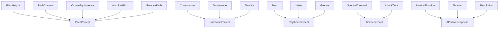
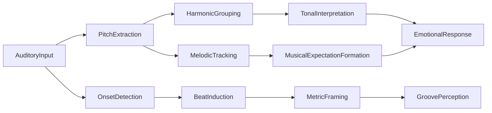

# Music Perception -- Higher-level auditory processing of music

Models how the auditory system perceives musical structure: pitch percepts (height, chroma, octave equivalence, absolute and relative pitch), harmonic percepts (consonance, dissonance, virtual pitch, tonality), rhythmic percepts (beat, meter, groove, entrainment), timbre percepts (spectral centroid, attack time), and affective responses (tension, resolution, musical emotion). The causal graph runs from auditory input through pitch extraction and onset detection to tonal interpretation and emotional response.

Key references:
- Helmholtz 1863: *On the Sensations of Tone*
- Krumhansl 1990: *Cognitive Foundations of Musical Pitch*
- Lerdahl & Jackendoff 1983: *A Generative Theory of Tonal Music*
- Huron 2006: *Sweet Anticipation*
- Plomp & Levelt 1965: consonance and critical bandwidth
- Large & Palmer 2002: neural resonance theory of rhythm
- Patel 2008: *Music, Language, and the Brain*
- McDermott & Oxenham 2008: music perception review

## Entities (40)

| Category | Entities |
|---|---|
| Pitch percepts (7) | PitchHeight, PitchChroma, OctaveEquivalence, AbsolutePitch, RelativePitch, MelodicContour, IntervalPerception |
| Harmonic percepts (9) | Consonance, Dissonance, RoughnessModel, HarmonicSeries, VirtualPitchPercept, MissingFundamental, Chord, Tonality, KeySense |
| Rhythmic percepts (7) | Beat, Meter, Tempo, Syncopation, Groove, Entrainment, TemporalExpectation |
| Timbre percepts (4) | SpectralCentroid, AttackTime, SpectralFlux, InstrumentIdentification |
| Affective (5) | MusicalExpectation, Surprise, Tension, Resolution, MusicalEmotion |
| Memory (3) | EarWorm, MusicalMemory, TonalSchemaMemory |
| Abstract (5) | PitchPercept, HarmonicPercept, RhythmicPercept, TimbrePercept, AffectiveResponse |

## Taxonomy

## Causal graph

## Opposition

| Pair | Meaning |
|---|---|
| Consonance / Dissonance | Smooth vs rough intervals (Plomp & Levelt 1965) |
| Tension / Resolution | Unresolved vs resolved harmonic state |
| AbsolutePitch / RelativePitch | Absolute frequency naming vs interval-based identification |

## Qualities

| Quality | Type | Description |
|---|---|---|
| ConsonanceRanking | u32 | Consonance 1, OctaveEquivalence 1, Dissonance 10 |
| PreferredTempoBPM | f64 | 120 bpm for Tempo, Beat, Entrainment |
| OctaveRatio | f64 | OctaveEquivalence 2.0 |

## Axioms

| Axiom | Description | Source |
|---|---|---|
| OctaveRatioIsTwo | Octave equivalence has a 2:1 frequency ratio | Helmholtz 1863 |
| ConsonanceOpposesDissonance | Consonance and dissonance are opposed | Plomp & Levelt 1965 |
| TensionOpposesResolution | Tension and resolution are opposed | Lerdahl & Jackendoff 1983 |
| ConsonanceRankedHigher | Consonance ranks higher (lower number) than dissonance | standard |
| FivePerceptualCategories | Pitch, harmonic, rhythmic, timbre, and affective categories exist | McDermott & Oxenham 2008 |
| InputCausesEmotion | Auditory input transitively causes emotional response | Huron 2006 |

Plus the auto-generated structural axioms from `define_ontology!`.

## Functors

No outgoing functors yet.

Incoming:

| Functor | Source | File |
|---|---|---|
| PsychoacousticsToMusic | psychoacoustics | `../psychoacoustics/music_functor.rs` |
| NeuroscienceToMusic | auditory_neuroscience | `../auditory_neuroscience/music_functor.rs` |

See [Compose via functor](../../../../../../docs/use/compose-via-functor.md) to add more.

## Files

- `ontology.rs` -- `MusicEntity`, taxonomy, causal graph, opposition, qualities, 6 domain axioms, tests
- `mod.rs` -- Module declarations
