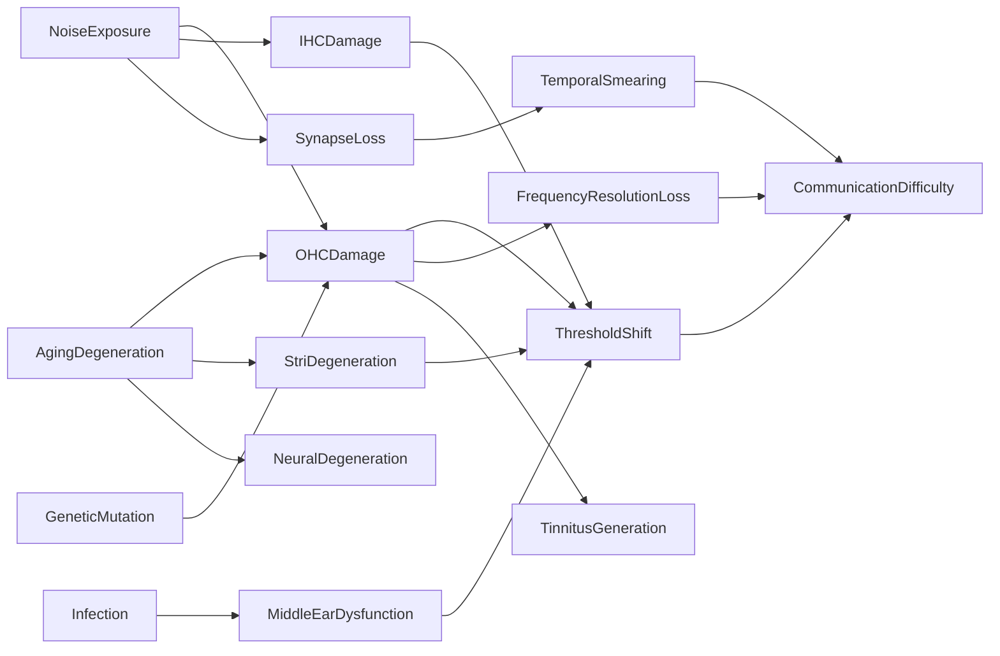

# Hearing Pathology -- Disorders, mechanisms, and perceptual consequences

Models hearing disorders at three levels: the clinical entity (conductive, sensorineural, mixed, auditory neuropathy, CAPD), the damage mechanism (hair cell loss, synaptic ribbon loss, stria dysfunction, etc.), and the perceptual deficit (elevated threshold, reduced frequency selectivity, loudness recruitment, poor speech in noise). The causal graph links etiologies (noise, aging, infection, genetic) through cellular damage to communication difficulty.

Key references:
- Møller 2006: *Hearing: Anatomy, Physiology, and Disorders*
- Gates & Mills 2005: *Presbycusis* (Lancet)
- Henderson et al. 2006: noise-induced hearing loss mechanisms
- Merchant & Rosowski 2008: conductive hearing loss
- Jastreboff 1990: neurophysiological model of tinnitus
- Eggermont & Roberts 2004: tinnitus neural mechanisms

## Entities (43)

| Category | Entities |
|---|---|
| Clinical entities (5) | ConductiveHearingLoss, SensorineuralHearingLoss, MixedHearingLoss, AuditoryNeuropathy, CentralAuditoryProcessingDisorder |
| Specific conditions (10) | Otosclerosis, Presbycusis, NoiseInducedHearingLoss, MenieresDisease, AcousticNeuroma, Tinnitus, Hyperacusis, SuddenSensorineuralLoss, OtitisMedia, TympanicPerforation, Cholesteatoma |
| Damage mechanisms (9) | HairCellLoss, StereociliaDamage, SynapticRibbonLoss, StriaDysfunction, OssicularFixation, EndolymphaticHydrops, DemyelinationVIII, Excitotoxicity, OxidativeStress |
| Perceptual deficits (7) | ElevatedThreshold, ReducedFrequencySelectivity, LoudnessRecruitment, PoorSpeechInNoise, ReducedTemporalResolution, AbnormalBinauralProcessing, PhantomPercept |
| Clinical measures (5) | Audiogram, PureToneAverage, SpeechReceptionThreshold, OtoacousticEmission, AuditoryBrainstemResponse |
| Abstract (6) | HearingLoss, PeripheralPathology, CentralPathology, DamageMechanism, PerceptualDeficit, ClinicalMeasure |

## Taxonomy

```mermaid
graph TD
    ConductiveHearingLoss --> HearingLoss
    SensorineuralHearingLoss --> HearingLoss
    MixedHearingLoss --> HearingLoss
    AuditoryNeuropathy --> HearingLoss
    CentralAuditoryProcessingDisorder --> HearingLoss
    Otosclerosis --> PeripheralPathology
    Presbycusis --> PeripheralPathology
    NoiseInducedHearingLoss --> PeripheralPathology
    MenieresDisease --> PeripheralPathology
    Tinnitus --> PeripheralPathology
    AcousticNeuroma --> CentralPathology
    CentralAuditoryProcessingDisorder --> CentralPathology
    HairCellLoss --> DamageMechanism
    StereociliaDamage --> DamageMechanism
    SynapticRibbonLoss --> DamageMechanism
    ElevatedThreshold --> PerceptualDeficit
    LoudnessRecruitment --> PerceptualDeficit
    PoorSpeechInNoise --> PerceptualDeficit
```

## Causal graph

## Opposition

| Pair | Meaning |
|---|---|
| ConductiveHearingLoss / SensorineuralHearingLoss | Middle-ear blockage vs cochlear/neural damage |
| Tinnitus / Hyperacusis | Phantom percept vs elevated loudness sensitivity |
| HairCellLoss / SynapticRibbonLoss | Presynaptic sensor loss vs synaptic connection loss |

## Qualities

| Quality | Type | Description |
|---|---|---|
| TypicalSeverityDB | f64 | Otosclerosis 40, Presbycusis 45, NIHL 50, AcousticNeuroma 55, SSNHL 60 |
| PrevalencePercent | f64 | Presbycusis 33, Tinnitus 15, NIHL 12 |
| OAEsPresent | bool | Conductive/neuropathy true; sensorineural/NIHL/presbycusis false |

## Axioms

| Axiom | Description | Source |
|---|---|---|
| NoiseCausesDifficulty | Noise exposure transitively causes communication difficulty | Henderson et al. 2006 |
| FiveHearingLossTypes | Five hearing loss types are classified under HearingLoss | standard |
| PresbycusisMostPrevalent | Presbycusis has highest prevalence among modeled conditions | Gates & Mills 2005 |
| NeuropathyHasOAEs | Auditory neuropathy has present OAEs (OHCs intact) | standard |

Plus the auto-generated structural axioms from `define_ontology!`.

## Functors

Outgoing:

| Functor | Target | File |
|---|---|---|
| PathologyToDevices | devices | `devices_functor.rs` |
| PathologyToAudiology | audiology | `audiology_functor.rs` |

Incoming:

| Functor | Source | File |
|---|---|---|
| EnvironmentalAcousticsToPathology | environmental_acoustics | `../environmental_acoustics/pathology_functor.rs` |

See [Compose via functor](../../../../../../docs/use/compose-via-functor.md) to add more.

## Files

- `ontology.rs` -- `PathologyEntity`, taxonomy, causal graph, opposition, qualities, 4 domain axioms, tests
- `devices_functor.rs` -- Functor into the devices ontology (disorder → treatment device)
- `audiology_functor.rs` -- Functor into the audiology ontology (disorder → diagnostic tests)
- `mod.rs` -- Module declarations
