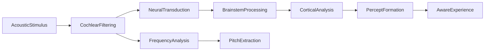

# Psychoacoustics -- How physical sound becomes subjective experience

Models auditory perception: the four perceptual dimensions (loudness, pitch, timbre, duration), loudness metrics (phon, sone, equal-loudness contour), pitch mechanisms (place, temporal, virtual), masking types, critical bands and auditory filters, temporal resolution, and spatial cues (ITD, ILD, HRTF). The causal graph runs from acoustic stimulus through cochlear filtering and neural transduction to aware experience.

Key references:
- Fletcher & Munson 1933: equal-loudness contours
- Zwicker & Fastl 2007: *Psychoacoustics: Facts and Models*
- Moore 2012: *An Introduction to the Psychology of Hearing* (6th ed.)
- Stevens 1957: sone scale for loudness
- Rayleigh 1907: duplex theory of sound localization
- Blauert 1997: *Spatial Hearing* (MIT Press)

## Entities (37)

| Category | Entities |
|---|---|
| Perceptual dimensions (4) | Loudness, Pitch, Timbre, Duration |
| Loudness metrics (4) | Phon, Sone, EqualLoudnessContour, LoudnessRecruitment |
| Pitch mechanisms (4) | PlacePitch, TemporalPitch, VirtualPitch, Octave |
| Masking types (4) | SimultaneousMasking, ForwardMasking, BackwardMasking, InformationalMasking |
| Critical-band (4) | CriticalBand, BarkScale, ERBScale, AuditoryFilter |
| Temporal (4) | FrequencySelectivity, TemporalResolution, GapDetection, TemporalIntegration |
| Spatial (4) | SoundLocalization, InterauralTimeDifference, InterauralLevelDifference, HeadRelatedTransferFunction |
| Thresholds (3) | AbsoluteThreshold, DifferentialThreshold, JustNoticeableDifference |
| Abstract (6) | PerceptualDimension, LoudnessMetric, PitchMechanism, MaskingType, SpatialCue, TemporalMeasure |

## Taxonomy

```mermaid
graph TD
    Loudness --> PerceptualDimension
    Pitch --> PerceptualDimension
    Timbre --> PerceptualDimension
    Duration --> PerceptualDimension
    Phon --> LoudnessMetric
    Sone --> LoudnessMetric
    EqualLoudnessContour --> LoudnessMetric
    PlacePitch --> PitchMechanism
    TemporalPitch --> PitchMechanism
    VirtualPitch --> PitchMechanism
    SimultaneousMasking --> MaskingType
    ForwardMasking --> MaskingType
    BackwardMasking --> MaskingType
    InformationalMasking --> MaskingType
    InterauralTimeDifference --> SpatialCue
    InterauralLevelDifference --> SpatialCue
    HeadRelatedTransferFunction --> SpatialCue
    TemporalResolution --> TemporalMeasure
    GapDetection --> TemporalMeasure
```

## Causal graph

## Opposition

| Pair | Meaning |
|---|---|
| PlacePitch / TemporalPitch | Tonotopic place code vs periodicity code |
| SimultaneousMasking / ForwardMasking | Concurrent vs temporally offset masking |
| InterauralTimeDifference / InterauralLevelDifference | Low-frequency vs high-frequency localization cue (Rayleigh duplex) |

## Qualities

| Quality | Type | Description |
|---|---|---|
| HearingThresholdDB | f64 | AbsoluteThreshold 0, JND 1 |
| CriticalBandwidth | f64 (Hz) | CriticalBand 160, AuditoryFilter 130 |
| GapDetectionThreshold | f64 (ms) | GapDetection 2.5, TemporalResolution 2.5 |
| ITDThreshold | f64 (µs / dB) | ITD 15, ILD 1 |

## Axioms

| Axiom | Description | Source |
|---|---|---|
| FourPerceptualDimensions | Loudness, pitch, timbre, duration are perceptual dimensions | Moore 2012 |
| FourMaskingTypes | Simultaneous, forward, backward, informational masking are classified | Zwicker & Fastl 2007 |
| ThreeSpatialCues | ITD, ILD, and HRTF are all spatial cues | Blauert 1997 |
| ITDOpposesILD | ITD and ILD are opposed spatial cues (duplex theory) | Rayleigh 1907 |
| StimulusCausesExperience | Acoustic stimulus transitively causes aware experience | standard |

Plus the auto-generated structural axioms from `define_ontology!`.

## Functors

Outgoing:

| Functor | Target | File |
|---|---|---|
| PsychoacousticsToMusic | music_perception | `music_functor.rs` |

Incoming:

| Functor | Source | File |
|---|---|---|
| TransductionToPsychoacoustics | transduction | `transduction_functor.rs` |

See [Compose via functor](../../../../../../docs/use/compose-via-functor.md) to add more.

## Files

- `ontology.rs` -- `PsychoacousticEntity`, taxonomy, causal graph, opposition, qualities, 5 domain axioms, tests
- `music_functor.rs` -- Functor into the music perception ontology
- `transduction_functor.rs` -- Functor from the transduction ontology
- `mod.rs` -- Module declarations
