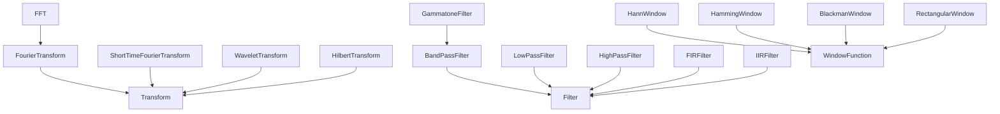
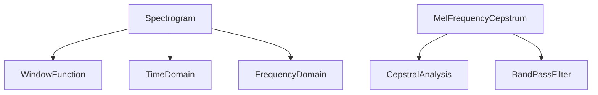
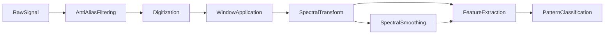

# Signal Processing -- Computational sound analysis

Models computational analysis of sound: transforms (Fourier, wavelet, Hilbert, cepstral), spectral representations, digital filters (FIR, IIR, gammatone), sampling concepts (Nyquist, aliasing, quantization), window functions, signal operations, and the time/frequency analysis domains. The mereology captures structural composition (Spectrogram has-a WindowFunction, TimeDomain, FrequencyDomain). The causal graph traces raw signal through anti-alias filtering, digitization, windowing, and spectral transform to pattern classification.

Key references:
- Oppenheim & Schafer 2010: *Discrete-Time Signal Processing* (3rd ed.)
- Smith 2007: *Mathematics of the DFT*
- Shannon 1949: sampling theorem
- Cooley & Tukey 1965: FFT algorithm
- Harris 1978: window functions
- Welch 1967: spectral estimation

## Entities (40)

| Category | Entities |
|---|---|
| Transforms (7) | FourierTransform, FFT, InverseFFT, ShortTimeFourierTransform, WaveletTransform, HilbertTransform, CepstralAnalysis |
| Representations (5) | Spectrogram, PowerSpectralDensity, Autocorrelation, Cepstrum, MelFrequencyCepstrum |
| Filters (7) | LowPassFilter, HighPassFilter, BandPassFilter, BandStopFilter, FIRFilter, IIRFilter, GammatoneFilter |
| Sampling (4) | Sampling, NyquistFrequency, Aliasing, Quantization |
| Windows (5) | WindowFunction, HannWindow, HammingWindow, BlackmanWindow, RectangularWindow |
| Operations (4) | Convolution, Correlation, Decimation, Interpolation |
| Domains (2) | TimeDomain, FrequencyDomain |
| Abstract (6) | Transform, Representation, Filter, SamplingConcept, SignalOperation, AnalysisDomain |

## Taxonomy

## Mereology

## Causal graph

## Opposition

| Pair | Meaning |
|---|---|
| TimeDomain / FrequencyDomain | Dual signal representations |
| LowPassFilter / HighPassFilter | Complementary passbands |
| Decimation / Interpolation | Rate reduction vs rate increase |
| FFT / InverseFFT | Analysis vs synthesis |

## Qualities

| Quality | Type | Description |
|---|---|---|
| ComputationalComplexity | Complexity | FFT/IFFT N log N; DFT/Convolution/Correlation N^2 |
| SidelobeLevel | f64 (dB) | Rectangular -13, Hann -31.5, Hamming -42, Blackman -58 |
| MainlobeBandwidth | f64 (bins) | Rectangular 1, Hann 2, Blackman 3 |

## Axioms

| Axiom | Description | Source |
|---|---|---|
| RectangularNarrowestMainlobe | Rectangular window has narrowest mainlobe bandwidth | Harris 1978 |
| SpectrogramContainsDomains | Spectrogram contains time and frequency domain components | standard |
| FFTSubsumption | FFT is-a FourierTransform is-a Transform | Cooley & Tukey 1965 |
| DomainsOpposed | Time and frequency domains are opposed | standard |
| BlackmanBestSidelobes | Blackman window has lowest sidelobes | Harris 1978 |
| GammatoneIsBandpass | Gammatone filter is-a bandpass filter | standard |
| RawSignalCausesClassification | Raw signal transitively causes pattern classification | standard |

Plus the auto-generated structural axioms from `define_ontology!`.

## Functors

No outgoing functors yet.

Incoming:

| Functor | Source | File |
|---|---|---|
| AcousticsToSignalProcessing | acoustics | `../acoustics/signal_functor.rs` |

See [Compose via functor](../../../../../../docs/use/compose-via-functor.md) to add more.

## Files

- `ontology.rs` -- `SignalEntity`, taxonomy, mereology, causal graph, opposition, qualities, 7 domain axioms, tests
- `mod.rs` -- Module declarations
