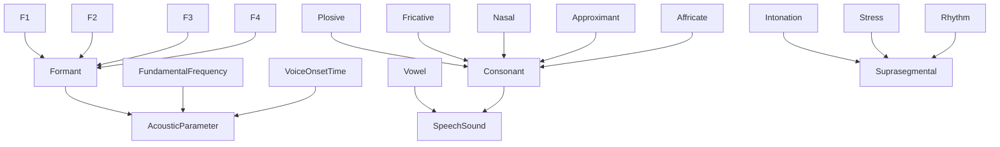
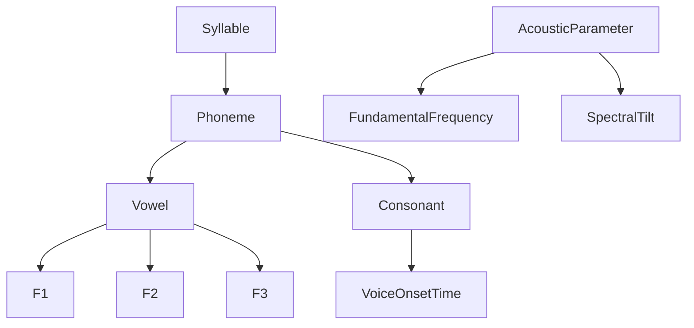
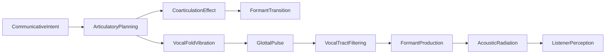

# Speech -- Production and perception acoustics

Models speech acoustics: fundamental frequency and formants (F1-F4), voice onset time, harmonics, vowels and consonant manners (plosive, fricative, nasal, approximant, affricate), voiced/voiceless contrast, suprasegmentals (intonation, stress, rhythm), intelligibility metrics (SII, SNR, SRT, AI), and spectral regions. The mereology composes syllables from phonemes (vowels and consonants), and the causal graph traces communicative intent through vocal fold vibration and vocal tract filtering to listener perception.

Key references:
- Fant 1960: *Acoustic Theory of Speech Production*
- Peterson & Barney 1952: vowel formant measurements
- Stevens 2000: *Acoustic Phonetics* (MIT Press)
- Lisker & Abramson 1964: voice onset time
- ANSI S3.5-1997: Speech Intelligibility Index

## Entities (35)

| Category | Entities |
|---|---|
| Acoustic parameters (9) | FundamentalFrequency, Formant, F1, F2, F3, F4, VoiceOnsetTime, SpectralTilt, Harmonics |
| Speech sounds (8) | Vowel, Consonant, Plosive, Fricative, Nasal, Approximant, Affricate, Voiced, Voiceless |
| Suprasegmentals (3) | Intonation, Stress, Rhythm |
| Structure (2) | Syllable, Phoneme |
| Intelligibility (4) | SpeechIntelligibilityIndex, SignalToNoiseRatio, SpeechReceptionThreshold, ArticulationIndex |
| Spectral regions (3) | LowFrequencySpeech, MidFrequencySpeech, HighFrequencySpeech |
| Abstract (6) | AcousticParameter, SpeechSound, Suprasegmental, IntelligibilityMetric, SpectralRegion |

## Taxonomy

## Mereology

## Causal graph

## Opposition

| Pair | Meaning |
|---|---|
| Voiced / Voiceless | Vocal fold vibration present vs absent (Lisker & Abramson 1964) |
| Vowel / Consonant | Open vs constricted vocal tract |

## Qualities

| Quality | Type | Description |
|---|---|---|
| TypicalFrequency | f64 (Hz) | F0 150, F1 500, F2 1500, F3 2500, F4 3500 |
| SpectralRange | FreqRange | Low 125-500, Mid 500-3000, High 3000-8000 |
| TypicalVOT | f64 (ms) | Voiced 0, Voiceless 70, Plosive 35 |

## Axioms

| Axiom | Description | Source |
|---|---|---|
| FormantsAreOrdered | Formants are frequency-ordered (F1 < F2 < F3 < F4) | Peterson & Barney 1952 |
| FormantsClassified | F1-F4 are all formants and acoustic parameters | Fant 1960 |
| FiveConsonantManners | Plosive, fricative, nasal, approximant, affricate are consonants | Stevens 2000 |
| VoicedOpposesVoiceless | Voiced and voiceless are opposed | Lisker & Abramson 1964 |
| SyllableContainsVowelsAndConsonants | Syllable transitively contains vowels and consonants | standard |
| IntentCausesPerception | Communicative intent transitively causes listener perception | standard |

Plus the auto-generated structural axioms from `define_ontology!`.

## Functors

No outgoing functors yet.

Incoming:

| Functor | Source | File |
|---|---|---|
| AcousticsToSpeech | acoustics | `../acoustics/speech_functor.rs` |

See [Compose via functor](../../../../../../docs/use/compose-via-functor.md) to add more.

## Files

- `ontology.rs` -- `SpeechEntity`, taxonomy, mereology, causal graph, opposition, qualities, 6 domain axioms, tests
- `mod.rs` -- Module declarations
